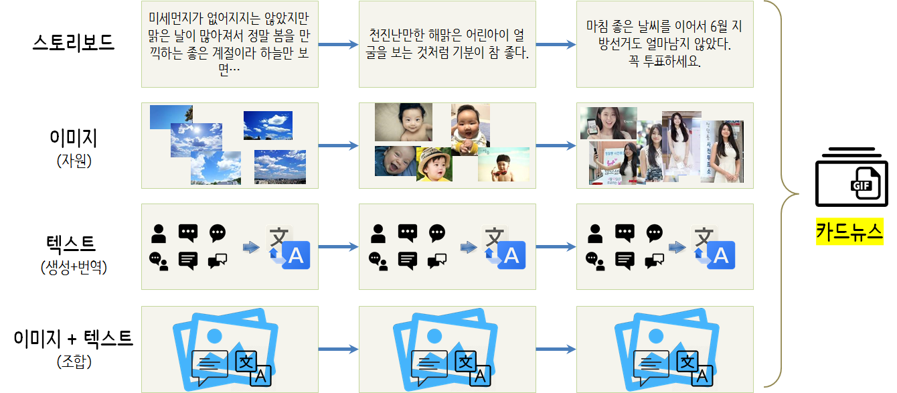

```{r, include=FALSE}
source("tools/chunk-options.R") 
knitr::opts_chunk$set(echo = TRUE, warning=FALSE, message=FALSE)
library(tidyverse)
img_bucket <- read_rds("data/img_bucket.rds")
img_caption_df <- read_rds("data/img_caption_df.rds")
```

# 전통적인 카드뉴스 제작방법 [^cardnews] {#how-to-make-card-news}

[^cardnews]: [네이버 블로그: 파워포인트 - 카드뉴스 만들기](http://blog.naver.com/happynut/221272739941)

네이버 블로그 [파워포인트 - 카드뉴스 만들기](http://blog.naver.com/happynut/221272739941) 제작방법이 최근에 올라와 있다.
파워포인트 제작에 익숙하면 누구나 손쉽게 카드뉴스를 제작할 수 있다.

# 딥러닝 활용 카드뉴스 제작 시도 {#how-to-make-card-news-with-deep-learning}

딥러닝 기술을 활용하여 카드뉴스를 제작하는 것은 어떨까? 아마도 다양한 기반기술이 필요로 하다.
물론 가장 먼저 의미있는 스토리보드를 만들어내고 ... 이에 대한 이미지 자원을 가지고 이미지에서 
자동으로 텍스트를 생성하고 이미지와 텍스트를 결합시켜 원하는 카드뉴스를 대량생산한다.



# 제작방법 {#cardnews-making}

## 스토리 제작 {#cardnews-making-story-telling}

미세먼지가 없는 맑은 하늘을 보니 기분이 좋아져서 천진난만하게 해맑게 웃는 아기얼굴 생각에 ...
급반전하여 꼭 투표하세요... 라는 카드뉴스를 제작한다고 스토리를 뽑아보자.

- 미세먼지가 없어지지는 않았지만 맑은 날이 많아져서 정말 봄을 만끽하는 좋은 계절이라 하늘만 보면…
- 천진난만한 해맑은 어린아이 얼굴을 보는 것처럼 기분이 참 좋다.
- 마침 좋은 날씨를 이어서 6월 지방선거도 얼마남지 않았다. 꼭 투표하세요.

## 이미지 모으기 {#cardnews-making-image}

이를 위해서 [xwMOOC 딥러닝 비행기 vs 자동차 - 강아지 vs 고양이](http://statkclee.github.io/deep-learning/r-keras-cats-and-dogs.html)에서 
제시된 것과 동일한 방식으로 "맑은 하늘", "해맑은 아기 얼굴", "설현 투표 꼭 하세요" 검색어로 20개씩 이미지를 구글에서 가져온다.

``` {r image-download, eval = FALSE}
# 0. 환경설정 ------
library(tidyverse)
library(magick)
library(rvest) 
library(urltools)
library(rvest)
library(httr)

# 0.1. 검색어 불러오기 -----

scrapeJSSite <- function(searchTerm){
    url <- paste0("https://www.google.com/search?q=", url_encode(searchTerm), "&source=lnms&tbm=isch&sa=X")
    
    lines <- readLines("code/imageScrape.js")
    lines[1] <- paste0("var url ='", url ,"';")
    writeLines(lines, "code/imageScrape.js")
    
    ## 다운로드 웹사이트 실행
    system("phantomjs code/imageScrape.js")
    
    pg <- read_html("1.html")
    files <- pg %>% html_nodes("img") %>% html_attr("src")
    df <- data.frame(images=files, search=searchTerm)
    return(df)
}

# 2. 검색 이미지 다운로드 함수 -----

downloadImages <- function(files, type, outPath="data/images"){
    for(i in 1:length(files)){
        download.file(files[i], destfile = paste0(outPath, "/", type, "_", i, ".jpg"), mode = 'wb')
    }
}

# 3. 이미지 다운로드 실행 -----
## 3.1. 맑은 하늘
sky_df <- scrapeJSSite(searchTerm = "맑은 하늘") %>% 
    filter(!str_detect(images, "tia.png"))

downloadImages(as.character(sky_df$images), "sky")

## 3.2. 기분이 좋다.
feel_good_df <- scrapeJSSite(searchTerm = "해맑은 아기 얼굴") %>% 
    filter(!str_detect(images, "tia.png"))

downloadImages(as.character(feel_good_df$images), "feel_good")

## 3.3. 6.13 투표 
vote_df <- scrapeJSSite(searchTerm = "설현 투표 꼭 하세요") %>% 
    filter(!str_detect(images, "tia.png"))

downloadImages(as.character(vote_df$images), "vote")
```

## 이미지 캡션 {#cardnews-making-image-text}

마이크로소프트 애져 Cognitive Service 컴퓨터 비젼 API를 활용하여 각 이미지에 캡션을 붙인다.

``` {r image-download-text, eval = FALSE}
# 1. API 설정 ------
computer_vision_endpoint <- "https://eastasia.api.cognitive.microsoft.com/vision/v1.0/analyze"

visual_features <- "Description,Tags,Categories,Faces,Adult" # options = "Categories, Tags, Description, Faces, ImageType, Color, Adult"
details <- "Landmarks" # options = Landmarks, Celebrities

req_url <- glue(computer_vision_endpoint, "?visualFeatures=", visual_features, "&details=", details)

# 2. 대상 이미지 ------

img_list <- list.files("data/images/")

img_bucket <- vector("list", length=length(img_list))

for(i in 1:length(img_list)){
    img_name <- paste0("data/images/", img_list[i])
    card_img <- httr::upload_file(img_name)

    if(i %% 20 == 0) Sys.sleep(40)
    
    api_resp <- POST(url = req_url,
                     content_type('application/json'),
                     add_headers(.headers = c('Ocp-Apim-Subscription-Key' = computer_vision_api_key,
                                              'Content-Type' = 'application/octet-stream')),
                     body = card_img)
    img_bucket[[i]] <- content(api_resp)
    
}
```

특별한 문제가 없다면 60개 던진 이미지를 분석하여 각 이미지에 대해 캡션을 붙여 리스트로 반환된다.

``` {r image-download-text-caption}
listviewer::jsonedit(img_bucket)
```

## 캡션 데이터프레임 {#cardnews-making-image-text-df}

이미지를 보내서 이미지에 대한 분석이 완료된 결과는 리스트로 반환된다.
리스트에서 캡션에 해당되는 부분만 추출하여 데이터프레임으로 변환시킨다.

``` {r image-download-text-df, eval = FALSE}
# 2. 텍스트 추출 ------
## 2.1. 캡션 리스트 
img_description_list <- map(img_bucket, ~.$description)
img_caption_list <- map(img_description_list, ~.$captions)

## 2.2. 이미지 파일명
img_list <- list.files("data/images/")
names(img_caption_list) <- img_list

img_caption_v <- map_chr(img_caption_list %>% flatten, ~.$text)

## 2.3. 캡션 데이터프레임
img_caption_df <- tibble(
    filename = names(img_caption_v),
    caption = img_caption_v
)
```

``` {r image-download-text-df-view}
DT::datatable(img_caption_df)
```

## 카드뉴스 애니메이션 {#cardnews-making-image-text-df-ani}

각 이미지에 해당되는 캡션을 붙였기 때문에 다양한 방향으로 프로젝트를 이어갈 수 있다.
이번에는 단순히 해당 이미지를 쭉 붙여서 카드뉴스 애니메이션으로 제작하는 경로만 살펴본다.

``` {r image-download-text-df-ani, eval = FALSE}
# 1. 데이터 ------
## 1.1. 이미지 데이터 -----
img_list <- list.files("data/images/")
img_filename_list <- vector("list", length=length(img_list))

for(i in 1:length(img_list)) {
    img_filename_list[[i]] <- glue("data/images/", img_list[i])
}

## 1.2. 이미지 캡션 데이터
img_caption_df <- read_rds("data/img_caption_df.rds")

# 2. 이미지 텍스트 결합 ------
img_caption_df <- img_caption_df %>% 
    mutate(dir_filename = str_c("data/images/", filename))

card_img <- c()

for(i in 1:nrow(img_caption_df)) {
    tmp_img <- image_read(img_caption_df$dir_filename[i]) %>% 
        image_scale("300x") %>% 
        image_annotate(img_caption_df$caption[i], size = 20, location = "northwest", color = "red")
    card_img <- c(tmp_img, card_img)
}

card_animation <- image_animate(image_scale(card_img, "300x300"), fps = 1, dispose = "previous")
# 3. 애니메이션 내보내기 ------
image_write(card_animation, "data/images/card_animation.gif")
```


