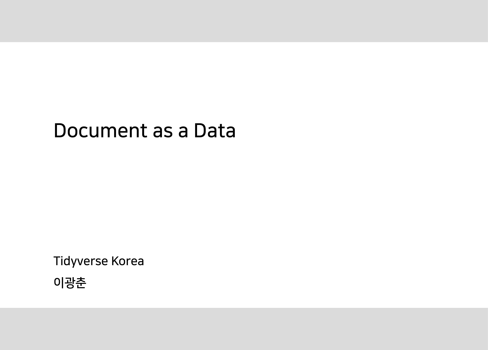
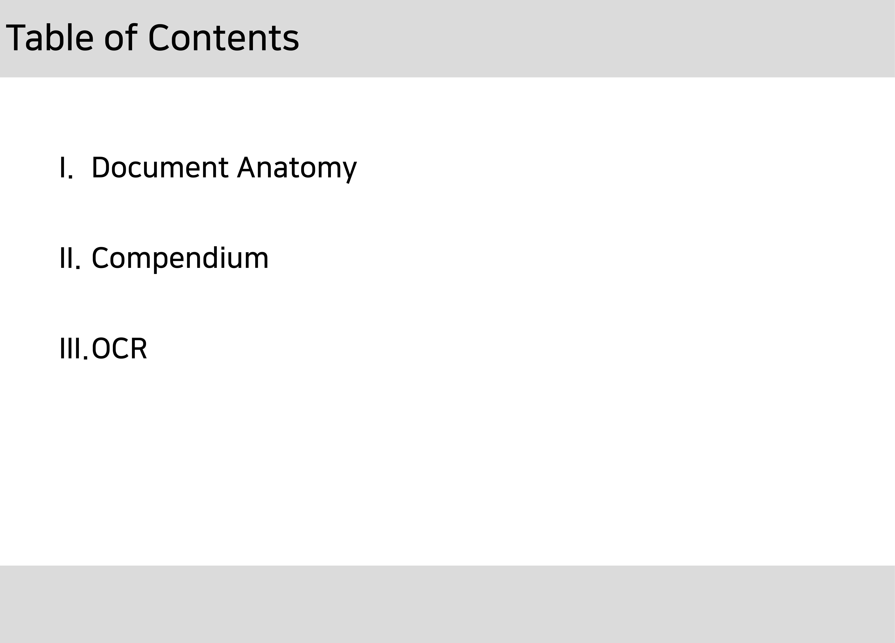
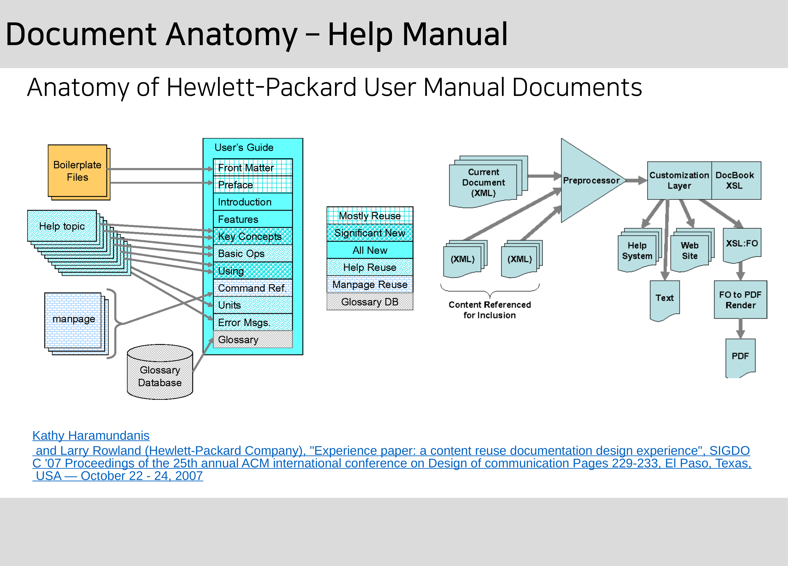
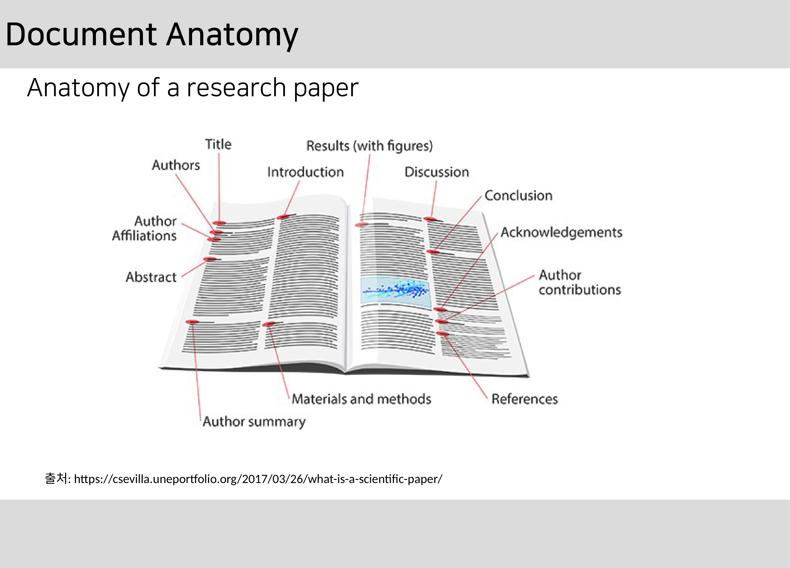
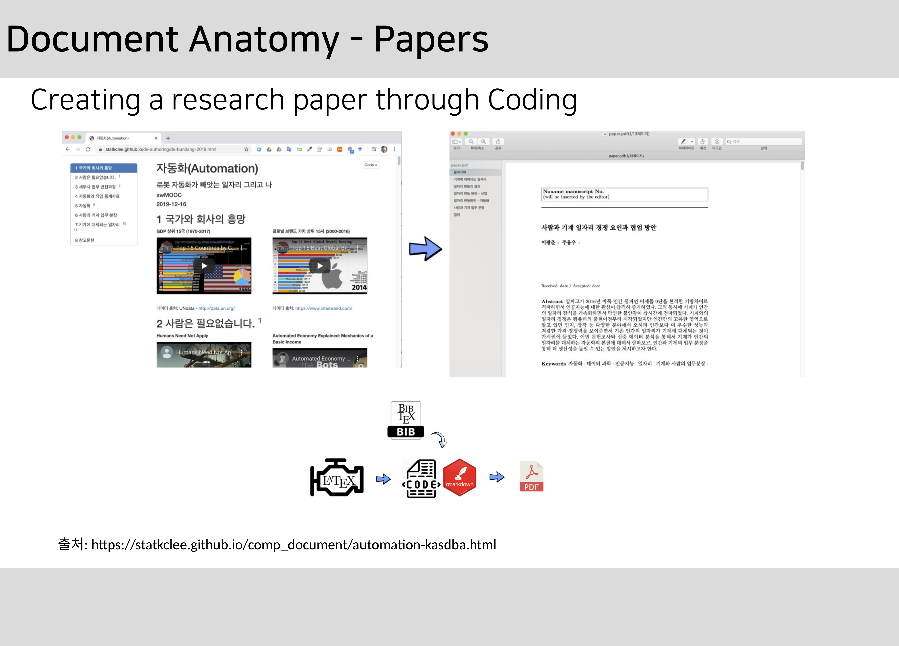
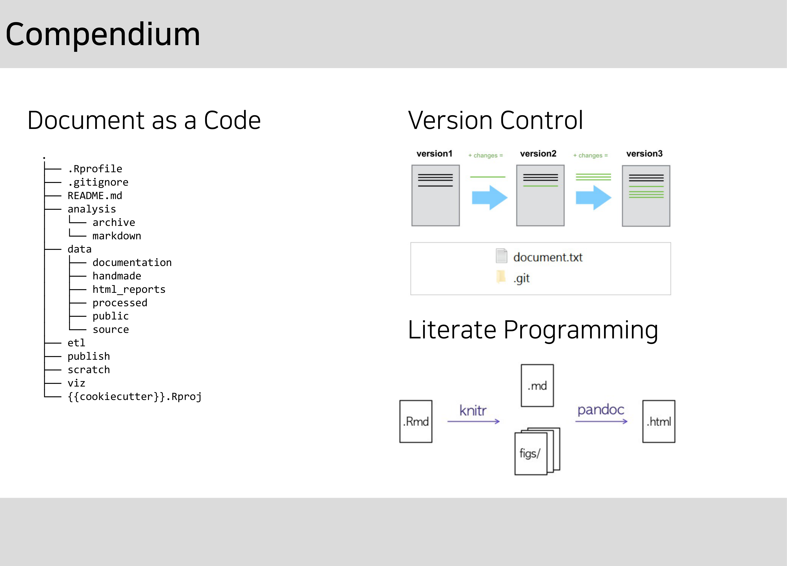
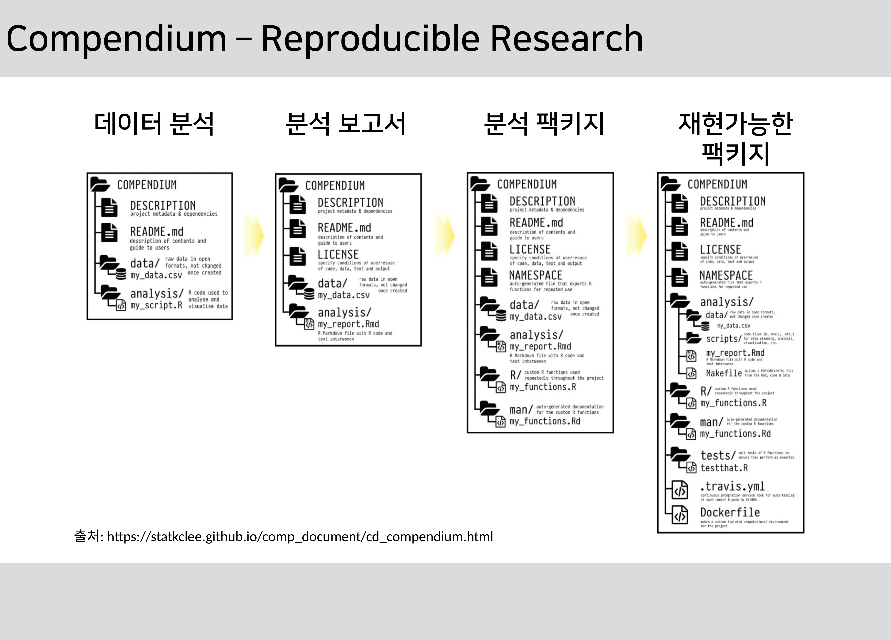
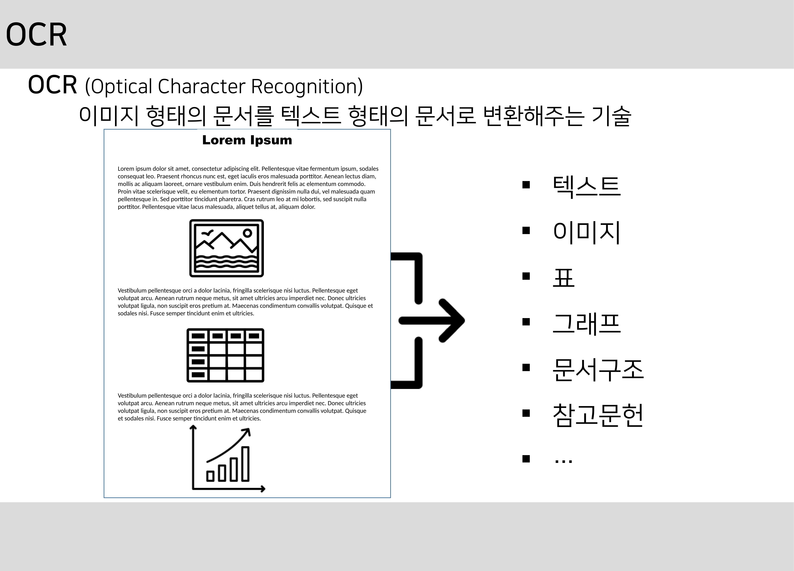
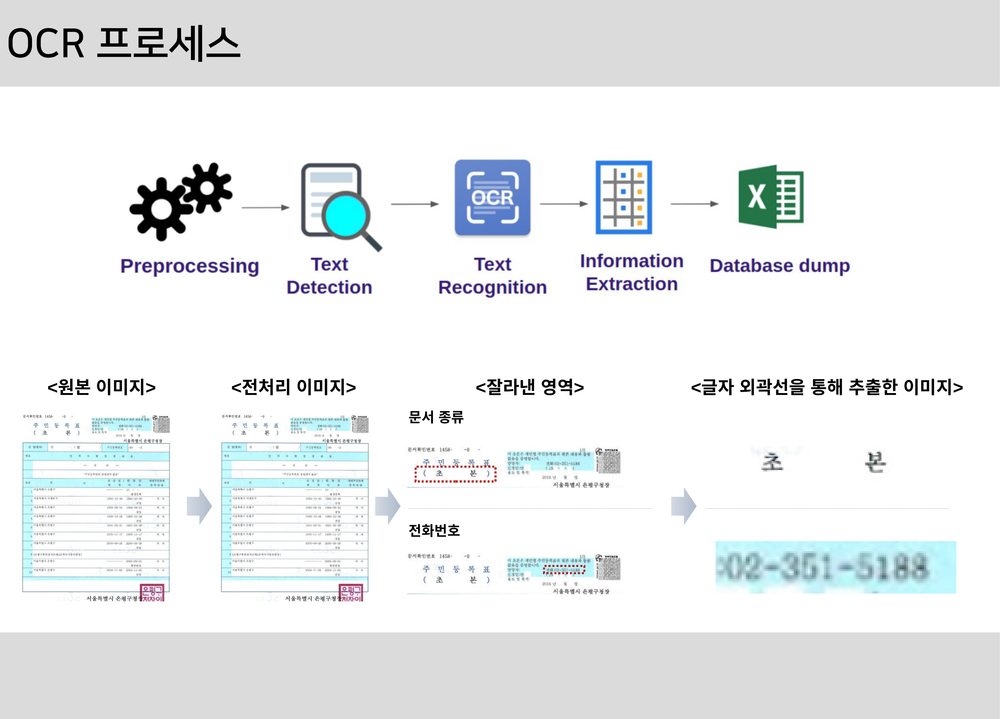
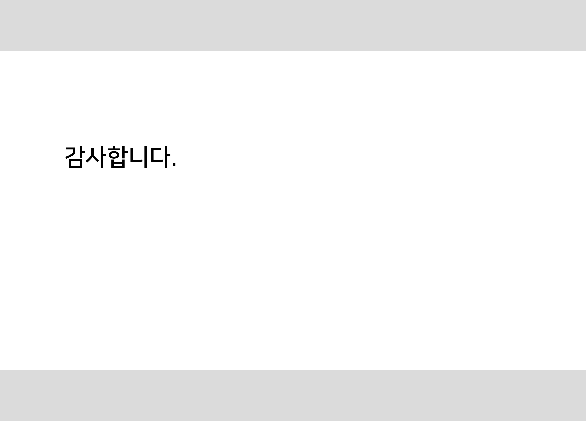

---
output:
  ariExtra::ari_document:
    verbose: yes
---

----------

<!--안녕하세요 .  데이터 과학자  이광춘입니다 . 제가 발표드릴 발표주제는 “ Document as a Data”  입니다 . 문서를 데이터로   이해하는 방식은 다소 생소할 수 있으나 데이터 과학의 기본이며  OCR  기술을 활용하여  데이터화하는  개념을 아주 높은 수준에서 일별하고자 합니다 . 1-->

----------

<!--인공지능기술을 적용하여  OCR  작업을 처리하고자 할 때 가장 먼저  해야되는  작업 중 하나가 자료구조를 파악하고 이를 기계가 처리할 수 있는  자료구조로 정의하는 것입니다 . 문서를 데이터로 이해하고자 했던 그동안의 노력을 먼저 살펴보고  OCR 로 넘어가겠습니다 . 2-->

----------

<!--HP 는 유명한 글로벌 기업으로 전세계를 대상으로 서버 ,  프린터 등을 판매하고 있다 . 이 회사는 전세계 대상으로 서버와 프린터 등을 판매하다 보니 사용자를 위한 매뉴얼 도움말을 제작해야만 되었고 , 영어 ,  중국어 ,  일본어 ,  독일어 등 다양한 언어를 기본적으로 지원하는 과제를 풀어야 했습니다 . 이를 위해서 상기와 같은 문서 템플릿을 만들고  One Source Multi Use  패러다임에 충실히 다양한 형태의 매뉴얼 제작을 자동화하였다 . 3-->

----------

<!--다음으로 연구논문을 해체하여 보겠습니다 . 연구논문은 문서 데이터의 전형을 보여주고 있습니다 . 연구논문은  연구제목 ,  저자 ,  소속기관 ,  초록 ,  그래프 ,  표 ,  참고문헌 등으로 구성됩니다 . 4-->

----------

<!--코딩을 통해 연구논문을 작성하는 시도도 최근에는 일반화되었다 . 이유는 대다수 연구논문이 데이터 과학에 기반을 두고 작성되는 경우가 빈번해 지면서  재현가능한  연구 (Reproducible Research) 가 기본이 되고 홀로 연구논문을 작성하는 대신  협업을 통한 작성이 일반화 되면서 특정 플랫폼 ,  특정 소프트웨어에 종속되는 것은 큰 장애로 다가서고 있습니다 . 데이터 ,  코드 ,  수식 ,  텍스트 ,  참고문헌 ,  스타일 등 논문을 구성하는 다양한 요소를 조합하고 재현가능하도록 논문을 저작해야 하고 , 더 나아가 이를 협업이 가능하고 누구나 특정 플랫폼이나 소프트웨어 제한없이 만들어야 하는 문제를 풀어야 합니다 . 5-->

----------

<!--한걸음 더 들어가 앞서 언급한 문제를 고려하여 연구논문을 제작하기 위한 프로젝트 구조를 예를 들어 설명해 보겠습니다 . 연구논문을 제작하는데 프로젝트 개념이 가장 상위 개념으로 들어가고 연구논문을 구성하는 데이터 ,  데이터를 탐색적으로 분석하여  다양한 표 ,  그래프 ,  모형에 대한 내용을 정리하는 부분이 프로젝트 디렉토리에 담겨야 합니다 . 한걸음 더 나아가 제작된 논문을 웹사이트 ,   PDF,  워드 ,  발표 슬라이드 등 다양한 형태로 뽑아내는 자동화 하는 과정도 포함되어야 하고 , 기본적으로 버전제어기능도 들어가야 합니다 .  여기에 논문 개발환경에 대한 정보도  도커   YAML  파일로 관리되어야 합니다 .   6-->

----------

<!--재현가능한  연구논문을 특히 데이터 과학을 차용한 연구논문은 한번에 작성되기 보다 다음과 같은  compendium( 개요서 ) 을 기초로 진화를 거치게 됩니다 . 즉 ,  먼저 데이터를 관리하고 데이터를 탐색적으로 분석함으로써 유의미한 결과를 찾아내게 되고 , 이를 마크다운 언어로 보고서화하여 공유가능한 기초를 갖추게 됩니다 . 다음으로  팩키지  개념을 도입하여 누구나 사용하기 편한 형태로 탈바꿈되고 도커  개념도 넣어 특정 플랫폼 ,  소프트웨어에 종속되지 않게 확장해 나갑니다 . 7-->

----------

<!--문서에서 문자를 인식하는 과정은 문서 형태에 따라 정형 / 비정형 문서로 나눌 수 있습니다 . 문서내부에  특정 위치에 존재하는 텍스트 ,  표 ,  그래프 등을 인식하여 기계가 후속 처리 작업을 수행할 수 있도록 텍스트를 정형데이터 형태로 바꾸게 됩니다 . 8-->

----------

<!--OCR  기본 작업 프로세스는 원본이미지를  OCR 이 잘 되도록 이미지 처리 기술을 적극 활용하여 전처리작업을 취하고  Tesseract  혹은 네이버 등  클라우드   OCR  엔진을 사용하여 텍스트를 추출하고 사전 ,  맞춤법 검사 등 후처리 기술을 동원하여  OCR  정확도를 높인 후 텍스트로 떨구는 과정을 거치게 됩니다 . 예를 들어 주민등록 초본에서 문서종류와 전화번호를 광학문자인식 기술을 활용하여 추출하는 사례를 살펴보겠습니다 . 먼저 원본  아나로그  문서를  디지털화시키고  이미지 처리 기술을 활용하여 최대한 문자가 잘 뽑힐 수 있도록  전처리합니다 . 그리고 나서 고정형 문서의 경우 특정 위치에서 문자 영역을 특정한 후 글자 외관선을 통한 이미지 추출작업을  수행후  텍스트를 뽑아냅니다 . 9-->

----------

<!--이상으로 문서를 데이터로 이해하는 새로운 관점을 제시하였고 ,  특히  OCR 에 관심을 갖게 되었는지 말씀을 드렸습니다 . 오늘  발표드린  문서를 데이터로 이해하고  OCR  대한 이해가 업무에 큰 도움이 되셨으면 좋겠습니다 .   감사합니다 . 10-->

