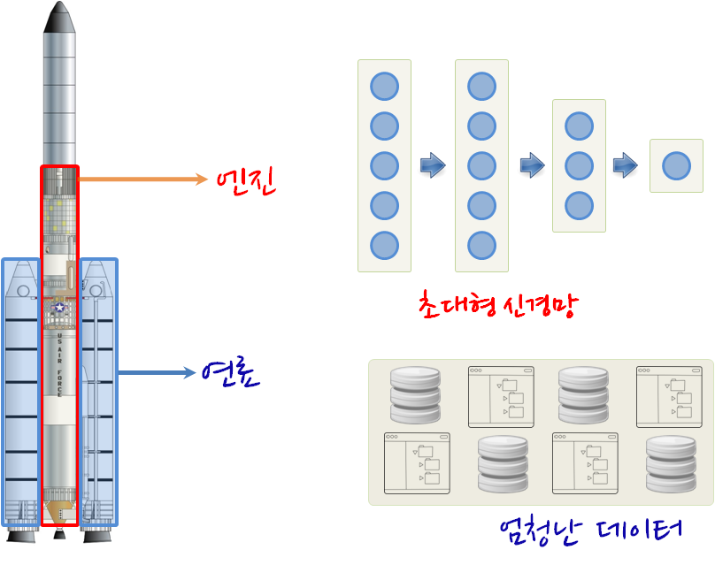
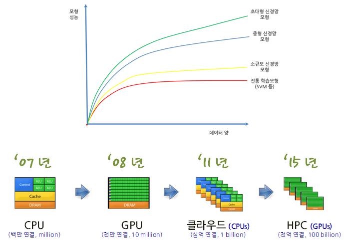

왜 지금 딥러닝이 각광받고 있는 이유가 뭘까? [^andrew-ng-spark-2016] 이 질문에 [앤드류 응](http://www.andrewng.org/) 박사는 마치 로켓이 강력한 엔진과 더불어 어마어마한 연료를 갖추었기 때문이라고 설명한다. 강력한 엔진이 어떤 데이터도 학습할 수 있는 유연하고 파괴력있는 표현력이 강한 신경망이고, 어마어마한 연료가 빅데이터로 회자되는 풍부한 데이터다. 이를 계산할 수 있는 병렬컴퓨팅 기술이 합쳐져 인공지능 AI 혁명을 모두 지켜보고 있다.

딥러닝을 뒷받침하고 있는 세가지 중요한 기술요소에는 **빅데이터**, **깊은 신경망 모형**, **병렬 컴퓨팅** 이 내포되어 있으며 이것중 하나도 빠지게 되면 오늘과 같은 변화와 혁신을 기대하기는 쉽지 않았을 것이다.

특히, 데이터 폭증과 병렬컴퓨팅을 통해 강력한 연산 능력을 갖추게 되었지만, 이를 효과적으로 활용할 모형이 마땅치 않았으나 깊은 신경망을 모형을 통해 그동안 홀대 받았던 신경망 모형이 가장 인기있는 모형으로 자리잡게 되었다.

전통 학습 모형은 작은 데이터에서 학습효과가 좋지만, 데이터가 많아져도 이를 반영한 성능은 나오지 않는다. 신경망 모형은 데이터 증가에 맞추어 표현력을 따라서 높이면 성능도 높일 수 있다. 하지만, 그에 따른 어마어마한 컴퓨팅 자원이 소요된다. 최근 클라우드와 더불어 고성능 컴퓨팅 HPC에 GPU를 도입해서 정말 상상도 못한 컴퓨팅 자원을 감당할만한 비용으로 이용가능한 세상이 되었다.

> ### AI is a Superpower {.callout}
>
> "AI is a superpower!!!", 인공지능을 체득하면 슈퍼파워를 손에 쥘 것이다. [Andrew Ng](https://twitter.com/andrewyng/status/728986380638916609)
>
> 금수저, 은수저 슈퍼파워를 받은 사람과 기계학습을 통달한 흑수저들간의 무한경쟁이 드뎌 시작되었다. 물론, 
> 금수저를 입에 물고 기계학습을 통달한 사람이 가장 유리한 출발을 시작한 것도 사실이다.

## 학습목차 [^jeff-dean-spark-2016] [^andrew-ng-spark-2016]

[^jeff-dean-spark-2016]: [Large Scale Deep Learning with TensorFlow](https://www.youtube.com/watch?v=XYwIDn00PAo) 
[^andrew-ng-spark-2016]: [AI-The New Electricity](https://www.youtube.com/watch?v=4eJhcxfYR4I)

1. [딥러닝이 주목받는 이유](why-dl.html)
1. 클라우드 API 활용 딥러닝 구현
    - [R 구글 url 축약-googleAuthR](r-short-url.html)
    - [R 구글 애널리틱스(GA)-RGA](r-ga.html)
    - **이미지**
        - **구글**
            - [R 구글 클라우드 비젼 API-RoogleVision](r-google-vision-rooglevision.html)
            - [R 구글 클라우드 비젼 API](r-google-vision-api.html)
            - [구글 클라우드 비젼 - 파이썬](gc-vision.html)            
        - **마이크로소프트**
            - [옥스포드 - 감정 API](ms-oxford-emotion.html)
            - [인지서비스(Cognitive Service) - 텍스트 감성분석](ms-cognitive-text-sentiment.html)
    - **음성**
        - [음성 API](speech-api.html)
1. 자체 구축한 하드웨어 혹은 도커환경에 오픈소스 텐서플로우 적용
1. 기존 모형 아키텍쳐를 사용하고 데이터를 바꿔 재훈련 혹은 모수 조정
1. 완전 새로운 문제에 자체 기계학습 모형 개발 
1. [$H_2 O$ 기계학습](h20-arch.html)
    - [$H_2 O$ 헬로 월드](h2o-hello-world.html)
    - [$H_2 O$ 앙상블 모형](h2o-ensemble-higgs.html)
    - [$H_2 O$ GBM 모형 세부조정](h2o-gbm-titanic.html)
    - [$H_2 O$ vs 딥러닝 랜딩클럽 대출 데이터](h2o-deep-learning-landingclub.html)
    - [전통 R 신경망](r-nnet.html)    

### xwMOOC 오픈 교재

- [컴퓨터 과학 언플러그드](http://unplugged.xwmooc.org)  
- [리보그](http://reeborg.xwmooc.org)  
     - [러플](http://rur-ple.xwmooc.org)  
- [파이썬 거북이](http://swcarpentry.github.io/python-novice-turtles/index-kr.html)  
- [정보과학을 위한 파이썬](http://python.xwmooc.org)  
- [소프트웨어 카펜트리 5.3](http://swcarpentry.xwmooc.org)
- [IoT 오픈 하드웨어(라즈베리 파이)](http://raspberry-pi.xwmooc.org/)
    - [$100 오픈 컴퓨터](http://computer.xwmooc.org/)   
    - [$100 오픈 슈퍼컴퓨터](http://computers.xwmooc.org/)
- **데이터 과학**
    - [R 데이터과학](http://data-science.xwmooc.org/)
    - [R 팩키지](http://r-pkgs.xwmooc.org/)
    - [R 도커](http://statkclee.github.io/r-docker/)
    - [통계적 사고](http://think-stat.xwmooc.org/)
    - [R 병렬 컴퓨팅](http://parallel.xwmooc.org/)    
- **기계학습, 딥러닝, 인공지능**
    - [기계학습](http://statkclee.github.io/ml)
    - [고생대 프로젝트](http://statkclee.github.io/trilobite)
- [기호 수학(Symbolic Math)](http://sympy.xwmooc.org/)
- [선거와 투표](http://politics.xwmooc.org/)

