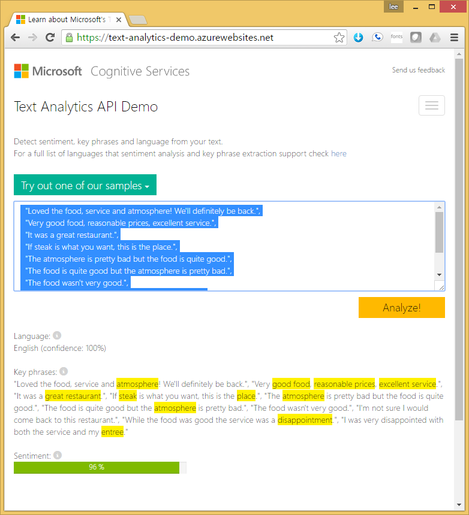
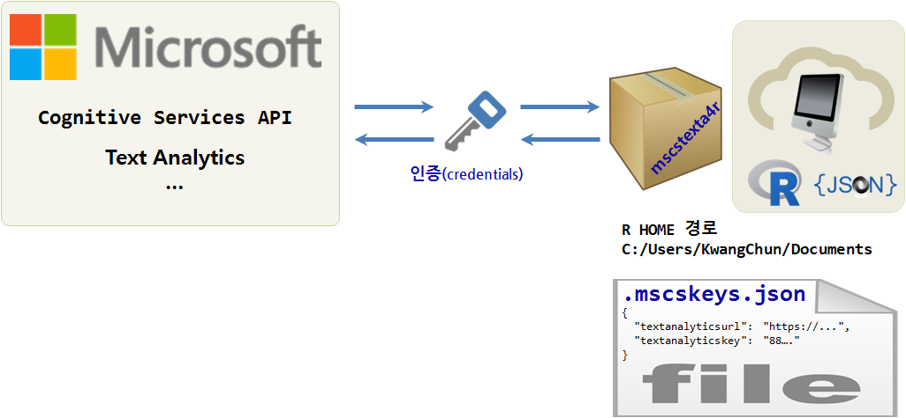
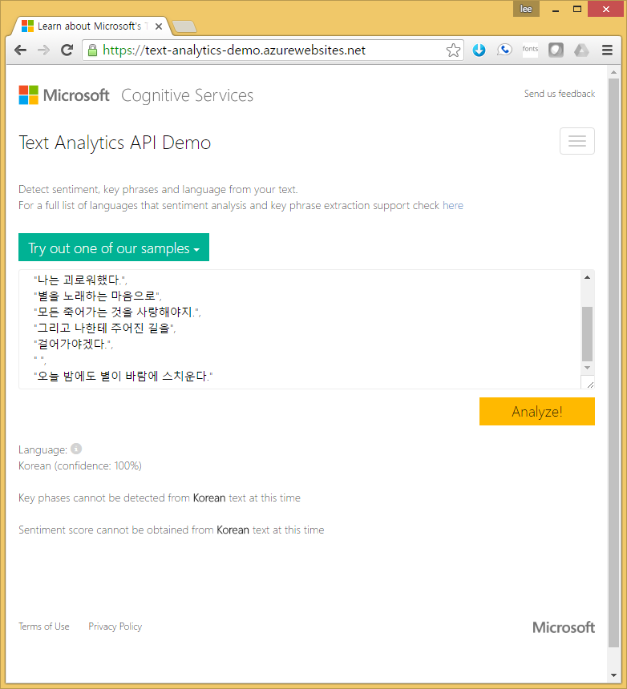

> ## 학습 목표 {.objectives}
>
> * 마이크로소프트 인지서비스 API를 이해한다.
> * 텍스트에 포함된 감성을 계량적으로 분석한다.
> * 한글 텍스트 감성분석의 한계를 이해한다.

### 1. 텍스트에 내포된 감성분석

다음과 같은 음식점 평가를 텍스트로 받은 경우, 
각 고객별로 평가한 내용을 기계가 자동으로 고객이 내린 평가결과를 정량화한다.

마이크로소프트 인지서비스(Cognitive Service)에서 제공하는 [텍스트 분석(Text Analytics) API 데모](https://text-analytics-demo.azurewebsites.net/) 프로그램으로 먼저 웹에서 돌려본다.

~~~ {.text}
"Loved the food, service and atmosphere! We'll definitely be back.",
"Very good food, reasonable prices, excellent service.",
"It was a great restaurant.",
"If steak is what you want, this is the place.",
"The atmosphere is pretty bad but the food is quite good.",
"The food is quite good but the atmosphere is pretty bad.",
"The food wasn't very good.",
"I'm not sure I would come back to this restaurant.",
"While the food was good the service was a disappointment.",
"I was very disappointed with both the service and my entree."
~~~

### 2. `mscstexta4r` 통한 MS 인지서비스 텍스트 분석 API 설정

최근 마이크로소프트에서 [`mscstexta4r`](https://cran.r-project.org/web/packages/mscstexta4r/index.html) "mscstexta4r: R Client for the Microsoft Cognitive Services Text Analytics REST API" 팩키지를 출시했다. MS 인지서비스 API 텍스트 감정분석을 사용하기 위해서 인증부분을 저자 나름대로 방식으로 처리를 했으니 이 부분을 잘 처리해 주는 것이 필요하다.

1. `Sys.getenv()` 명령어를 통해 R HOME 경로를 확인한다.
    * R을 설치한 상황에 따라 차이가 날 수 있지만, 예를 들면, `HOME C:/Users/KwangChun/Documents` 이렇다.
1. `.mscskeys.json` 파일을 생성하고 R HOME 경로에 복사해 놓는다.
    * 다음과 같이 호출할 API와 인증키를 `.mscskeys.json` 파일에 저장한다.
1. `mscstexta4r` 팩키지를 설치하고 라이브러리를 적재한다.
1. `textaInit()` 명령어를 통해 MS 인지서비스  텍스트 분석 API를 제대로 호출하고 있는지 확인한다.
    * 아무 소식도 없이 소리소문없이 넘어가면 로컬 컴퓨터 설정은 완료된 것이다.

> ### `.mscskeys.json` 설정 파일 예제 {.callout}
> 
> `textanalyticskey`는 본인이 발급받은 키값을 필히 사용한다.
> 
> ~~~ {.json}
> {
>   "textanalyticsurl": "https://westus.api.cognitive.microsoft.com/text/analytics/v2.0/",
>   "textanalyticskey": "XXXXXXXXXXXXXXXXXXXXXXXXXXXXXXXXXXXXX"
> }
> ~~~

~~~ {.r}
##==========================================================================================
## 00. 환경설정  
##==========================================================================================
if ("mscstexta4r" %in% installed.packages()[,"Package"] == FALSE) {
  install.packages("mscstexta4r")
}
library(mscstexta4r)

setwd("~/10-microsoft-oxford")

##==========================================================================================
## 01. 마이크로소프트 API 설정  
##==========================================================================================
# Sys.getenv()
# HOME                    C:/Users/KwangChun/Documents

tryCatch({
  textaInit()
}, error = function(err) {
  geterrmessage()
})
~~~

### 3. MS 인지서비스 텍스트 분석 API 통한 감성분석

이제 감정을 분석할 텍스트를 준비한다. `docsText` 파일에 벡터로 감정분석할 데이터를 넣는다.

`docsSentiment` 함수에 언어를 영어(`en`)로 설정하고 API를 호출해서 감성분석을 실시한다.

~~~ {.r}
##==========================================================================================
## 02. 감정분석할 이미지 지정 및 호출
##==========================================================================================

docsText <- c(
  "Loved the food, service and atmosphere! We'll definitely be back.",
  "Very good food, reasonable prices, excellent service.",
  "It was a great restaurant.",
  "If steak is what you want, this is the place.",
  "The atmosphere is pretty bad but the food is quite good.",
  "The food is quite good but the atmosphere is pretty bad.",
  "The food wasn't very good.",
  "I'm not sure I would come back to this restaurant.",
  "While the food was good the service was a disappointment.",
  "I was very disappointed with both the service and my entree."
)

docsLanguage <- rep("en", length(docsText))

tryCatch({
  
  docsSentiment <- textaSentiment(
    documents = docsText,    # Input sentences or documents
    languages = docsLanguage
    # "en"(English, default)|"es"(Spanish)|"fr"(French)|"pt"(Portuguese)
  )
  
}, error = function(err) {
  
  # Print error
  geterrmessage()
  
})
~~~

각 문장별로 감성분석 결과를 확인할 수 있다. 가장 감정이 좋은 것은 1에 가깝게 나타나고 부정적인 감정은 0에 가깝게 나타난다. MS 인지서비스 감정분석 API를 사용할 경우 그렇다는 것이다.

~~~ {.output}
> docsSentiment
texta [https://westus.api.cognitive.microsoft.com/text/analytics/v2.0/sentiment]

--------------------------------------
             text               score 
------------------------------ -------
 Loved the food, service and   0.9847 
 atmosphere! We'll definitely         
           be back.                   

  Very good food, reasonable   0.9831 
  prices, excellent service.          

  It was a great restaurant.   0.9306 

  If steak is what you want,   0.8014 
      this is the place.              

 The atmosphere is pretty bad  0.4998 
 but the food is quite good.          

The food is quite good but the  0.475 
  atmosphere is pretty bad.           

  The food wasn't very good.   0.1877 

I'm not sure I would come back 0.2857 
     to this restaurant.              

 While the food was good the   0.08727
service was a disappointment.         

 I was very disappointed with  0.01877
   both the service and my            
           entree.                    
--------------------------------------
~~~

### 4. 한글 윤동주 서시 감정분석

한글은 지원을 하지 않기 때문에 한글을 넣어 감정분석을 돌리면 다음과 같은 결과가 출력된다. [Text Analytics API Demo](https://text-analytics-demo.azurewebsites.net/)에서 돌려도 동일하다.

~~~ {.r}
docsText <- c(
  "죽는 날까지 하늘을 우러러", 
  "한 점 부끄럼이 없기를.", 
  "잎새에 이는 바람에도", 
  "나는 괴로워했다.", 
  "별을 노래하는 마음으로", 
  "모든 죽어가는 것을 사랑해야지.", 
  "그리고 나한테 주어진 길을", 
  "걸어가야겠다.", 
  " ", 
  "오늘 밤에도 별이 바람에 스치운다."
)
docsLanguage <- rep("ko", length(docsText))

tryCatch({
  
  docsSentiment <- textaSentiment(
    documents = docsText,    # Input sentences or documents
    languages = docsLanguage
    # "en"(English, default)|"es"(Spanish)|"fr"(French)|"pt"(Portuguese)
  )
  
}, error = function(err) {
  
  # Print error
  geterrmessage()
  
})
~~~

~~~ {.output}
[1] "mscstexta4r: Bad Request (HTTP 400). - {\"code\":\"BadRequest\",\"message\":\"Invalid request\",\"innerError\":{\"code\":\"InvalidRequestContent\",\"message\":\"Record cannot be null/empty\"}}"
~~~

한글은 100% 확인할 수 있으나, 중요문구와 감정점수는 현재 시점에서는 제공할 수 없다고 합니다.

