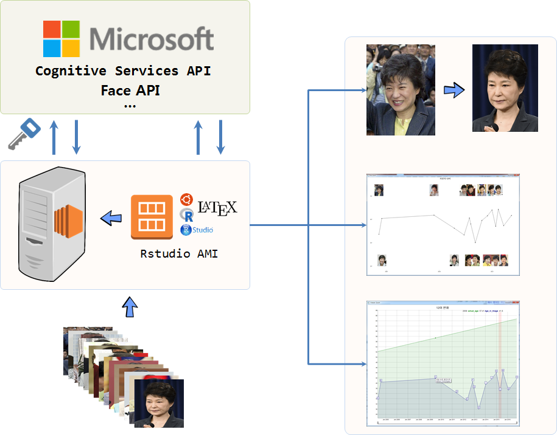
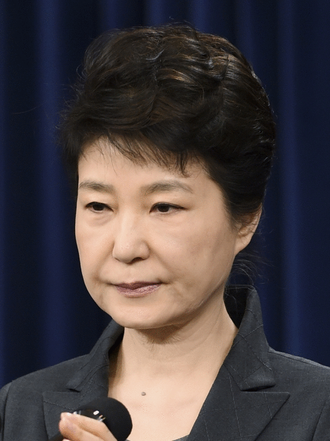
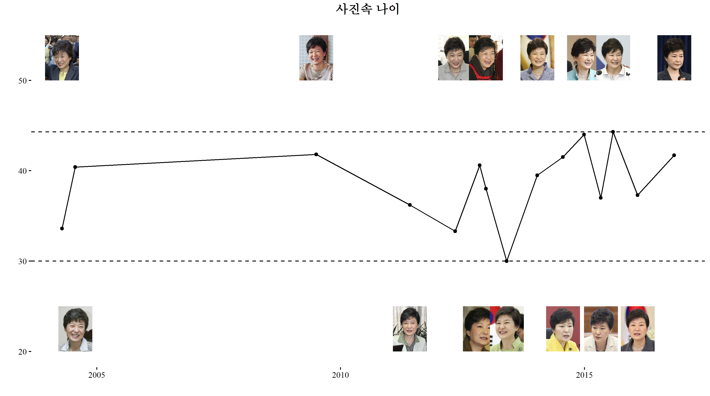

```{r, include=FALSE}
source("tools/chunk-options.R") 
library(readr)
library(dygraphs)
library(xts)
img_buckets <- read_csv("data/img_buckets.csv", col_names = TRUE)
```
> ## 학습 목표 {.objectives}
>
> * 실제 나이와 사진 속 나이 차이를 수치화한다. 
> * 인공지능 API를 활용하여 사진속 나이를 추정한다.
> * 수많은 사진자료작업을 작업화하는 깨알같은 기법을 학습한다.

## 1. 연령추정 작업흐름 [^pictures-with-age-info]

사진속 연령추정을 위한 작업흐름은 먼저 연령을 추정할 데이터를 구하고 나서, 이를 R로 불러 읽어들인다.
다양한 인공지능 API가 있어 연령추정기능을 제공하는 API를 찾아 이곳에 보낼 수 있는 자료형으로 이미지 데이터를 준비한다.
인공지능 API에 전달하기 전에 이미지 데이터에 대한 기초 분석과 더불어 탐색적 데이터 분석 및 데이터 정제작업을 거친다.

정제된 이미지 데이터가 준비되면 이를 API에 던져 이미지속 성별과 나이결과값을 받아 온다. 그리고 나면 기존 이미지 데이터와 더불어 
애니메이션 제작, 인터랙티브 데이터 분석을 포함한 심도깊은 작업을 수행한다.




[^pictures-with-age-info]: [2004년부터 2016년까지 촬영된 박 대통령 사진 비교](http://news.naver.com/main/read.nhn?mode=LSD&mid=sec&sid1=100&oid=028&aid=0002342652)

연령추정에 사용될 이미지 데이터는 [2004년부터 2016년까지 촬영된 박 대통령 사진 비교](http://news.naver.com/main/read.nhn?mode=LSD&mid=sec&sid1=100&oid=028&aid=0002342652) 기사에 
올라온 이미지를 다운로드받는다. 다운로드받은 이미지 데이터는 원본데이터로 `03.data/` 같은 폴더를 별로 만들어서 저장하고 안전하게 보관한다. 만약 문제가 발생되게 되면, 다시 
원본 이미지를 분석작업에 활용한다.

## 2. R에서 이미지 기본작업 [^r-magick]

[^r-magick]: [The magick package: Advanced Image-Processing in R](https://cran.r-project.org/web/packages/magick/vignettes/intro.html)

R에서 이미지 분석에 필요한 팩키지를 설치하고 나서 작업환경에 불러온다. 
개별적으로 이미지를 `magick::image_read` 명령어를 통해서 불러오는 것은 사람보다
기계가 더 잘 하는 작업으로 R에서 자주 활용되는 기법을 활용하여 통째로 불러온다.

1. 개별적으로 불러와서 작업한 결과를 담을 통을 준비: `img_info_bucket <- list()`
1. 개별적으로 작업할 이미지 파일 목록을 생성:  `list.files("03_data/")`
1. 반복문을 간결하게 생성: `seq_along()` 함수 사용
1. 반복작업 결과를 집계: `do.call(rbind, img_info_bucket)`

전형적인 [분할-적용-병합(split-apply-combine) 전략](https://statkclee.github.io/r-novice-gapminder/12-plyr-kr.html)의 대표적인 적용사례다.

### 1.1. 이미지 정보 확인

이미지를 불러와서 가장 먼저 할 작업은 데이터프레임을 통해 이미지 데이터 정보를 살펴보는 것이다.
다행히 이미지 파일 형식(**JPEG**)과 넓이와 높이가 모두 동일하고 파일크기만 일부 차이가 
나는 것이 확인된다. 따라서, 별도 전처리 작업은 필요하지 않게 되었다. 기사의 사진 자료를 준비해주신 분께 깊은 감사의 말씀을 전한다.

```{r eval=FALSE}
# 0. 환경설정--------------------------------------------------
library(png)
library(grid)
library(dplyr)
library(magick)
library(stringr)

# 1. 데이터 불러오기 ----------------------------------------------

img_list <- list.files("03_data/") 
img_list <- stringr::str_replace(img_list, ".jpg", "")

img_info_bucket <- list()

# 2. 사진 정보 확인 ------------------------------------------------
# https://cran.r-project.org/web/packages/magick/vignettes/intro.html
for(lst in seq_along(img_list)){
  tmp <- image_read(paste0("03_data/", img_list[lst], ".jpg"))
  img_info_bucket[[lst]] <- image_info(tmp)
}

img_info_buckets <- do.call(rbind, img_info_bucket)

img_info_df <- data.frame(idate = substr(as.vector(img_list), 5,13), img_info_buckets)

img_info_df
##       idate format width height colorspace filesize
## 1  20040414   JPEG   540    720       sRGB   275964
## 2  20040723   JPEG   540    720       sRGB   241867
## 3  20090702   JPEG   540    720       sRGB   266427
## 4  20110603   JPEG   540    720       sRGB   237164
## 5  20120508   JPEG   540    720       sRGB   261189
## 6  20121108   JPEG   540    720       sRGB   234499
## 7  20121224   JPEG   540    720       sRGB   240137
## 8  20130529   JPEG   540    720       sRGB   277783
## 9  20140113   JPEG   540    720       sRGB   267968
## 10 20140724   JPEG   540    720       sRGB   241137
## 11 20141229   JPEG   540    720       sRGB   183747
## 12 20150504   JPEG   540    720       sRGB   229414
## 13 20150804   JPEG   540    720       sRGB   218613
## 14 20160204   JPEG   540    720       sRGB   238201
## 15 20161104   JPEG   540    720       sRGB   221589

summary(img_info_df)

##    idate              format              width         height     colorspace           filesize     
## Length:15          Length:15          Min.   :540   Min.   :720   Length:15          Min.   :183747  
## Class :character   Class :character   1st Qu.:540   1st Qu.:720   Class :character   1st Qu.:231957  
## Mode  :character   Mode  :character   Median :540   Median :720   Mode  :character   Median :240137  
##                                       Mean   :540   Mean   :720                      Mean   :242380  
##                                       3rd Qu.:540   3rd Qu.:720                      3rd Qu.:263808  
##                                       Max.   :540   Max.   :720                      Max.   :277783  
```

### 1.2. 사진 가로로 붙이기

이제 전체 이미지 데이터가 제대로 들어왔는지 다시 한번 시각적으로 확인한다. 개별 파일을 열어서 확인할 수도 있지만,
`image_append` 함수 기능을 사용해서 데이터를 확인한다. 기본설정은 가로방향으로 쭉 붙게 되고, `stack = TRUE` 인자를 넘기면
수직으로 쭉 쌓는 것도 가능하다.

```{r eval=FALSE}
# 3. 이미지 쫙 붙이기 ------------------------------------------------
# 전체 이미지 불러오기
for(lst in seq_along(img_list)){
  img_name <- img_list[lst]
  assign(img_name, image_read(paste0("03_data/", img_list[lst], ".jpg")))
}

img_vec <- c(img_20040414, img_20040723, img_20090702, img_20110603, 
             img_20120508, img_20121108, img_20121224, img_20130529, 
             img_20140113, img_20140724, img_20141229, img_20150504,
             img_20150804, img_20160204, img_20161104)


img_left2right <- image_append(image_scale(img_vec, "x77"))

image_write(img_left2right, "04.result/left2right.png", format = "png")

img_top2bottom <- image_append(image_scale(img_vec, "x77"), stack = TRUE)
```


### 1.3. 애니메이션 만들기

이미지를 생성시킨 다음에 가장 나이가 적은 사진과 가장 나이가 많은 사진을 뽑아 
`image_morph()` 기능을 통해 10년이 넘는 동안 얼굴변화과정을 `.gif` 파일로 변환하여 
동적인 시간정보를 담아 낸다.

```{r eval=FALSE}
# 이미지 좌우 반전
img_20161104 <- image_flop(img_20161104)

img_transition <- image_morph(c(img_20040414, img_20161104), frames = 10)
img_animation <- image_animate(img_transition, fps=5)

image_write(img_animation, "04.result/img_transition.gif")
```




## 3. 인공지능 API 활용 사진속 성별과 나이 추정

사진속 사람의 나이는 보는 사람의 관점에 따라 주관적이고 취향에 따라 차이가 나곤한다.
그래서 항상 민증을 까라... 어려보인다... 몇살이냐? 등등 질문을 통한 결례를 범하곤한다.
인공지능 API를 활용하여 사진속 컴퓨터가 판단한 나이를 살펴보자.


### 3.1. 마이크로소프트 Face API 호출

`img_list`에 얼굴인식 Face API에 호출할 목록을 넘긴다. 
그리고 나서 `httr` 팩키지를 통해 [마이크로소프트 Face API](https://www.microsoft.com/cognitive-services/en-us/face-api)에 이미지를 넘기고 
결과값을 전달받는다. 필요한 정보는 나이와 성별로 `returnFaceAttributes=age,gender` 인자를 `face_api_url`에 실어 넘긴다.
마찬가지로 활용할 정보도 나이와 설별로 `"faceAttributes.gender", "faceAttributes.age"` 뽑아내서 `img_bucket` 에 잘 담아둔다.

``` {r eval=FALSE}
# 0. 환경설정--------------------------------------------------
library(httr)
library(XML)
library(dplyr)
library(lubridate)

# 1. 데이터 불러오기 ----------------------------------------------

img_list <- list.files("03_data/")

# 2. 얼굴인식 API 호출 ------------------------------------------------

face_api_url <- "https://api.projectoxford.ai/face/v1.0/detect?returnFaceAttributes=age,gender"

source("02_code/secret_key_from_api.R")
# emotionKEY <- '53xxxxxxxxxxxxxxxxxx'

img_bucket <- list()

for(lst in seq_along(img_list)){
  img_name <- paste0("03_data/", img_list[lst])
  img <- httr::upload_file(img_name)
  
  result <- POST(url = face_api_url,
                 body = img,
                 add_headers(.headers = c('Content-Type' = 'application/octet-stream',
                                          'Ocp-Apim-Subscription-Key' = emotionKEY))
  )
  
  img_bucket[[lst]] <- as.data.frame(content(result))[,c("faceAttributes.gender", "faceAttributes.age")]
}
```

### 3.2. API 호출 데이터 정리

마이크로소프트 Face API 호출을 했으면 결과값을 활용할 수 있도록 데이터프레임으로 변환작업을 수행한다.
이때 앞에서 처럼 `do.call(rbind, img_bucket)` 명령어를 활용한다.
이제 박근혜 대통령 생일 [1952년 2월 2일](http://people.search.naver.com/search.naver?where=nexearch&query=%EB%B0%95%EA%B7%BC%ED%98%9C&sm=tab_etc&ie=utf8&key=PeopleService&os=96325)을 
확인하고 이를 기준정보로 하여 실제 나이를 추산한다. 이때 `eeptools` 팩키지의 `age_calc` 함수를 사용하면 편하다. 


``` {r eval=FALSE}
# 3. 데이터 정리-------------------------------------
library(eeptools)

img_buckets <- do.call(rbind, img_bucket)

img_buckets <- data.frame(idate=substr(as.vector(img_list),5,12), img_buckets)
img_buckets <- img_buckets %>% 
  rename(gender = faceAttributes.gender, age=faceAttributes.age) %>% 
  mutate(idate = ymd(idate), 
         dob = ymd("19520202"),
         age = round(age, 1), 
         actual_age = round(age_calc(ymd(dob), ymd(fig_date), units='years')),1)
  
img_buckets
##         idate fig_date gender  age        dob actual_age
## 1  2004-04-14 20040414 female 33.6 1952-02-02   52.19399
## 2  2004-07-23 20040723 female 40.4 1952-02-02   52.46721
## 3  2009-07-02 20090702 female 41.8 1952-02-02   57.41096
## 4  2011-06-03 20110603 female 36.2 1952-02-02   59.33151
## 5  2012-05-08 20120508 female 33.3 1952-02-02   60.25956
## 6  2012-11-08 20121108 female 40.6 1952-02-02   60.76230
## 7  2012-12-24 20121224 female 38.0 1952-02-02   60.88798
## 8  2013-05-29 20130529 female 30.0 1952-02-02   61.31781
## 9  2014-01-13 20140113 female 39.5 1952-02-02   61.94545
## 10 2014-07-24 20140724 female 41.5 1952-02-02   62.47123
## 11 2014-12-29 20141229 female 44.0 1952-02-02   62.90411
## 12 2015-05-04 20150504 female 37.0 1952-02-02   63.24932
## 13 2015-08-04 20150804 female 44.3 1952-02-02   63.50137
## 14 2016-02-04 20160204 female 37.3 1952-02-02   64.00546
## 15 2016-11-04 20161104 female 41.7 1952-02-02   64.75137
```

### 3.3. 정적 이미지 시각화

인공지능에서 판단한 나이와 실제 사진을 하나의 그래프에 넣어 사진과 나이 변화추이를 시각화한다.
사진 이미지를 R 그래프에 적용을 하기 위해서는 래스터(Raster) 파일 형식으로 변환을 해야 된다.
래스터 파일 변환 작업을 한 후에 `ggplot`에 `annotation_custom()` 함수를 활용하여 15개 사진 각각을 붙여 
적절한 위치에 붙여 넣는다. 특정 시점에 사진이 몰려있어 시간순으로 홀수 이미지는 상단에
짝수 이미지는 하단에 위치시키는 방법을 통해 시점이 몰려 겹치는 문제를 다소 해소했다.

``` {r eval=FALSE}
# 0. 환경설정--------------------------------------------------
library(ggplot2)
library(grid)
library(ggthemes)

# 1. 나이변화 정적 이미지 ----------------------------------------------------

img_viz_df <- img_buckets %>% dplyr::select(idate, age, actual_age)

# 래스터 파일 변환 작업
img_20040414_g <- rasterGrob(img_20040414, interpolate=TRUE)
img_20040723_g <- rasterGrob(img_20040723, interpolate=TRUE)
img_20090702_g <- rasterGrob(img_20090702, interpolate=TRUE)
img_20110603_g <- rasterGrob(img_20110603, interpolate=TRUE)
img_20120508_g <- rasterGrob(img_20120508, interpolate=TRUE)
img_20121108_g <- rasterGrob(img_20121108, interpolate=TRUE)
img_20121224_g <- rasterGrob(img_20121224, interpolate=TRUE)
img_20130529_g <- rasterGrob(img_20130529, interpolate=TRUE)
img_20140113_g <- rasterGrob(img_20140113, interpolate=TRUE)
img_20140724_g <- rasterGrob(img_20140724, interpolate=TRUE)
img_20141229_g <- rasterGrob(img_20141229, interpolate=TRUE)
img_20150504_g <- rasterGrob(img_20150504, interpolate=TRUE)
img_20150804_g <- rasterGrob(img_20150804, interpolate=TRUE)
img_20160204_g <- rasterGrob(img_20160204, interpolate=TRUE)
img_20161104_g <- rasterGrob(img_20161104, interpolate=TRUE)

static_img <- ggplot(img_viz_df, aes(x=idate, age)) + 
  geom_line() +
  geom_point() +
  geom_hline(yintercept = c(min(img_viz_df$age),max(img_viz_df$age)), lty=2) + 
  theme_tufte() + 
  scale_y_continuous(limits = c(20, 55)) +
  xlab("") + ylab("") +
  ggtitle("사진속 나이") +
  theme(plot.title = element_text(lineheight=.7, face="bold")) +
  annotation_custom(img_20040414_g, xmin=as.numeric(img_viz_df$idate[1])-450,  xmax=as.numeric(img_viz_df$idate[1])+ 450, ymin=50, ymax=55) +
  annotation_custom(img_20040723_g, xmin=as.numeric(img_viz_df$idate[2])-450,  xmax=as.numeric(img_viz_df$idate[2])+ 450, ymin=20, ymax=25) +
  annotation_custom(img_20090702_g, xmin=as.numeric(img_viz_df$idate[3])-450,  xmax=as.numeric(img_viz_df$idate[3])+ 450, ymin=50, ymax=55) +
  annotation_custom(img_20110603_g, xmin=as.numeric(img_viz_df$idate[4])-450,  xmax=as.numeric(img_viz_df$idate[4])+ 450, ymin=20, ymax=25) +
  annotation_custom(img_20120508_g, xmin=as.numeric(img_viz_df$idate[5])-450,  xmax=as.numeric(img_viz_df$idate[5])+ 450, ymin=50, ymax=55) +
  annotation_custom(img_20121108_g, xmin=as.numeric(img_viz_df$idate[6])-450,  xmax=as.numeric(img_viz_df$idate[6])+ 450, ymin=20, ymax=25) +
  annotation_custom(img_20121224_g, xmin=as.numeric(img_viz_df$idate[7])-450,  xmax=as.numeric(img_viz_df$idate[7])+ 450, ymin=50, ymax=55) +
  annotation_custom(img_20130529_g, xmin=as.numeric(img_viz_df$idate[8])-450,  xmax=as.numeric(img_viz_df$idate[8])+ 450, ymin=20, ymax=25) +
  annotation_custom(img_20140113_g, xmin=as.numeric(img_viz_df$idate[9])-450,  xmax=as.numeric(img_viz_df$idate[9])+ 450, ymin=50, ymax=55) +
  annotation_custom(img_20140724_g, xmin=as.numeric(img_viz_df$idate[10])-450, xmax=as.numeric(img_viz_df$idate[10])+450, ymin=20, ymax=25) +
  annotation_custom(img_20141229_g, xmin=as.numeric(img_viz_df$idate[11])-450, xmax=as.numeric(img_viz_df$idate[11])+450, ymin=50, ymax=55) +
  annotation_custom(img_20150504_g, xmin=as.numeric(img_viz_df$idate[12])-450, xmax=as.numeric(img_viz_df$idate[12])+450, ymin=20, ymax=25) +
  annotation_custom(img_20150804_g, xmin=as.numeric(img_viz_df$idate[13])-450, xmax=as.numeric(img_viz_df$idate[13])+450, ymin=50, ymax=55) +
  annotation_custom(img_20160204_g, xmin=as.numeric(img_viz_df$idate[14])-450, xmax=as.numeric(img_viz_df$idate[14])+450, ymin=20, ymax=25) +
  annotation_custom(img_20161104_g, xmin=as.numeric(img_viz_df$idate[15])-450, xmax=as.numeric(img_viz_df$idate[15])+450, ymin=50, ymax=55)

static_img
ggsave("04.result/static_img.png")
```




### 3.4. 동적 이미지 시각화 [^visit-south-america]

이미지의 나이 변화를 사건의 변화와 함께 살펴보는 것도 전체적인 흐름을 파악하는데 도움이 많이 된다.
특정 사건 전후를 통해 그 특정 사건이 얼굴 나이에 얼마나 영향을 미쳤는지 정량화하는 것도 가능해졌다.

`dygraphs` 팩키지를 통해 동적 사건 변화를 시각적으로 표현할 뿐만 아니라 `dyAnnotation` 기능을 통해 해당 사건도 즉시 파악할 수 있다.
특히, 중남미 순방 직후 7년 정도 사진속 나이가 감소했지만 곧 다시 원래 사진속 나이로 회복된 것이 눈에 띈다.

[^visit-south-america]: [박근혜 대통령 중남미 4개국 순방 세부일정](http://www.huffingtonpost.kr/2015/04/15/story_n_7071958.html)

``` {r}
# library(dygraphs)
# library(xts)

viz_df <- img_buckets %>% dplyr::select(idate, age, actual_age)
viz_df <- xts(viz_df, order.by=viz_df$idate)[, c("age", "actual_age")]

dygraph(viz_df, main="나이 변화") %>%
  dySeries("age", label = "Age_in_Image") %>%
  # dySeries("actual_age", label = "Actual_Age") %>%
  dyOptions(fillGraph = TRUE, fillAlpha = 0.1) %>% 
  dyRangeSelector(height = 20) %>% 
  dyLegend(width = 400) %>% 
  dyAnnotation("2004-4-14", text = "A", tooltip = "제17대 국회의원 투표를 하루 전날 수원시 수원역 한나라당 유세장") %>%
  dyAnnotation("2004-7-23", text = "B", tooltip = "한나라당 대표") %>%
  dyAnnotation("2009-7-2", text = "C", tooltip = "몽골 방문 울란바토로에서 기자간담회") %>%
  dyAnnotation("2011-6-3", text = "D", tooltip = "국회 의원회관 사무실에서 이명박 대통령과의 회동 결과를 취재진에게 설명") %>%
  dyAnnotation("2012-5-8", text = "E", tooltip = "비대위원장 시절 어버이날 서울 용산구 용산노인종합복지관") %>%
  dyAnnotation("2012-11-8", text = "F", tooltip = "대선후보 시절 중구 프레스센터 외신기자클럽 기자회견") %>%
  dyAnnotation("2012-12-24", text = "G", tooltip = "대통령 당선인 성탄절을 전날 관악구 난곡 사랑의 밥집") %>%
  dyAnnotation("2013-5-29", text = "H", tooltip = "청와대 본관 무궁화실에서 벤저민 카딘 미국 상원 동아태소위원장 접견") %>%
  dyAnnotation("2014-1-13", text = "I", tooltip = "청와대에서 미국 CNN 서울주재 특파원 폴라 행콕스와 인터뷰") %>%
  dyAnnotation("2014-7-24", text = "J", tooltip = "정부세종청사에서 확대경제관계장관회의 주재") %>%
  dyAnnotation("2014-12-29", text = "K", tooltip = "청와대에서 핵심 국정과제 점검회의 참석") %>%
  dyAnnotation("2015-5-4", text = "L", tooltip = "중남미 순방 후 청와대에서 수석비서관회의 주재") %>%
  dyAnnotation("2015-8-4", text = "M", tooltip = " 청와대에서 국무회의를 주재") %>%
  dyAnnotation("2016-2-4", text = "N", tooltip = " 청와대에서 열린 사립대학 총장 간담회") %>%
  dyAnnotation("2016-11-4", text = "O", tooltip = " 청와대 춘추관에서 대국민 담화") %>% 
  dyShading(from = "2015-3-17", to = "2015-6-17", color = "#FFE6E6")
```
