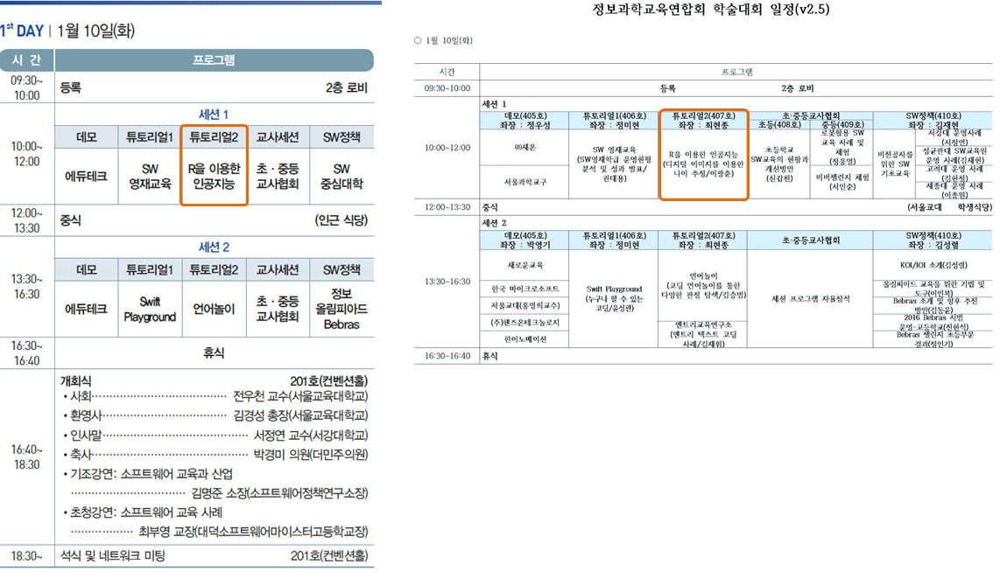
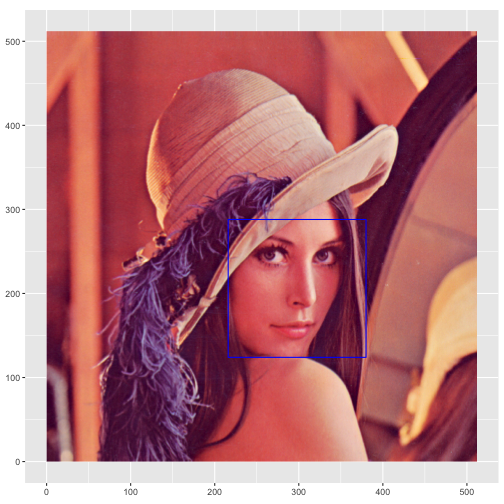
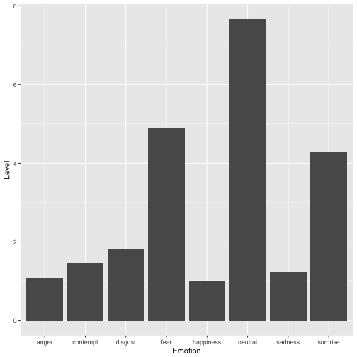

> ## 학습 목표 {.objectives}
>
> * 본인 나이, 사진속 얼굴 나이, 기계가 판단하는 나이를 비교한다.
> * 인공지능 API 서비스의 다양한 면을 살펴본다.
> * 인공지능 API 코딩 실습을 통해 코딩교육의 방향을 (나름) 설정한다.

## 1. R을 이용한 인공지능 튜토리얼

- [소프트웨어교육 어디로 가야 하는가?, 등록사이트](http://163.239.199.187:8888/ws2016/)
- [한국정보과학교육연합회(KiSEF) 홈페이지](http://kcode.kr/)
- [학술대회, 4차 산업혁명 시대의 소프트웨어 교육 어디로 가야 하는가? 공지사항](http://kcode.kr/notice/761)

## 2. 나이측정 인공지능 서비스 [^how-to-detect-face-algorithm]

[^how-to-detect-face-algorithm]: [How to Detect Faces in Image](https://www.microsoft.com/cognitive-services/en-us/face-api/documentation/face-api-how-to-topics/HowtoDetectFacesinImage)

### 2.1. 나이측정 앱서비스 

- [How-Old.net, How old do I look? #HowOldRobot](https://how-old.net/)

### 2.2. 나이측정 API 둘러보기

- [마이크로소프트 Cognitive Services - Face API](https://www.microsoft.com/cognitive-services/en-us/face-api)

### 2.3. 나이측정 API 개발 사용자 인터페이스

- **사전 준비물**
    - 구독 열쇠(subscription keys) : https://www.microsoft.com/cognitive-services/en-us/apis
    - 사진 url: [https://raw.githubusercontent.com/statkclee/2016-11-06-sogang/gh-pages/figure/angry-face.jpg](https://raw.githubusercontent.com/statkclee/2016-11-06-sogang/gh-pages/figure/angry-face.jpg)
    - 매개변수: **returnFaceAttributes** : Age,Gender,Smile,FacialHair,HeadPose,Glasses

- [마이크로소프트 Cognitive Services](https://www.microsoft.com/cognitive-services/en-us/documentation)
    - Face API &rarr; API reference &rarr; Open API Testing Console : [실습 웹콘솔](https://dev.projectoxford.ai/docs/services/563879b61984550e40cbbe8d/operations/563879b61984550f30395236/console)

> ### 얼굴인식 중요정보(face landmark) {.callout}
> 
> 

## 3. 코딩 

이미지를 컴퓨터에 넣어 이미지에 들어있는 사람얼굴을 인식하고 사람얼굴을 숫자로 뽑아내는 실습을 진행한다.

### 3.1. Lena 이미지 불러오기

가장 먼저 R로 이미지를 불러온다. 메모리에 적재되어 중앙처리장치를 통해 R로 만든 명령어를 수행하기 위한 선행작업이다.

~~~{.r}
library(dplyr)
library(ggplot2)

# install.packages("png")
# install.packages("grid")

library(png)
library(grid)

par(mar=c(0,0,0,0))
plot.new()

lena <- readPNG("02_data/lena.png")
rasterImage(lena,0,0,1,1)
~~~

### 3.2. Lena 이미지 얼굴 위치 파악

~~~{.r}
## 1. Lena 이미지

library(httr)

par(mar=c(0,0,0,0))
plot.new()

lena <- readPNG("02_data/lena.png")
rasterImage(lena,0,0,1,1, interpolate = TRUE)
~~~

~~~{.r}
## 2. 얼굴 위치 파악
img <- httr::upload_file("02_data/lena.png")

face_api_url = "https://api.projectoxford.ai/face/v1.0/detect?returnFaceLandmarks=true&returnFaceAttributes=age,gender,headPose,smile,facialHair,glasses"

# faceKEY <- '53xxxxxxxxxxxxxxxxxxxxxxxxxx'
source("03_code/private-keys.R") 

result <- POST(url = face_api_url,
               body = img,
               add_headers(.headers = c('Content-Type' = 'application/octet-stream',
                                        'Ocp-Apim-Subscription-Key' = faceKEY))
)

face_df <- as.data.frame(content(result))

## 3. 얼굴 위치 사각형 표시

rect <- data.frame(x1 = face_df$faceRectangle.left,
                   x2 = face_df$faceRectangle.left + face_df$faceRectangle.width,
                   y1 = dim(lena)[1] - face_df$faceRectangle.top,
                   y2 = dim(lena)[1] - face_df$faceRectangle.top - face_df$faceRectangle.height)

df <- data.frame(0:dim(lena)[2], 0:dim(lena)[1])

g <- rasterGrob(lena, interpolate=TRUE)

ggplot(df) +  
  scale_x_continuous(limits = c(0, 512)) +
  scale_y_continuous(limits = c(0, 512)) +
  annotation_custom(g, xmin=0, xmax=dim(lena)[2], ymin=0, ymax=dim(lena)[1]) +
  geom_rect(data=rect, mapping=aes(xmin=x1, xmax=x2, ymin=y1, ymax=y2), color="blue", alpha=0.0) +
  coord_fixed()
~~~

### 3.3. 수지 감정

~~~{.r}
## 00. 환경설정  ========================================================================================== 
library("httr")
library("XML")
library("ggplot2")

## 01. 마이크로소프트 API 설정 ==========================================================================================

# 적용할 마이크로소프트 API 지정
URL.emoface <- 'https://api.projectoxford.ai/emotion/v1.0/recognize'

# 접속 인증키 설정
# emotionKEY = 'XXXXXXXXXXXXXXXXXXXXXXXXXXXXX'
source("03_code/private-keys.R") 

## 02. 감정분석할 이미지 지정 및 호출 ==========================================================================================

img <- httr::upload_file("02_data/suji.jpg")
emotion_api_url = "https://api.projectoxford.ai/emotion/v1.0/recognize"

suji_face <- POST(url = emotion_api_url,
            body = img,
            add_headers(.headers = c('Content-Type' = 'application/octet-stream',
                        'Ocp-Apim-Subscription-Key' = emotionKEY))
)

## 03. 감정분석결과 추가분석 (Suji Face) ==========================================================================================
# 얼굴 분석결과
suji_face_lst <- httr::content(suji_face)[[1]]
suji_face_df <- as.data.frame(suji_face_lst[2]) %>% t %>% as.data.frame

suji_face_df$V1 <- lapply(strsplit(as.character(suji_face_df$V1), "e"), "[", 1)
suji_face_df$V1 <- as.numeric(suji_face_df$V1)
colnames(suji_face_df)[1] <- "Level"

suji_face_df$Emotion <- sub("scores.", "", rownames(suji_face_df))

# 시각화
ggplot(suji_face_df, aes(x=Emotion, y=Level)) +   
  geom_bar(stat="identity")
~~~

~~~{.r}
suji_face_df
~~~

~~~{.output}
                     Level   Emotion
scores.anger     1.0956078     anger
scores.contempt  1.4617596  contempt
scores.disgust   1.8161433   disgust
scores.fear      4.8990230      fear
scores.happiness 0.9999176 happiness
scores.neutral   7.6674960   neutral
scores.sadness   1.2341061   sadness
scores.surprise  4.2812660  surprise

~~~

### 3.4. 사진속 나이

~~~{.r}
# 0. 환경설정--------------------------------------------------
library(httr)
library(XML)
library(ggplot2)
library(png)
library(grid)
library(jsonlite)
library(dplyr)

# 1. 데이터 불러오기 ----------------------------------------------

img_list <- list.files("02_data/")

# 2. 얼굴인식 API 호출 ------------------------------------------------

face_api_url <- "https://api.projectoxford.ai/face/v1.0/detect?returnFaceAttributes=age,gender"

# faceKEY <- '53xxxxxxxxxxxxxxxxxx'
source("03_code/private-keys.R")

img_bucket <- list()

for(lst in seq_along(img_list)){
  img_name <- paste0("02_data/", img_list[lst])
  img <- httr::upload_file(img_name)
  
  result <- POST(url = face_api_url,
                 body = img,
                 add_headers(.headers = c('Content-Type' = 'application/octet-stream',
                                          'Ocp-Apim-Subscription-Key' = faceKEY))
  )
  
  img_bucket[[lst]] <- as.data.frame(content(result))[,c("faceAttributes.gender", "faceAttributes.age")]
}

# 3. 데이터 정리-------------------------------------

img_buckets <- do.call(rbind, img_bucket)

img_buckets <- data.frame(idate=img_list, img_buckets)
img_buckets <- img_buckets %>% 
  rename(gender = faceAttributes.gender, age=faceAttributes.age)

img_buckets
~~~

~~~{.output}
           idate gender  age
1 angry-face.jpg female  6.2
2         hq.png   male 45.9
3       lena.png female 27.7
4     suji-2.png female 23.8
5       suji.jpg female 22.3

~~~
