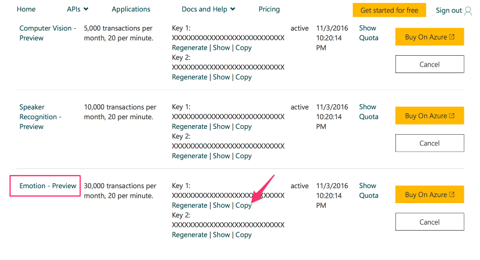

```{r, include=FALSE}
source("tools/chunk-options.R") 
library(tidyverse)
library(dygraphs)
library(xts)
library(stringr)
library(ggplot2)
```
> ## 학습 목표 {.objectives}
>
> * 동영상 데이터를 분석하기 위한 전처리 작업을 살펴본다.
> * 동영상 데이터를 위한 R 툴체인을 구축한다.
> * 동영상 데이터를 인공지능 API에 던져 감정 변화를 분석한다.


## 1. 동영상 분석 개요

동영상은 광고를 보는 조건으로 [유튜브](https://www.youtube.com/)등을 통해 다양한 곳에서 구할 수 있다. 
동영상을 정했으면 다음 단계로 스트리밍 방식 동영상을 파일 동영상으로 변환을 한다. 파일 동영상을 로컬 컴퓨터에 
얻게 되면 동영상 편집기나 R을 포함한 다양한 도구를 통해 통계적 분석도 가능하게 된다.

적당한 크기의 동영상이 되면 이 파일을 R로 불러와서 감정분석을 위해서는 인공지능 API 
(예를 들어, [마이크로소프트 Cognitive Services](https://www.microsoft.com/cognitive-services/en-us/apis))를 통해
동영상 속 인물에 대한 감정을 받아와서 R의 강력한 그래픽 기능을 동원하여 동영상 속 인물의 감정변화를 분석하게 된다.


## 2. 동영상 분석 툴체인

[유튜브](https://www.youtube.com/)에서 대상 분석 동영상을 선정하고 나면 다음 단계로 
url을 복사(이번 경우, [https://www.youtube.com/watch?v=KiJhWHYZkow](https://www.youtube.com/watch?v=KiJhWHYZkow))해서 
[http://www.computerhope.com/issues/ch001002.htm](http://www.computerhope.com/issues/ch001002.htm) 사이트 등을 통해서
유튜브 동영상 스트림을 동영상 파일로 변환시킨다. 

파일을 다운로드 받은 다음 [HandBrake](https://handbrake.fr/downloads.php)와 같은 동영상 편집기를 사용해서 적당한 크기로 
동영상을 편집한다. 

최종 편집된 동영상 파일을 R로 불러읽어와서 통계적 분석을 진행한다. R은 하나의 플랫폼으로 감정분석 및 동영상 분석, 시각화를 
위해 다양한 팩키지가 동원된다.

## 3. 감정분석 동영상 데이터

| 제1차 국민담화 | 제2차 국민담화 | 제2차 국민담화 | 
|-----------------------------------|-----------------------------------|-----------------------------------|
|<iframe width="320" height="180" src="https://www.youtube.com/embed/SuOJEZMPGqE" frameborder="0" allowfullscreen></iframe>|<iframe width="320" height="180" src="https://www.youtube.com/embed/KiJhWHYZkow" frameborder="0" allowfullscreen></iframe>|<iframe width="320" height="180" src="https://www.youtube.com/embed/y8RapzS-JxI" frameborder="0" allowfullscreen></iframe>|


- 제1차 국민담화 : 2016.10.25
    - [동영상](https://www.youtube.com/watch?v=SuOJEZMPGqE)
    - 전문 : [박근혜 대통령 대국민사과 전문](http://news.chosun.com/site/data/html_dir/2016/10/25/2016102502058.html)
- 제2차 국민담화 : 2016.11.04 
    - [동영상](https://www.youtube.com/watch?v=KiJhWHYZkow)
    - 전문: [박근혜 대통령 사과 대국민담화](http://news.khan.co.kr/kh_news/khan_art_view.html?artid=201611041048021)
- 제3차 국민담화 : 2016.11.29
    - [박근혜 대통령 3차 대국민 담화](http://myk.kbs.co.kr/hotclip?shortclip_id=meta_shortclip_k1_myk1_pt201600023101000e6e325be)
    - 전문 : [박근혜 대통령, 대국민 담화 전문](http://www1.president.go.kr/news/newsList2.php?srh[view_mode]=detail&srh[seq]=18402)


## 4. 동영상 감정 분석 [^microfot-ai-and-r] [^microfot-ai-and-python]

[^microfot-ai-and-r]: [Analyzing Emotions using Facial Expressions in Video with Microsoft AI and R](https://blog.exploratory.io/analyzing-emotions-using-facial-expressions-in-video-with-microsoft-ai-and-r-8f7585dd0780#.8tkpux2i2)

[^microfot-ai-and-python]: [How to apply face recognition API technology to data journalism with R and python](https://benheubl.github.io/data%20analysis/fr/)

동영상 감정분석을 위해 미국대선에서 11월에 분석된 파이썬과 R코드를 기반으로 대국민담화 동영상 데이터속 감정변화를 분석한다.

### 4.1. 기본 동영상 분석 

R에서 동영상분석을 위한 팩키지는 공식적으로 배포되는 것은 없고, [GitHub](http://github.com)을 통해 일부 개발중에 있으며 실험목적으로 활용은 가능하다.

``` {r eval=FALSE}
devtools::install_github("swarm-lab/ROpenCVLite")
devtools::install_github("swarm-lab/Rvision")
```


### 4.1. 감정분석 API 사용 권한 획득




``` {r emo-api-ggplot}
# 0. 환경설정------------------------------------------------------------------
# library(stringr)
# library(dplyr)

# 1. 데이터 가져오기-----------------------------------------------------------

emo_01_df <- read_csv("data/park_emo_01.csv")
emo_02_df <- read_csv("data/park_emo_02.csv")
emo_03_df <- read_csv("data/park_emo_03.csv")

# 2. 데이터 정제-----------------------------------------------------------

emo_01_df <- emo_01_df %>% mutate(speech='10-25', frame=1:length(speech)) %>% unite(speech_frame, speech, frame)
emo_02_df <- emo_02_df %>% mutate(speech='11-04', frame=1:length(speech)) %>% unite(speech_frame, speech, frame)
emo_03_df <- emo_03_df %>% mutate(speech='11-29', frame=1:length(speech)) %>% unite(speech_frame, speech, frame)

emo_df <- bind_rows(emo_01_df, emo_02_df, emo_03_df)

emo_long_df <- emo_df %>% gather(key, value, starts_with("scores")) %>%
  mutate(key = str_replace(key, "scores.", "")) %>%
  dplyr::filter(key != 'neutral')

# 3. 데이터 시각화-----------------------------------------------------------
library(ggplot2)
ggplot(emo_long_df, aes(speech_frame, value, group = key, col = key)) +
  # geom_line() +  # would display all the non-smoothed lines
  geom_smooth(method = "loess", n = 100000, se = F,  span = 0.1, aes(linetype=key)) +
  theme_minimal() +
  theme(axis.text.x = element_text(angle = 90, hjust = 1)) +
  scale_x_discrete(breaks = c('10-25_1', '11-04_1', '11-29_1'))
```
