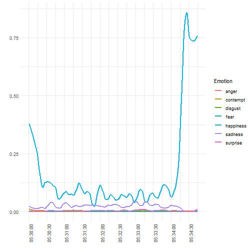

> ## 학습 목표 {.objectives}
>
> * 동영상 데이터를 분석하기 위한 전처리 작업을 살펴본다.
> * 동영상 데이터를 위한 R 툴체인을 구축한다.
> * 동영상 데이터를 인공지능 API에 던져 감정 변화를 분석한다.

## 1. 동영상 분석 개요

동영상은 광고를 보는 조건으로 [유튜브](https://www.youtube.com/)등을 통해 다양한 곳에서 구할 수 있다. 
동영상을 정했으면 다음 단계로 스트리밍 방식 동영상을 파일 동영상으로 변환을 한다. 파일 동영상을 로컬 컴퓨터에 
얻게 되면 동영상 편집기나 R을 포함한 다양한 도구를 통해 통계적 분석도 가능하게 된다.

적당한 크기의 동영상이 되면 이 파일을 R로 불러와서 감정분석을 위해서는 인공지능 API 
(예를 들어, [마이크로소프트 Cognitive Services](https://www.microsoft.com/cognitive-services/en-us/apis))를 통해
동영상 속 인물에 대한 감정을 받아와서 R의 강력한 그래픽 기능을 동원하여 동영상 속 인물의 감정변화를 분석하게 된다.

## 2. 동영상 분석 툴체인

[유튜브](https://www.youtube.com/)에서 대상 분석 동영상을 선정하고 나면 다음 단계로 
url을 복사(이번 경우, [https://www.youtube.com/watch?v=KiJhWHYZkow](https://www.youtube.com/watch?v=KiJhWHYZkow))해서 
[http://www.computerhope.com/issues/ch001002.htm](http://www.computerhope.com/issues/ch001002.htm) 사이트 등을 통해서
유튜브 동영상 스트림을 동영상 파일로 변환시킨다. 

파일을 다운로드 받은 다음 [HandBrake](https://handbrake.fr/downloads.php)와 같은 동영상 편집기를 사용해서 적당한 크기로 
동영상을 편집한다. 

최종 편집된 동영상 파일을 R로 불러읽어와서 통계적 분석을 진행한다. R은 하나의 플랫폼으로 감정분석 및 동영상 분석, 시각화를 
위해 다양한 팩키지가 동원된다.

## 3. 감정분석 동영상 데이터

| 제1차 국민담화 | 제2차 국민담화 | 제2차 국민담화 | 
|-----------------------------------|-----------------------------------|-----------------------------------|
|<iframe width="320" height="180" src="https://www.youtube.com/embed/SuOJEZMPGqE" frameborder="0" allowfullscreen></iframe>|<iframe width="320" height="180" src="https://www.youtube.com/embed/KiJhWHYZkow" frameborder="0" allowfullscreen></iframe>|<iframe width="320" height="180" src="https://www.youtube.com/embed/y8RapzS-JxI" frameborder="0" allowfullscreen></iframe>|

- 제1차 국민담화 : 2016.10.25
    - [동영상](https://www.youtube.com/watch?v=SuOJEZMPGqE)
    - 전문 : [박근혜 대통령 대국민사과 전문](http://news.chosun.com/site/data/html_dir/2016/10/25/2016102502058.html)
- 제2차 국민담화 : 2016.11.04 
    - [동영상](https://www.youtube.com/watch?v=KiJhWHYZkow)
    - 전문: [박근혜 대통령 사과 대국민담화](http://news.khan.co.kr/kh_news/khan_art_view.html?artid=201611041048021)
- 제3차 국민담화 : 2016.11.29
    - [박근혜 대통령 3차 대국민 담화](http://myk.kbs.co.kr/hotclip?shortclip_id=meta_shortclip_k1_myk1_pt201600023101000e6e325be)
    - 전문 : [박근혜 대통령, 대국민 담화 전문](http://www1.president.go.kr/news/newsList2.php?srh[view_mode]=detail&srh[seq]=18402)

## 4. 동영상 감정 분석 [^microfot-ai-and-r] [^microfot-ai-and-python]

[^microfot-ai-and-r]: [Analyzing Emotions using Facial Expressions in Video with Microsoft AI and R](https://blog.exploratory.io/analyzing-emotions-using-facial-expressions-in-video-with-microsoft-ai-and-r-8f7585dd0780#.8tkpux2i2)

[^microfot-ai-and-python]: [How to apply face recognition API technology to data journalism with R and python](https://benheubl.github.io/data%20analysis/fr/)

동영상 감정분석을 위해 미국대선에서 11월에 분석된 파이썬과 R코드를 기반으로 대국민담화 동영상 데이터속 감정변화를 분석한다.

### 4.1. 기본 동영상 분석 

R에서 동영상분석을 위한 팩키지는 공식적으로 배포되는 것은 없고, [GitHub](http://github.com)을 통해 일부 개발중에 있으며 실험목적으로 활용은 가능하다.
`Rvision` 팩키지의 `video()` 함수를 사용해서 [OpenCV](http://opencv.org/) `Rcpp_Image` 객체로 만들고 나서 차원정보를 보게 되면
동영상 화면 정보와 더불어 프레임(frame) 정보를 확인한게 된다.
제3차 담화문 총 8540 프레임중 5000 번째 프레임을 추출해 보자.

~~~{.r}
# 0. 환경설정------------------------------------------------------------------

# devtools::install_github("swarm-lab/videoplayR")
# devtools::install_github("swarm-lab/ROpenCVLite")
# devtools::install_github("swarm-lab/Rvision")
library(Rvision)

# 1. 데이터 가져오기-----------------------------------------------------------

speech_video <- video("03.data/park_speech_03_320.mp4")
dim(speech_video)
## [1]  180.0000  319.3333 8540.0000

# 2. 동영상 이미지 불러오기-----------------------------------------------------------

img_5000 <- readFrame(speech_video, 5000)
plot(img_5000)
~~~

### 4.2. 동영상 얼굴인식

동영상에서 사람 얼굴을 인식하고 인식된 영역에 사각형으로 표식을 한다.
이를 위해 `Rvision` 팩키지 `video()` 함수로 동영상을 읽어오고, [Microsoft Emotion API](https://www.microsoft.com/cognitive-services/en-us/emotion-api)를 통해
동영상 분석 감정분석과 더불어 얼굴 영역을 탐지해서 저장한 데이터프레임을 불러 읽어온다.
그리고 `plot()` 함수를 통해 시각화하고 나서 `rect` 함수로 얼굴영역에 직사각형을 그리고, 감정을 분석한 수치값을 
감정 각각의 라벨과 더불어 표식한다.

~~~{.r}
# 0. 환경설정------------------------------------------------------------------

# devtools::install_github("swarm-lab/videoplayR")
# devtools::install_github("swarm-lab/ROpenCVLite")
# devtools::install_github("swarm-lab/Rvision")
library(Rvision)
library(tidyverse)
library(stringr)
# 1. 데이터 가져오기-----------------------------------------------------------

speech_video <- video("03.data/park_speech_03_320.mp4")
emo_df <- read_csv("03.data/park_emo_03.csv")
# scores. 변수명 제거
names(emo_df) <- str_replace(names(emo_df), "scores.", "")

# 2. 동영상 이미지 불러오기-----------------------------------------------------------
iframe <- 200
img_iframe <- readFrame(speech_video, iframe)
plot(img_iframe)

x_dim <- dim(img_iframe)[2]
y_dim <- dim(img_iframe)[1]

# 얼굴 위치 사각형 표시
with(emo_df[iframe,], 
  rect(x*x_dim, (y_dim-(y)*y_dim), (x+width)*x_dim, (y_dim-(y)*y_dim - (height)*y_dim), border = "red"))

# 다양한 감정 수치화
with(emo_df[iframe,], 
    text(x*x_dim+75, (y_dim-(y)*y_dim), bquote(paste("neutral:", .(neutral))), cex = .75, col="red"))
with(emo_df[iframe,], 
    text(x*x_dim+75, (y_dim-(y)*y_dim)-10, bquote(paste("happiness:", .(happiness))), cex = .75, col="red"))
with(emo_df[iframe,], 
     text(x*x_dim+75, (y_dim-(y)*y_dim)-20, bquote(paste("surprise:", .(surprise))), cex = .75, col="red"))
with(emo_df[iframe,], 
     text(x*x_dim+75, (y_dim-(y)*y_dim)-30, bquote(paste("sadness:", .(sadness))), cex = .75, col="red"))
with(emo_df[iframe,], 
     text(x*x_dim+75, (y_dim-(y)*y_dim)-40, bquote(paste("anger:", .(anger))), cex = .75, col="red"))
with(emo_df[iframe,], 
     text(x*x_dim+75, (y_dim-(y)*y_dim)-50, bquote(paste("disgust:", .(disgust))), cex = .75, col="red"))
with(emo_df[iframe,], 
     text(x*x_dim+75, (y_dim-(y)*y_dim)-60, bquote(paste("fear:", .(fear))), cex = .75, col="red"))
with(emo_df[iframe,], 
     text(x*x_dim+75, (y_dim-(y)*y_dim)-70, bquote(paste("contempt:", .(contempt))), cex = .75, col="red"))
~~~

### 4.3. 동영상 얼굴인식 애니메이션 

동영상이 수천 프레임이라 매우 길어 해당 동영상에서 10개 프레임만 뽑아 이를 `.git` 파일로 만들어 감정변화에 대한 
내용을 확인한다. 앞서 개별적으로 동영상에서 추출한 이미지 위에 얼굴의 위치를 사각형으로 표시하고 나서,
각 감정별 라벨과 수치도 함께 표현한 이미지를 10개 반복문을 통해 생성하고 이를 특정 디렉토리에 저장시킨다.
그리고 나서, `animation` 팩키지 `im.convert` 함수를 사용해서 `.gif` 파일 하나로 생성한다.

~~~{.r}
# 3. 동영상 + 감정 이미지-----------------------------------------------------------
# 10 개 프레임만 선택
idx <- seq(1, dim(speech_video)[3], length.out=10)

for(iframe in seq_along(idx)){
  img_iframe <- readFrame(speech_video, iframe)
  plot(img_iframe)
  
  x_dim <- dim(img_iframe)[2]
  y_dim <- dim(img_iframe)[1]
  
  with(emo_df[iframe,], 
       rect(x*x_dim, (y_dim-(y)*y_dim), (x+width)*x_dim, (y_dim-(y)*y_dim - (height)*y_dim), border = "red"))

  with(emo_df[iframe,], 
       text(x*x_dim+75, (y_dim-(y)*y_dim), bquote(paste("neutral:", .(neutral))), cex = .75, col="red"))
  with(emo_df[iframe,], 
       text(x*x_dim+75, (y_dim-(y)*y_dim)-10, bquote(paste("happiness:", .(happiness))), cex = .75, col="red"))
  with(emo_df[iframe,], 
       text(x*x_dim+75, (y_dim-(y)*y_dim)-20, bquote(paste("surprise:", .(surprise))), cex = .75, col="red"))
  with(emo_df[iframe,], 
       text(x*x_dim+75, (y_dim-(y)*y_dim)-30, bquote(paste("sadness:", .(sadness))), cex = .75, col="red"))
  with(emo_df[iframe,], 
       text(x*x_dim+75, (y_dim-(y)*y_dim)-40, bquote(paste("anger:", .(anger))), cex = .75, col="red"))
  with(emo_df[iframe,], 
       text(x*x_dim+75, (y_dim-(y)*y_dim)-50, bquote(paste("disgust:", .(disgust))), cex = .75, col="red"))
  with(emo_df[iframe,], 
       text(x*x_dim+75, (y_dim-(y)*y_dim)-60, bquote(paste("fear:", .(fear))), cex = .75, col="red"))
  with(emo_df[iframe,], 
       text(x*x_dim+75, (y_dim-(y)*y_dim)-70, bquote(paste("contempt:", .(contempt))), cex = .75, col="red"))
}

# 4. GIF 만들기-------------------------
idx <- seq(1, dim(speech_video)[3], length.out=10)

for(iframe in seq_along(idx)){
  png(filename=paste0("06.images/img_",iframe,".png"))
  img_iframe <- readFrame(speech_video, iframe)
  plot(img_iframe)
  
  x_dim <- dim(img_iframe)[2]
  y_dim <- dim(img_iframe)[1]
  
  with(emo_df[iframe,], 
       rect(x*x_dim, (y_dim-(y)*y_dim), (x+width)*x_dim, (y_dim-(y)*y_dim - (height)*y_dim), border = "red"))
  
  with(emo_df[iframe,], 
       text(x*x_dim+75, (y_dim-(y)*y_dim), bquote(paste("neutral:", .(neutral))), cex = .75, col="red"))
  with(emo_df[iframe,], 
       text(x*x_dim+75, (y_dim-(y)*y_dim)-10, bquote(paste("happiness:", .(happiness))), cex = .75, col="red"))
  with(emo_df[iframe,], 
       text(x*x_dim+75, (y_dim-(y)*y_dim)-20, bquote(paste("surprise:", .(surprise))), cex = .75, col="red"))
  with(emo_df[iframe,], 
       text(x*x_dim+75, (y_dim-(y)*y_dim)-30, bquote(paste("sadness:", .(sadness))), cex = .75, col="red"))
  with(emo_df[iframe,], 
       text(x*x_dim+75, (y_dim-(y)*y_dim)-40, bquote(paste("anger:", .(anger))), cex = .75, col="red"))
  with(emo_df[iframe,], 
       text(x*x_dim+75, (y_dim-(y)*y_dim)-50, bquote(paste("disgust:", .(disgust))), cex = .75, col="red"))
  with(emo_df[iframe,], 
       text(x*x_dim+75, (y_dim-(y)*y_dim)-60, bquote(paste("fear:", .(fear))), cex = .75, col="red"))
  with(emo_df[iframe,], 
       text(x*x_dim+75, (y_dim-(y)*y_dim)-70, bquote(paste("contempt:", .(contempt))), cex = .75, col="red"))
  
  dev.off()
}
# GIF 만들기
library(animation)
im.convert("06.images/*.png", output = "img_animation.gif")
~~~

## 5. 인공지능 API를 활용한 동영상 감정 추출

동영상 속 인물의 감정을 파악하기 위해 감정분석 API를 사용할 수 있는 권한을 획득한다.
마이크로소프트 [Emotion API](https://www.microsoft.com/cognitive-services/en-us/emotion-api)에 가입하고
감정분석 API 키를 받아 이를 무료로 부여된 할당량만큼 사용한다. 연구 및 초기 실험 목적으로 충분히 무료로 활용할 횟수를 제공하고 있다.

### 5.1. 감정분석 API 사용 권한 획득

마이크로소프트 [Cognitive Services APIs](https://www.microsoft.com/cognitive-services) 중 관련있는 
[Emotion API](https://www.microsoft.com/cognitive-services/en-us/emotion-api)의 동영상 감정분석 API키를 복사한다.
R이나 파이썬 프로그램에서 동영상 감정분석을 요청할 때 활용되고, 외부에 유출될 경우 곤란할 수 있으니 보안에 각별히 신경쓴다.

### 5.2. 동영상을 업로드하고 감정데이터 받아오기

동영상을 마이크로소프트 [Cognitive Services APIs](https://www.microsoft.com/cognitive-services)에 업로드하고 
동영상에서 감정을 프레임 단위로 추출하도록 R 프로그램을 작성한다. 
인공지능 기술 활용 방안으로 미국 대선 트럼프와 힐러리 토론에 감정인식 기술을 적용시켜 데이터 저널리즘의 새로운 가능성을 제시했다.

1. 마이크로소프트 감정 API를 활용할 설정을 한다.
    - 비디오 API `perFrame` 출력결과에 대한 엔드포인트 설정
    - 감정(Emotion) API 키값을 설정
1. 감정을 분석할 동영상을 설정한다.
	- 100 MB 이상되면 마이크로소프트 인공지능 API에서 동영상 분석을 거부
	- 여러가지 이유로 보안이나 접속이 제한된 경우 동영상 분석이 되지 않을 수 있음.
1. 각 프레임별 감정분석을 실행
    - 각 프레임별 감정분석을 진행하고 이를 결과값으로 저장한다.
    - 반환받은 결과값이 익숙한 형태의 데이터프레임으로 변환
1. 인공지능 API를 실행해서 돌려받은 결과는 로컬 파일로 저장

~~~{.r}
library(tidyverse)
library(httr)

# `perFrame` 출력결과에 대한 비디오 API의 감정 엔드포인트 설정
apiUrl <- "https://api.projectoxford.ai/emotion/v1.0/recognizeInVideo?outputStyle=perFrame"
# 감정(Emotion) API 키값 설정
key <- "XXXXXXXXXXXXXXXXXXXXXXXXXXXXXXXX"

# 감정을 분석할 비디오 URL 설정
urlVideo <- 'https://github.com/statkclee/identify_age_with_oxford_api/raw/master/03_data/park_speech_03_320.mp4'

mybody <- list(url = urlVideo)
# 마이크로소프트 인공지능 API에 데이터 요청
faceEMO <- httr::POST(
  url = apiUrl,
  httr::content_type('application/json'),
  httr::add_headers(.headers = c('Ocp-Apim-Subscription-Key' = key)),
  body = mybody,
  encode = 'json'
)
# 인공지능 API 요청하여 돌려받은 출력결과를 저장할 장소 설정
operationLocation <- httr::headers(faceEMO)[["operation-location"]]

while(TRUE){
  ret <- httr::GET(operationLocation,
                   httr::add_headers(.headers = c('Ocp-Apim-Subscription-Key' = key)))
  con <- httr::content(ret)
  if(is.null(con$status)){
    warning("Connection Error, retry after 1 minute")
    Sys.sleep(60)
  } else if (con$status == "Running" | con$status == "Uploading"){
    cat(paste0("status ", con$status, "\n"))
    cat(paste0("progress ", con$progress, "\n"))
    Sys.sleep(60)
  } else {
    cat(paste0("status ", con$status, "\n"))
    break()
  }
}
data <- (con$processingResult %>% jsonlite::fromJSON())$fragments

# status Uploading
# progress 
# status Running
# progress 3.04
# status Running
# progress 9.15
# status Running
# progress 15.27
# status Running
# progress 21.38
# status Running
# progress 24.43
# status Running
# progress 33.6
# status Running
# progress 39.71
# status Running
# progress 45.82
# status Running
# progress 51.93
# status Running
# progress 58.04
# status Running
# progress 64.15
# status Running
# progress 70.26
# status Running
# progress 76.38
# status Running
# progress 82.49
# status Running
# progress 88.86
# status Running
# progress 94.94
# status Succeeded

# 결과값이 data$events로 저장되어 있는데 데이터프레임 칼럼을 갖는 이벤트 리스트가 자료형이라 
# 루프를 돌려 평평하게 펴서 익숙한 데이터프레임 형태로 변환시킨다.
data$events <- purrr::map(data$events, function(events){
  events %>% purrr::map(function(event){
    jsonlite::flatten(event)
  }) %>% bind_rows()
})
data

# 결과값을 csv 파일로 저장시킨다.
park_emo_03_df <- data %>% unnest(events)
write_csv(park_emo_03_df, "04.output/park_emo_03.csv")
~~~

### 5.3. 동영상 감정 분석 시각화

동영상 속 사람이 여럿 존재하는 경우 각각을 추적해서 식별해야 하는 문제가 있어,
가능하면 동영상속 사람이 한명 존재하고 이를 끝까지 추적하는 것이 이후 데이터 분석과정도 단순화할 수 있는 장점이 있다.
세차례에 걸친 담화 분석결과를 하나의 데이터 프레임으로 묶어 연결시키고 나서 이를 `ggplot` 팩키지를 통해 시각화한다.
동영상 프레임이 쭉 연결되기 때문에 10월 25일, 11월 4일, 11월 29일 첫번째 프레임으로 기준으로 동영상 각각을 구별한다.

~~~{.r}
# 0. 환경설정------------------------------------------------------------------
# library(stringr)
# library(dplyr)

# 1. 데이터 가져오기-----------------------------------------------------------

emo_01_df <- read_csv("data/park_emo_01.csv")
~~~

~~~{.output}
Parsed with column specification:
cols(
  x = col_double(),
  y = col_double(),
  width = col_double(),
  height = col_double(),
  scores.neutral = col_double(),
  scores.happiness = col_double(),
  scores.surprise = col_double(),
  scores.sadness = col_double(),
  scores.anger = col_double(),
  scores.disgust = col_double(),
  scores.fear = col_double(),
  scores.contempt = col_double()
)

~~~

~~~{.r}
emo_02_df <- read_csv("data/park_emo_02.csv")
~~~

~~~{.output}
Parsed with column specification:
cols(
  x = col_double(),
  y = col_double(),
  width = col_double(),
  height = col_double(),
  scores.neutral = col_double(),
  scores.happiness = col_double(),
  scores.surprise = col_double(),
  scores.sadness = col_double(),
  scores.anger = col_double(),
  scores.disgust = col_double(),
  scores.fear = col_double(),
  scores.contempt = col_double()
)

~~~

~~~{.r}
emo_03_df <- read_csv("data/park_emo_03.csv")
~~~

~~~{.output}
Parsed with column specification:
cols(
  x = col_double(),
  y = col_double(),
  width = col_double(),
  height = col_double(),
  scores.neutral = col_double(),
  scores.happiness = col_double(),
  scores.surprise = col_double(),
  scores.sadness = col_double(),
  scores.anger = col_double(),
  scores.disgust = col_double(),
  scores.fear = col_double(),
  scores.contempt = col_double()
)

~~~

~~~{.r}
# 2. 데이터 정제-----------------------------------------------------------

emo_01_df <- emo_01_df %>% mutate(speech='10-25', frame=1:length(speech)) %>% unite(speech_frame, speech, frame)
emo_02_df <- emo_02_df %>% mutate(speech='11-04', frame=1:length(speech)) %>% unite(speech_frame, speech, frame)
emo_03_df <- emo_03_df %>% mutate(speech='11-29', frame=1:length(speech)) %>% unite(speech_frame, speech, frame)

emo_df <- bind_rows(emo_01_df, emo_02_df, emo_03_df)

emo_long_df <- emo_df %>% gather(key, value, starts_with("scores")) %>%
  mutate(key = str_replace(key, "scores.", "")) %>%
  dplyr::filter(key != 'neutral')

# 3. 데이터 시각화-----------------------------------------------------------
library(ggplot2)
ggplot(emo_long_df, aes(speech_frame, value, group = key, col = key)) +
  # geom_line() +  # 평활이 되지 않는 모든 선이 시각화 됨.
  geom_smooth(method = "loess", n = 100000, se = F,  span = 0.1) +
  theme_minimal() +
  theme(axis.text.x = element_text(angle = 90, hjust = 1)) +
  scale_x_discrete(breaks = c('10-25_1', '11-04_1', '11-29_1'))
~~~

### 5.4. 시간별 감정 변화 

대국민 담화 1차, 2차, 3차 시작 시간은 1차 담화의 경우 녹화를 하여 오후 5시에 담화를 가졌으며,
2차 담화는 오전 10시반, 3차 담화는 오후 2시 30분 시작되었고, 각 담화별 시간은 1차 담화의 경우 1분 42초,
2차 담화의 경우 9분 14초, 3차 담화의 경우 4분 45초 동안 진행되었다.

- 제1차 담화: 10월 25일, 17시 00분 [조지 6세가 ‘킹스 스피치’를 배운 이유](http://news.joins.com/article/20800106)
- 제2차 담화: 11월 04일, 10시 30분 [박근혜 대통령 2차 대국민사과…지지율 5% 반전?](http://www.newdaily.co.kr/news/article.html?no=326166)
- 제3차 담화: 11월 29일, 14시 30분 [박대통령, 오후 2시30분 3차 대국민 담화 예정](http://www.polinews.co.kr/news/article.html?no=295335)

담화 시작 시간별 감정 변화를 시각화해 보자. `ggplot`에서 시계열 데이터를 시각화하기 위해서 먼저 x-축에 시간 정보를 넣어야 되기 때문에
데이터프레임에 시간정보를 갖는 변수를 생성시킨다. 시간 정보를 생성시키는 함수는 `strptime()` 함수를 사용해서 `times`라는 변수로 저장하고,
이를 `ggplot`에서 x-축에 넣고 `scale_x_datetime` 함수를 사용하여 30초 간격으로 감정변화를 시각화시킨다.

~~~{.r}
# 3차 담화 
emo_03_df <- read_csv("data/park_emo_03.csv")
~~~

~~~{.output}
Parsed with column specification:
cols(
  x = col_double(),
  y = col_double(),
  width = col_double(),
  height = col_double(),
  scores.neutral = col_double(),
  scores.happiness = col_double(),
  scores.surprise = col_double(),
  scores.sadness = col_double(),
  scores.anger = col_double(),
  scores.disgust = col_double(),
  scores.fear = col_double(),
  scores.contempt = col_double()
)

~~~

~~~{.r}
emo_03_df$times <- strptime("2016-11-29 14:30:00", format="%Y-%m-%d %H:%M:%OS", tz="Asia/Seoul") + seq(1, by = 1/30, length.out = dim(emo_03_df)[1])

emo_long_df <- emo_03_df %>% gather(key, value, starts_with("scores")) %>%
  mutate(key = str_replace(key, "scores.", "")) %>%
  dplyr::filter(key != 'neutral')

# 3. 데이터 시각화-----------------------------------------------------------
ggplot(emo_long_df, aes(times, value, group = key, col = key)) +
  # geom_line() +  # would display all the non-smoothed lines
  geom_smooth(method = "loess", n = 100000, se = F,  span = 0.1) +
  theme_minimal() +
  theme(axis.text.x = element_text(angle = 90, hjust = 1)) +
  scale_x_datetime(breaks = date_breaks(width ="30 sec"), labels=date_format("%H:%M:%S")) +
  labs(colour = "Emotion") +
  xlab("") +
  ylab("")
~~~

## 6. 분석 데이터

동영상 감정 분석에 활용된 원본 동영상과 마이크로소프트 비디오 API와 감정 API로 반환받은 데이터는 
[GitHub](https://github.com/statkclee/identify_age_with_oxford_api/tree/master/03_data)에서 확인할 수 있다.
