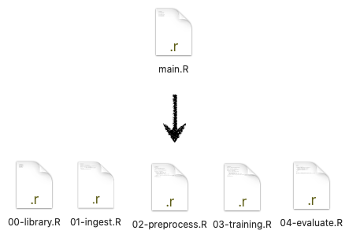

``` {r setup, include=FALSE}
knitr::opts_chunk$set(echo = TRUE, message=FALSE, warning=FALSE,
                      comment="", digits = 3, tidy = FALSE, prompt = FALSE, fig.align = 'center')

knitr::opts_knit$set(global.par = TRUE) 
```

# R코드 딥러닝 모형 {#automation-r-deep-learning}

가장 먼저 준비할 사항은 캡챠를 깨기 위한 코드를 작성한 후에 자동화 스크립트를 만드는 것이다. 이를 위해서 `source()` 함수를 사용해서 각 실행 단계별로 코드를 쭉 실행시킨다.



즉 각 단계별로 R 코드를 스크립트로 작성하여 순차적으로 실행시키고 이를 다시 `run_main()` 함수로 작성하여 작성한 딥러닝 모형 결과를 바로 확인할 수 있도록 코드를 작성한다.

```{r run-main, eval = FALSE}
run_main <- function() {
    source("00-library.R")
    
    source("01-ingest.R")
    
    source("02-preprocess.R")
    
    source("03-training.R")
    
    source("04-evaluate.R")
}

run_main()

── Attaching packages ────────────────────────────────────────────────────────────── tidyverse 1.2.1 ──
✓ ggplot2 3.2.1     ✓ purrr   0.3.4
✓ tibble  2.1.3     ✓ dplyr   0.8.3
✓ tidyr   1.0.0     ✓ stringr 1.4.0
✓ readr   1.3.1     ✓ forcats 0.4.0
── Conflicts ───────────────────────────────────────────────────────────────── tidyverse_conflicts() ──
x dplyr::filter() masks stats::filter()
x dplyr::lag()    masks stats::lag()
Linking to ImageMagick 6.9.9.39
Enabled features: cairo, fontconfig, freetype, lcms, pango, rsvg, webp
Disabled features: fftw, ghostscript, x11

Attaching package: ‘glue’

The following object is masked from ‘package:dplyr’:

    collapse

15.549 sec elapsed
----------------------------------------------------------------
- 정확도:  4.67  %
----------------------------------------------------------------
Warning messages:
1: package ‘purrr’ was built under R version 3.6.2 
2: package ‘glue’ was built under R version 3.6.2 
```

## 이미지 전처리 추가 {#automation-advanced-deep-learning}

이미지 전처리를 통해서 Captcha 이미지에서 불필요하다고 생각되는 선을 제거한 후에 다시 OCR 엔진에 던져 정확도로를 확인한다.

<div class = "row">
  <div class = "col-md-6">
**이미지 전처리 전**

```{r image-preprocessing-captcha}
library(tidyverse)
library(magick)

orignal_img <- image_read("data/captcha_dataset/226md.png")
orignal_img %>% 
  image_resize("377x")
```

  </div>
  <div class = "col-md-6">
**이미지 전처리 후**

```{r image-preprocessing-captcha-morph}
orignal_img %>% 
  image_convert(colorspace = 'gray') %>%
  image_threshold(threshold = "50%", type = "white") %>% 
  image_deskew() %>% 
  image_morphology('Dilate', "Diamond", iterations = 2)  %>% 
  image_resize("377x")
```

  </div>
</div>

캡챠 이미지를 전처리하여 OCR 엔진에 넣은 성능은 `r 20.552 - 15.549` 만큼 더 걸렸지만, 성능은 `r 7.94 - 4.67` % 소폭 상승했다.

<div class = "row">
  <div class = "col-md-6">
**성능(이미지 전처리 전)**

```{r before-preprocessing, eval = FALSE}
15.549 sec elapsed
----------------------------------------------------------------
- 정확도:  4.67  %
----------------------------------------------------------------
```

  </div>
  <div class = "col-md-6">
**성능(이미지 전처리 후)**

```{r after-preprocessing, eval = FALSE}
20.552 sec elapsed
----------------------------------------------------------------
- 정확도:  7.94  %
----------------------------------------------------------------
```

  </div>
</div>


