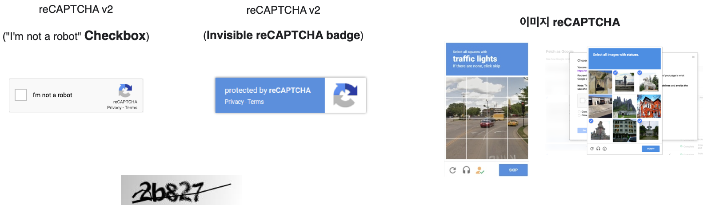

``` {r setup, include=FALSE}
knitr::opts_chunk$set(echo = TRUE, message=FALSE, warning=FALSE,
                      comment="", digits = 3, tidy = FALSE, prompt = FALSE, fig.align = 'center')

knitr::opts_knit$set(global.par = TRUE) 
```

<div class="g-recaptcha form-field" data-sitekey="6LfW6wATAAAAAHLqO2pb8bDBahxlMxNdo9g947u9"><div style="width: 304px; height: 78px;"><div><iframe src="https://www.google.com/recaptcha/api2/anchor?ar=1&amp;k=6LfW6wATAAAAAHLqO2pb8bDBahxlMxNdo9g947u9&amp;co=aHR0cHM6Ly9yZWNhcHRjaGEtZGVtby5hcHBzcG90LmNvbTo0NDM.&amp;hl=en&amp;v=JPZ52lNx97aD96bjM7KaA0bo&amp;size=normal&amp;cb=qk3j3v1xun3b" width="304" height="78" role="presentation" name="a-pi7jm04ezku2" frameborder="0" scrolling="no" sandbox="allow-forms allow-popups allow-same-origin allow-scripts allow-top-navigation allow-modals allow-popups-to-escape-sandbox"></iframe></div><textarea id="g-recaptcha-response" name="g-recaptcha-response" class="g-recaptcha-response" style="width: 250px; height: 40px; border: 1px solid rgb(193, 193, 193); margin: 10px 25px; padding: 0px; resize: none; display: none;"></textarea></div>

# 캡차 {#what-is-capcha} 

[reCaptcha](https://namu.wiki/w/reCAPTCHA)는 사람에게는 쉽지만, 기계(봇, bot)에게는 어려운 문제(Easy on Humans, Hard on Bots)를 만들어 개발된 시스템이 기계에 의해 오남용되는 것을 방지하고자 하는 목적으로 개발되었다.

구글이 이 분야에서 앞서가고 있다보니 다음 동영상에 `reCaptcha V3`를 도입한 효과에 대해서 잘 파악할 수 있다.

- 홈페이지: 스크래퍼를 필터링하는 동안 관리 콘솔에서 트래픽을 일관적으로 볼 수 있다.
- 로그인: 점수가 낮으면 이중 인증(2FA)나 이메일 인증을 요구해서 무차별 대입 공격(브루트포스)를 막을 수 있다.
- 소셜: 악성 유저의 친구 요청을 제한하고 위험한 댓글을 검토로 보낼 수 있다.
- 전자상거래: 봇보다 먼저 판매할 수 있고 위험한 사기 거래를 식별할 수 있다.

<iframe width="300" height="180" src="https://www.youtube.com/embed/tbvxFW4UJdU" frameborder="0" allow="accelerometer; autoplay; encrypted-media; gyroscope; picture-in-picture" allowfullscreen></iframe>

# 캡챠 종류 {#captcha-type}

캡챠는 전통적인 숫자를 보고 타이핑하여 방법부터 단순히 마우스를 클릭하는
체크박스(checkbox)를 거쳐 이미지 퍼즐을 맞추는 진화된 형태가 존재한다. 



# 캡차 파해법 {#captcha-breaker}

단순한 캡챠의 경우 "인간 OCR" 업무를 RPA에 힘을 불어넣는 방식으로 추진될 수 있는데 다음 기반 기술이 필요하다.

1. 데이터셋 
1. 라벨 데이터 (Annotation)
1. 캡챠 탐지 (YOLO)
1. tesseract OCR
1. 딥러닝 


