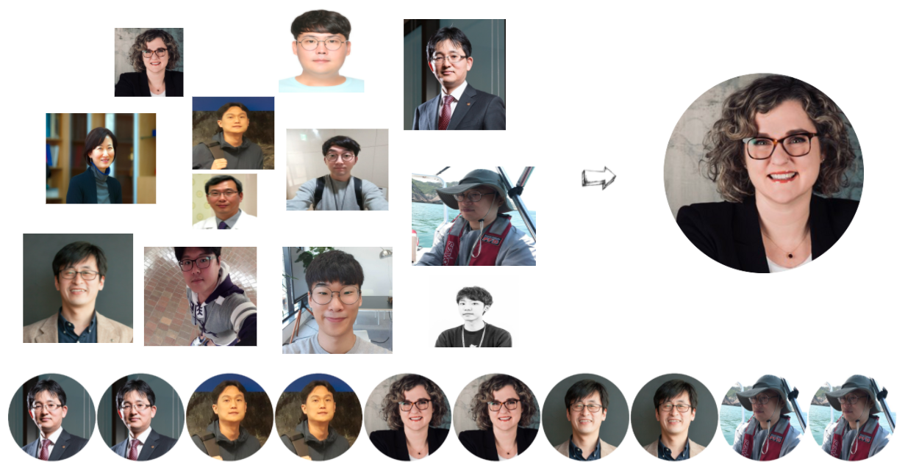

``` {r setup, include=FALSE}
knitr::opts_chunk$set(echo = TRUE, message=FALSE, warning=FALSE,
                      comment="", digits = 3, tidy = FALSE, prompt = FALSE, fig.align = 'center')

knitr::opts_knit$set(global.par = TRUE) 
```



# 한국 R 컨퍼런스 {#korean-r-conference}

[한국 R 컨퍼런스](https://use-r.kr)에 다양한 발표자가 프로필 사진을 보내주셨기 때문에 어떤 형태로든 이를 표준화시킬 필요가 있다. 가장 일반적인 방식은 사진속 얼굴을 중심으로 작은 원을 통해 졸업앨범과 같은 느낌을 구현하는 것이 아닌가 싶다.

# 얼굴 인식 {#recognized-faces}

가장 먼저 사진속 얼굴을 인식하는 것이다. 코를 중심으로 가로세로 위치를 통해 얼굴이 특정된 이미지를 찾아내고 그 다음 단계로 작은 원을 그려 졸업앨범 발표자 사진으로 표준화시키는 것이다.


## `opencv` 환경 설정 {#recognized-faces-env}

[ropensci opencv](https://github.com/ropensci/opencv) 팩키지를 기본으로 하여 외부 `opencv` 기능을 활용하여 얼굴을 잡아내도록 한다. `opencv`가 운영체제에 설치되어 있어야 하기 때문에 먼저 다음 명령어로 맥의 경우 설치한다.

```{r install-mac-opencv, eval = FALSE}
brew install opencv
```

`opencv` 팩키지를 R에서 사용할 수 있도록 `opencv` R 팩키지도 설치한다.

```{r install-opencv-r-pkg, eval = FALSE}
install.packages("opencv")
```

## 헬로 월드 {#helloworld-faces}

`opencv` R 팩키지를 사용해서 발표자 얼굴을 인식해서 특정 부분을 뽑아내는 사례를 만들어보자.

```{r face-recognition}
library(tidyverse)
library(opencv)
library(magick)

julia_raw <- ocv_read('fig/rconf_speakers/julia_silge.jpg')
julia_face <- ocv_face(julia_raw)

julia_face
```

`opencv` 팩키지 `ocv_facemask()` 함수를 사용해서 사진속 얼굴 마스크 정보를 추출하자.

```{r face-info}
julia_face_info <- ocv_facemask(julia_face)

attributes(julia_face_info)
```

이미지에서 얼굴과 관련된 중요정보를 데이터프레임으로 추출한다.

```{r face-info-tibble}
julia_tbl <- attr(julia_face_info, "faces") %>% 
  as_tibble()

julia_tbl
```


## 얼굴인식 영역 {#helloworld-faces-bbox}

인식한 얼굴의 영역을 원이 아니라 영역상자(bouding box)를 통해 원본 이미지 위에 표현해보자.
인식한 얼굴의 좌표를 바탕으로 얼굴이 위치한 곳에 녹색 영역상자를 그려보자.

```{r face-recognition-bbox}

julia_img <- image_read("fig/rconf_speakers/julia_silge.jpg")

## 영역 표시 -------------------------
julia_draw <- image_draw(julia_img)

rect(xleft   = julia_tbl$x - julia_tbl$radius, 
     xright  = julia_tbl$x + julia_tbl$radius,
     ybottom = julia_tbl$y - julia_tbl$radius,
     ytop    = julia_tbl$y + julia_tbl$radius, border = "green", lwd = 5)

dev.off()

fs::dir_create("fig/rconf_speakers_processed")

julia_draw %>% 
  image_write("fig/rconf_speakers_processed/julia_rect.png")
```

`image_read()` 함수로 저장한 이미지를 불러와서 확인해보자.

```{r check-julia-bbox}
julia_bbox_img <-  
  image_read("fig/rconf_speakers_processed/julia_rect.png")

julia_bbox_img
```

