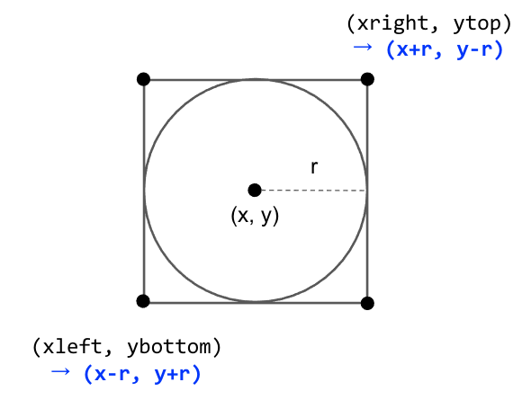

``` {r setup, include=FALSE}
knitr::opts_chunk$set(echo = TRUE, message=FALSE, warning=FALSE,
                      comment="", digits = 3, tidy = FALSE, prompt = FALSE, fig.align = 'center')

knitr::opts_knit$set(global.par = TRUE) 
```


# 한국 R 컨퍼런스 {#korean-r-conference}

[한국 R 컨퍼런스](https://use-r.kr)에 다양한 발표자가 프로필 사진을 보내주셨기 때문에 어떤 형태로든 이를 표준화시킬 필요가 있다. 가장 일반적인 방식은 사진속 얼굴을 중심으로 작은 원을 통해 졸업앨범과 같은 느낌을 구현하는 것이 아닌가 싶다.

# 얼굴 인식 {#recognized-faces}

가장 먼저 사진속 얼굴을 인식하는 것이다. 코를 중심으로 가로세로 위치를 통해 얼굴이 특정된 이미지를 찾아내고 그 다음 단계로 작은 원을 그려 졸업앨범 발표자 사진으로 표준화시키는 것이다.


## `opencv` 환경 설정 {#recognized-faces-env}

[ropensci opencv](https://github.com/ropensci/opencv) 팩키지를 기본으로 하여 외부 `opencv` 기능을 활용하여 얼굴을 잡아내도록 한다. `opencv`가 운영체제에 설치되어 있어야 하기 때문에 먼저 다음 명령어로 맥의 경우 설치한다.

```{r install-mac-opencv, eval = FALSE}
brew install opencv
```

`opencv` 팩키지를 R에서 사용할 수 있도록 `opencv` R 팩키지도 설치한다.

```{r install-opencv-r-pkg, eval = FALSE}
install.packages("opencv")
```

## 헬로 월드 {#helloworld-faces}

`opencv` R 팩키지를 사용해서 발표자 얼굴을 인식해서 특정 부분을 뽑아내는 사례를 만들어보자.

```{r face-recognition}
library(tidyverse)
library(opencv)
library(magick)

julia_raw <- ocv_read('fig/rconf_speakers/julia_silge.jpg')
julia_face <- ocv_face(julia_raw)

julia_face
```

`opencv` 팩키지 `ocv_facemask()` 함수를 사용해서 사진속 얼굴 마스크 정보를 추출하자.

```{r face-info}
julia_face_info <- ocv_facemask(julia_face)

attributes(julia_face_info)
```

이미지에서 얼굴과 관련된 중요정보를 데이터프레임으로 추출한다.

```{r face-info-tibble}
julia_tbl <- attr(julia_face_info, "faces") %>% 
  as_tibble()

julia_tbl
```


## 얼굴인식 영역 {#helloworld-faces-bbox}

인식한 얼굴의 영역을 원이 아니라 영역상자(bouding box)를 통해 원본 이미지 위에 표현해보자.
인식한 얼굴의 좌표를 바탕으로 얼굴이 위치한 곳에 녹색 영역상자를 그려보자. 먼저 원으로 된 좌표를 정사각형으로 변화시키는데 필요한 로직을 정리하면 다음과 같다. `rect()` 함수의 인자값에 맞춰야 하기 때문에 다음 수식을 사용한다.




```{r face-recognition-bbox}

julia_img <- image_read("fig/rconf_speakers/julia_silge.jpg")

## 영역 표시 -------------------------
julia_draw <- image_draw(julia_img)

rect(xleft   = julia_tbl$x - julia_tbl$radius, 
     xright  = julia_tbl$x + julia_tbl$radius,
     ybottom = julia_tbl$y - julia_tbl$radius,
     ytop    = julia_tbl$y + julia_tbl$radius, border = "green", lwd = 5)

dev.off()

fs::dir_create("fig/rconf_speakers_processed")

julia_draw %>% 
  image_write("fig/rconf_speakers_processed/julia_rect.png")
```

`image_read()` 함수로 저장한 이미지를 불러와서 확인해보자.

```{r check-julia-bbox}
julia_bbox_img <-  
  image_read("fig/rconf_speakers_processed/julia_rect.png")

julia_bbox_img
```


## 얼굴 추출 함수 {#extract-face-from-image}

앞선 알고리즘을 바탕으로 사진을 입력값으로 넣었을 때 얼굴을 추출하여 이미지로 저장하는 함수를 작성해보자.
원본 이미지 경로를 받아 이미지에서 얼굴 좌표를 얻어내고 이미지 영역 표시를 거쳐 얼굴 영역만 짤라낸다.
그리고 추출된 이미지를 적절한 확장자를 붙여 로컬 파일에 저장시킨다.

```{r make-face-detection-function}

extract_face <- function(raw_image) {
  # 1. 얼굴인식 좌표 추출 --------------
  figure_face_info <- ocv_read(raw_image) %>% 
    ocv_facemask()
  
  ## 데이터프레임 자료구조 변환
  face_tbl <- attr(figure_face_info, "faces") %>% 
  as_tibble()
  
  # 2. 이미지 영역 표시 -------------
  figure_img <- image_read(raw_image)

  ## 영역 표시 -------------------------
  figure_draw <- image_draw(figure_img)
  
  rect(xleft   = face_tbl$x - face_tbl$radius, 
       xright  = face_tbl$x + face_tbl$radius,
       ybottom = face_tbl$y - face_tbl$radius,
       ytop    = face_tbl$y + face_tbl$radius, border = "green", lwd = 5)
  
  dev.off()

  # 3. 이미지 잘라내기 -------------
  figure_crop <- figure_draw %>% 
    image_crop(geometry_area(x_off = face_tbl$x - face_tbl$radius * 1.5, 
                             y_off = face_tbl$y - face_tbl$radius * 1.5,
                             width = face_tbl$radius  * 2 * 1.5, 
                             height = face_tbl$radius * 2 * 1.5))
  
  # 4. 이미지 저장하기 -------------
  processed_filename <- fs::path_file(raw_image) %>% fs::path_ext_remove(.)
  
  figure_crop %>% 
    image_write(path =  glue::glue("fig/rconf_processed/{processed_filename}_face.png"))
  
  # return(figure_crop)
}

extract_face('fig/rconf_speakers/julia_silge.jpg')

julia_face_img <- image_read(path = "fig/rconf_processed/julia_silge_face.png")
julia_face_img
```


## 발표자 얼굴 추출 {#extract-face-from-image-automation}

발표자 사진 모두에서 발표자를 추출하여 얼굴만 담긴 프로필 사진을 저장시킨다.

```{r make-face-detection-function-automation, eval=FALSE}

speakers_list <- fs::dir_ls("fig/rconf_speakers/")

safely_extract_face <- safely(extract_face, otherwise = NA_real_)

walk(speakers_list, safely_extract_face)
```


## 추출 결과확인 {#extract-face-from-image-automation-check}

추출한 발표자 얼굴을 확인한다.

```{r make-face-detection-function-check}
speakers_face_list <- fs::dir_ls("fig/rconf_processed/")

speakers_face_img <- map(speakers_face_list, image_read)
speakers_face_img <- map(speakers_face_img, image_resize, "100")

image_join(speakers_face_img) %>% 
  image_append()
```


# 졸업 얼굴 추출 {#recognized-faces-circle}

`ocv_facemask()` 함수를 사용해서 바로 마스크를 사용해서 발표자 얼굴을 추출해보자.

```{r extract-face-circle}

julia_img <- image_read("fig/rconf_speakers/julia_silge.jpg")

# 1. 얼굴인식 좌표 추출 --------------
figure_face_info <- ocv_read('fig/rconf_speakers/julia_silge.jpg') %>% 
  ocv_facemask() 

# 2. 마스크 저장 --------------
# fs::dir_create("fig/rconf_circle")

figure_face_info %>% 
  ocv_write(path = "fig/rconf_circle/julia_silge_mask.png")

julia_silge_mask <- 
  image_read("fig/rconf_circle/julia_silge_mask.png") %>% 
  image_transparent(color = "white")

# 3. 마스크 이미지에 적용 --------------

julia_silge_circle <- 
  image_composite(julia_img, julia_silge_mask, operator='atop') %>% 
  image_fill(
    color = "white", 
    refcolor = "black", 
    fuzz = 3,
    point = "+1+1" # start at top left 1 pixel in
  ) %>% 
  image_trim

julia_silge_circle %>% 
  image_resize("200%")

```

