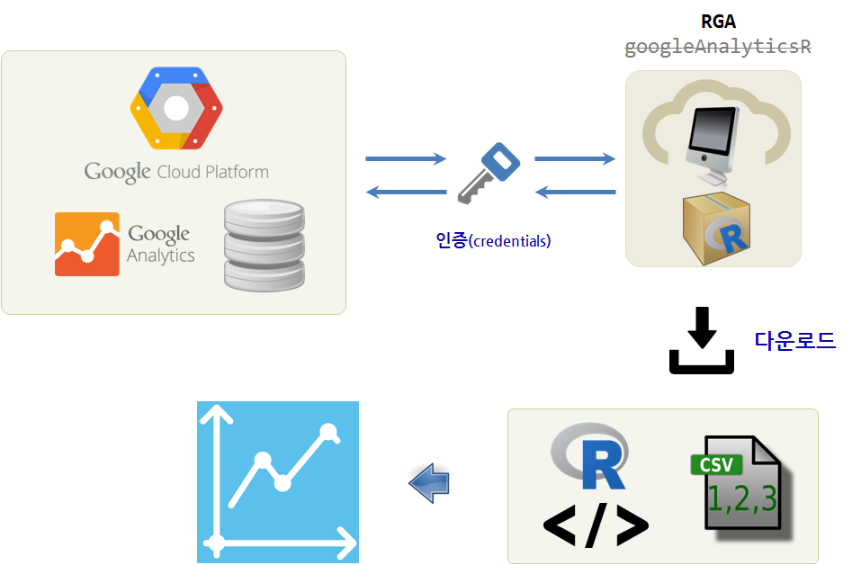
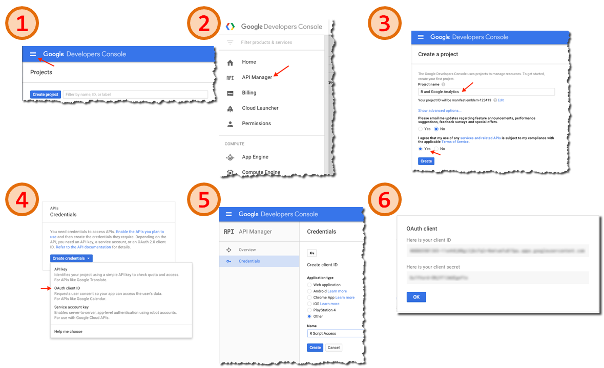
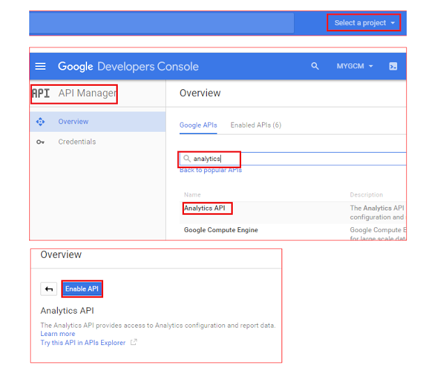
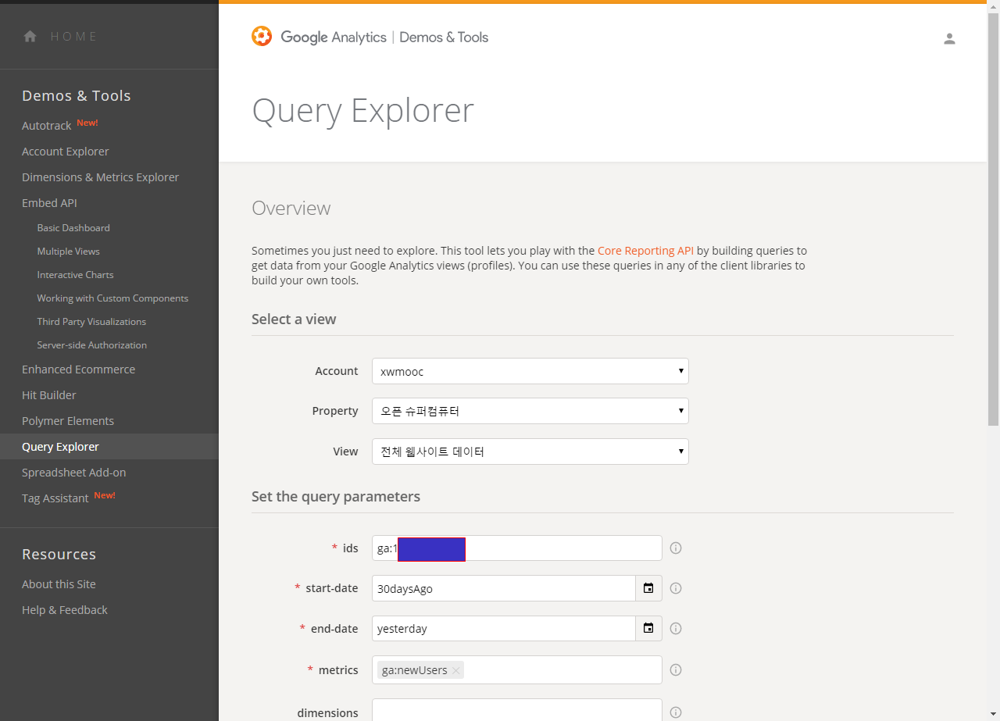
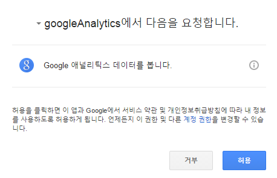
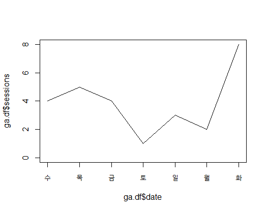

> ## 학습 목표 {.objectives}
>
> * R 구글 애널리틱스(GA)를 이해한다.
> * RGA 팩키지를 통해 인증을 마친 다음 데이터를 가져온다.
> * RGA 기능을 활용하여 R코드를 고급화한다.

### 1. R 구글 애널리틱스 설치

구글 클라우드 플랫폼에 담긴 구글 애널리틱스(Google Analytics, GA) 데이터를 뽑아내서 
R에서 자유로이 작업을 하고자 한다. 

> ### 사전 학습 {.prereq}
> 
> * 클라우드와 API 기초 개념이해
> * OAUTH 2.0 작동방식 이해
> * GA 서비스 이해

### 2. GA를 지원하는 R 팩키지

GA를 지원하는 R 팩키지는 다양하다.

* [RGA](https://cran.r-project.org/web/packages/RGA/index.html) : 1 개발자 [^RGA] [^RGA-demystified]
* [rga](https://github.com/skardhamar/rga) : 12 개발자
* [googleAnalyticsR](https://cran.r-project.org/web/packages/googleAnalyticsR/index.html): 3 개발자
* [RGoogleAnalytics](https://github.com/Tatvic/RGoogleAnalytics) : 4 개발자 [^RGoogleAnalytics]
* [ganalytics](https://github.com/jdeboer/ganalytics) : 2 개발자

[^RGoogleAnalytics]: [How to extract Google Analytics data in R using RGoogleAnalytics](http://www.tatvic.com/blog/author/kushan/)

[^RGA]: [4 Ways to Export Your Google Analytics Data with R](http://www.lunametrics.com/blog/2015/11/23/export-google-analytics-data-with-r/)

[^RGA-demystified]: [FROM 0 TO R WITH GOOGLE ANALYTICS](http://analyticsdemystified.com/analysis/tutorial_pulling_google_analytics_data_with_r/)

서로 장단점이 있지만, **RGA** 로 간다. 이유는 저자와 같은 학습과정을 정말 잘 정리해서 표현했고, 가장 최근 현재 구글 클라우드 플랫폼을 그대로 적용했기 때문이다. 아무래도 가장 최근 블로그 글이라 그런가 보다.

### 3. R에서 GA 구현 [^RGA-demystified]

구글 클라우드 플랫폼에서 데이터를 땡겨 R에서 마음껏 분석을 한다는 것은 많은 제약이 따른다. 다르게 생각하면 구글에서 사용자에게 GA API를 공개하고 허용된 데이터를 자유로이 전달해줘야 하는데 보안, 성능, 편의성 등을 여러 요소를 고려하여 오랜기간동안 나름 정립된 것인만큼 존중해 주도록 한다.

R과 RStudio IDE는 설치가 된 것으로 간주하고 생략하고 바로 R과 GA를 연결하는 작업을 수행한다.

#### 3.1. 구글 클라우드 플랫폼 프로젝트 생성

R과 GA를 연결할 때 핵심이 되는 **인증서를 생성** 하는 것이 목적이다. 이를 통해 사람의 개업없이 R 응용프로그램과 GA 클라우드 시스템간에 인증이 되어 데이터를 주고 받을 수 있게 된다.

1. [구글 개발자 콘솔(Google Develoers Console)](https://console.developers.google.com/project)로 이동   
1. 좌측상단 햄버거 모양을 클릭하면 좌측에 메뉴가 보인다. 
1. 좌측 메뉴에서 **API Manager** 를 클릭한다.
1. 프로젝트가 꼭 필요하니 처음이면 새로 프로젝트를 생성한다.
1. 좌측메뉴에서 **Credentials** 를 클릭하여 인증서를 생성한다. `Create credentials` &rarr;  `OAuth client ID`
    * `Application Type` &rarr; `Other`를 선택하고 인증서에 명칭을 부여한다.
1. `Create` 를 클릭하면 **OAuth client** `client ID` 와 함께 `client secret` 이 생성되는데 소중히 메모하여 간직한다.

> #### Analytics API 활성화 {.callout}
> 
> 

#### 3.2. 구글 애널리틱스 `ids` 확인

[Google Analytics Query Explorer](https://ga-dev-tools.appspot.com/query-explorer/)에서 `ids`를 확인한다.
R코드에서 사용할 것이기 때문에 잘 보관하여 준비해 둔다.

**View ids** 가 확인되면 이것으로 모든 준비가 된 것이다.

> #### R과 GA 토큰 생성 {.callout}
> 
> 구글 클라우드 프로젝트 인증 `client ID`, `client secret`, 구글 애널리틱스 `ids`를 확인하고 R 응용프로그램에서 함께 실어 
> 구글로 보내면 다음과 같은 인증 화면이 나오고 나서 토큰이 생성된다. 토큰은 구글에서 정한 수명이 있어 시간이 지나면 
> 재인증하고 새로 생성된다. 
> 
> 

#### 3.3. R과 GA 합체 

`client.id`, `client.secret`를 R코드에 넣고, `get_ga`에 `ids`도 확인하여 넣는다. 
`ids`는 `ga:XXXXXXXXXXX` 형식으로 구현된다.
마지막으로 불러온 데이터를 간단히 도식화한다.

~~~ {.r}
##=========================================================================================
## 1. 환경설정
##=========================================================================================

if("RGA" %in% installed.packages() == FALSE) install.packages("RGA")
library(RGA)

# GA 계정 인증
client.id <- "------------------.apps.googleusercontent.com"
client.secret <- "XXXXXXXXXXXXXXX"

ga_token <- authorize(client.id = client.id, 
                      client.secret = client.secret)

# 토큰 정보를 저장
save(ga_token, file="./ga_token")

##=========================================================================================
## 2. 데이터 가져오기 및 인증 후 토큰 생성
##=========================================================================================

# GA 데이터를 로컬 `ga.df` 데이터프레임으로 가져오기
ga.df <- get_ga(profileId = "ga:XXXXXXXXXXX", 
                 start.date = "7daysAgo",
                 end.date = "yesterday", 
                 metrics = c("ga:users", "ga:sessions"," ga:pageviews"), 
                 dimensions = "ga:date", sort = NULL, filters = NULL,
                 segment = NULL, samplingLevel = NULL, start.index = NULL,
                 max.results = NULL, include.empty.rows = NULL, fetch.by = NULL, ga_token)

##=========================================================================================
## 3. 시각화
##=========================================================================================

plot(ga.df$date, ga.df$sessions,type="l",ylim=c(0,max(ga.df$sessions)))
~~~

### 4. RGA R 프로그램 고도화

#### 4.1. 비밀 환경설정 정보 비노출

`client.id`, `client.secret`와 더불어, `get_ga`에 `ids`를 모두 R코드에 한곳에 넣었다. 이렇게 하면 향후 유지보수에도 문제가 있고, 보안문제를 야기할 수도 있다. 

`client.id`, `client.secret` 정보를 앞선 프로그램에서 `ga_token` 파일에 저장했다. 이를 `load` 명령어를 통해 불러오고, 유효한 토큰인지 `ValidateToken` 명령어로 확인한다.

또한, `get_ga`에 `ids`를 로컬 파일에 환경설정 변수로 넣어 저장해서 프로그램에 함께 포함되지 않게 만들었다.

~~~ {.r}
##=========================================================================================
## 1. 환경설정
##=========================================================================================
# 팩키지 설치 
if("RGA" %in% installed.packages() == FALSE) install.packages("RGA")
library(RGA)

# GA 계정 인증
ga_profile <- list_profiles(token = ga_token)

load("ga_token")
ValidateToken(token)

##=========================================================================================
## 2. 데이터 가져오기 및 인증 후 토큰 생성
##=========================================================================================
# GA ID 파일 환경설정으로 처리
source("ga_conf.R") # id <- "ga:1xxxxxxxxxx"

# GA 데이터를 로컬 `ga.df` 데이터프레임으로 가져오기
ga.df <- get_ga(profileId = id, 
                 start.date = "2015-09-01",
                 end.date = "yesterday", 
                 metrics = c("ga:users", "ga:sessions"," ga:pageviews"), 
                 dimensions = "ga:date", sort = NULL, filters = NULL,
                 segment = NULL, samplingLevel = NULL, start.index = NULL,
                 max.results = 10000, include.empty.rows = NULL, fetch.by = NULL, ga_token)

##=========================================================================================
## 3. 시각화
##=========================================================================================

plot(ga.df$date, ga.df$sessions,type="l",ylim=c(0,max(ga.df$sessions)))
~~~

#### 4.2. RGA 고급 분석 [^RGA-ggplot]

[^RGA-ggplot]: [FROM LEVEL 1  TO LEVEL 2 WITH R AND GOOGLE ANALYTICS: GGPLOT2](http://www.tmllr.com/from-level1-to-level2-with-r-and-google-analytics-ggplot2/)

`ggplot`을 활용하여 GA에서 수집한 정보를 시각화 했다. 
**[구글 애널리틱스 Dimensions & Metrics Explorer](https://developers.google.com/analytics/devguides/reporting/core/dimsmets)** 에서 다양한 데이터를 찾아보고 영감을 받기 바란다.

~~~ {.r}
##=========================================================================================
## 1. 환경설정
##=========================================================================================
# 팩키지 설치 
if("RGA" %in% installed.packages() == FALSE) install.packages("RGA")
library(RGA)

# GA 계정 인증
ga_profile <- list_profiles(token = ga_token)

load("ga_token")
ValidateToken(token)

##=========================================================================================
## 2. 데이터 가져오기 및 인증 후 토큰 생성
##=========================================================================================
# GA ID 파일 환경설정으로 처리
source("ga_conf.R") # id <- "ga:1xxxxxxxxxx"

# GA 데이터를 로컬 `ga.df` 데이터프레임으로 가져오기
ga.df <- get_ga(profileId = id, 
                 start.date = "2015-09-01",
                 end.date = "yesterday", 
                 metrics = c("ga:users", "ga:sessions"," ga:pageviews"), 
                 dimensions = c("ga:date","ga:devicecategory"), sort = NULL, filters = NULL,
                 segment = NULL, samplingLevel = NULL, start.index = NULL,
                 max.results = 10000, include.empty.rows = NULL, fetch.by = NULL, ga_token)

##=========================================================================================
## 3. 시각화
##=========================================================================================
library(ggplot2)
# plot(ga.df$date, ga.df$sessions,type="l",ylim=c(0,max(ga.df$sessions)))

# 3.1. 시각화
ggplot(data = ga.df, mapping = aes(x = date, y = sessions)) + geom_line() +
  theme_bw() +   ylim(0,NA)

# 3.2. 시각화
ggplot(data = ga.df, mapping = aes(x = date, y = sessions)) + 
  geom_bar(stat = "identity") +
  theme_bw() +  ylim(0,NA)

# 3.3. 시각화 사용자와 페이지뷰
ggplot(data = ga.df, mapping = aes(x = users, y = pageviews)) + 
  geom_point() +
  theme_bw() + ylim(0,NA)

# 3.4. 시각화 디바이스 별
ggplot(data = ga.df, mapping = aes(x = date, y = sessions, color = deviceCategory) ) + 
  geom_line() +  theme_bw() + ylim(0,NA)

# 3.5. 시각화 디바이스 별
ggplot(data = ga.df, mapping = aes(x = date, y = sessions) ) + 
  geom_line() + facet_grid(deviceCategory ~ .) + theme_bw() + ylim(0,NA)
~~~

