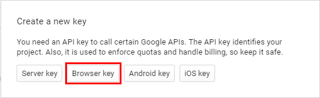
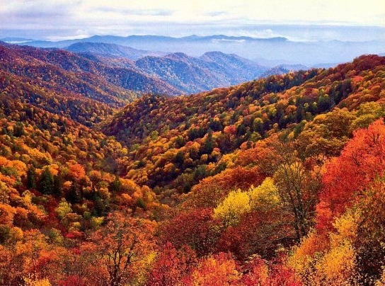
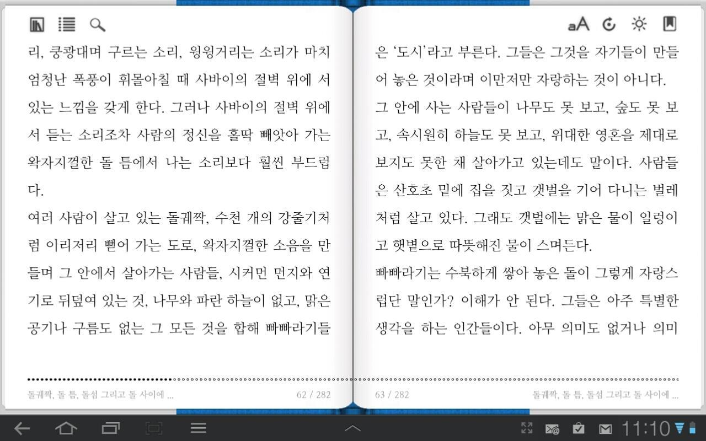

> ## 학습 목표 {.objectives}
>
> * 구글 클라우드 비젼 API 기능을 이해한다.
> * `RoogleVision` 팩키지 없이 구글 비젼 API 호출을 통해 이미지를 인식한다.
> * 구글 비젼 API 이미지 검출 기능을 활용한다. 
>     * 이미지 로고, 표지, 얼굴, 텍스트 검출 및 감정 인식 등  

### 1. 구글 비젼 API 설정

1. `Google Cloud Platform` 접속한다.
1. 좌측메뉴 `API Manager`를 클릭한다.
1. `Credentials`를 클릭한다.
1. `Credentials` &rarr; `Create credentials`를 클릭해서 API 인증키를 생성한다.
1. `API key`를 선택하면 다음과 같은 그림이 팝업되어 나타난다.
    * `Browser key`를 클릭하고 Google Cloud Vision API 키로 사용한다.
    

### 2. 구글 비젼 API를 활용 인식에 사용할 이미지와 서비스

#### 2.1. 구글 비젼 API를 활용 인식에 사용할 이미지

| 사진 속 물체 표식 | 텍스트 OCR 탐지 | 주요지명 탐지 | 명품로고 탐지 |
|--------|--------|--------|--------|
| | | | |

#### 2.2. 구글 비젼 API 사용 서비스

* 사진 속 물체 표식 : LABEL_DETECTION
* 텍스트 OCR 탐지: TEXT_DETECTION
* 주요지명 탐지: LANDMARK_DETECTION
* 명품 로고 탐지: LOGO_DETECTION

### 3. R 코드

[RからGoogle Cloud Vision APIを使う](http://d.hatena.ne.jp/dichika/20160223/p1)의 코드를 재사용했다. [RoogleVision](https://github.com/cloudyr/RoogleVision)의 내부도 이와 유사하게 되어있고, 인증방식과 API JSON 호출값을 처리하는 방식에 차이만 있다.

~~~ {.r}
##=======================================================================================
## 01. 환경설정
##=======================================================================================

library(magrittr)
#library(formattable)
library(jsonlite)

##=======================================================================================
## 02. 구글 비젼 API 호출 함수
##=======================================================================================

getResult <- function(f, type = "TEXT_DETECTION"){
  library("httr")
  library("base64enc")
  CLOUD_VISION_KEY <- "개인 구글 클라우드 비젼 브라우져 API KEY값"
  u <- paste0("https://vision.googleapis.com/v1/images:annotate?key=", CLOUD_VISION_KEY)
  img <- readBin(f, "raw", file.info(f)[1, "size"])
  base64_encoded <- base64encode(img)
  body <- list(requests = list(image = list(content = base64_encoded),
                               features = list(type = type,
                                               maxResults = 10))
  )

    res <- POST(url = u,
              encode = "json",
              body = body,
              content_type_json())
}

##=======================================================================================
## 03. 구글 비젼 API 활용
##=======================================================================================
# 3.1. 사진 속 물체 표식
getResult("설악산.png", "LABEL_DETECTION") %>% 
  content(as = "text") %>% fromJSON() %$% 
  responses$labelAnnotations %>% as.data.frame()

# 3.2. 텍스트 OCR 탐지
getResult("한글스캔-OCR.jpg", "TEXT_DETECTION") %>% 
  content(as = "text") %>% fromJSON() %$% 
  responses$textAnnotations[[1]]$description[[1]]

# 3.3. 주요지명 탐지
getResult("경복궁.jpg", "LANDMARK_DETECTION") %>% 
  content(as = "text") %>% fromJSON() %$% 
  responses$landmarkAnnotations

# 3.4. 로고 탐지
getResult("명품로고.jpg", "LOGO_DETECTION") %>% 
  content(as = "text") %>% fromJSON() %$% 
  responses$logoAnnotations
~~~

~~~ {.output}
> getResult("설악산.png", "LABEL_DETECTION") %>% 
+   content(as = "text") %>% fromJSON() %$% 
+   responses$labelAnnotations %>% as.data.frame()
          mid                      description     score
1    /m/05h0n                           nature 0.9671625
2    /m/06fvc                              red 0.9423453
3    /m/0134l                           autumn 0.9225224
4   /m/023bbt                       wilderness 0.8904110
5    /m/09t49                             leaf 0.8540347
6    /m/09d_r                         mountain 0.8344762
7    /m/0754v                           season 0.8279265
8    /m/07j7r                             tree 0.8096020
9   /m/05fblh                          habitat 0.8046784
10 /m/03d3zqn northern hardwood forest concept 0.7999645
> getResult("한글스캔-OCR.jpg", "TEXT_DETECTION") %>% 
+   content(as = "text") %>% fromJSON() %$% 
+   responses$textAnnotations[[1]]$description[[1]]
[1] "aA 6寮圆\n리 쿵쾅대며 구르는 소리, 윙윙거리는 소리가 마치 | 은 도시라고 부른다. 그들은 그것을 자기들이 만들\n엄청난 폭풍이 휘몰아칠 때 사바이의 절벽 위에 서 | 어 놓은 것이라며 이만저만 자랑하는 것이 아니다.\n있는 느낌을 갖게 한다. 그러나 사바이의 절벽 위에 그 안에 사는 사람들이 나무도 못 보고, 숲도 못 보\n서 듣는 소리조차 사람의 정신을 홀딱 빼앗아 가는 고, 속시원히 하늘도 못 보고, 위대한 영혼을 제대로\n왁자지껄한 돌 틈에서 나는 소리보다 훨씬 부드럽 | 보지도 못한 채 살아가고 있는데도 말이다. 사람들\n다.\n은 산호초 밑에 집을 짓고 갯벌을 기어 다니는 벌레\n여러 사람이 살고 있는 돌궤짝, 수천 개의 강줄기처 | 처럼 살고 있다. 그래도 갯벌에는 맑은 물이 일렁이\n럼 이리저리 뻗어 가는 도로, 왁자지껄한 소음을 만 | 고 햇볕으로 따뜻해 진 물이 스며든다.\n들며 그 안에서 살아가는 사람들, 시커먼 먼지와 연 | 빠빠라기는 수북하게 쌓아놓은 돌이 그렇게 자랑스\n기로 뒤덮여 있는 것, 나무와 파란 하늘이 없고, 맑은 | 럽단 말인가? 이해가 안 된다. 그들은 아주 특별한\n공기나 구름도 없는 그 모든 것을 합해 빠빠라기들 | 생각을 하는 인간들이다. 아무 의미도 없거나 의미\n←仑占\na M 11:10\n"
> getResult("경복궁.jpg", "LANDMARK_DETECTION") %>% 
+   content(as = "text") %>% fromJSON() %$% 
+   responses$landmarkAnnotations
[[1]]
           mid        description     score                             vertices            locations
1    /m/02v3t6      Gyeongbokgung 0.8770003 96, 788, 788, 96, 236, 236, 466, 4661 37.57009, 126.97700
2  /g/1thlk_wx HOTEL SEOUL PALACE 0.8333730 42, 783, 783, 42, 197, 197, 410, 4102 37.53709, 126.97449
3    /m/02v3t6      Gyeongbokgung 0.7953022 56, 783, 783, 56, 196, 196, 399, 3993 37.57826, 126.97702
4    /m/02v3t6      Gyeongbokgung 0.7666436 71, 667, 667, 71, 188, 188, 402, 4024 37.55712, 126.98067
5 /g/12q4v7zdt               <NA> 0.7113404 96, 769, 769, 96, 192, 192, 438, 4385 37.53478, 126.95938
> # 3.4. 로고 탐지
> getResult("명품로고.jpg", "LOGO_DETECTION") %>% 
+   content(as = "text") %>% fromJSON() %$% 
+   responses$logoAnnotations
[[1]]
           mid         description     score                                   vertices
1    /m/03b7w3 Salvatore Ferragamo 0.2697557     131, 511, 511, 131, 895, 895, 952, 952
2         <NA>               Cazal 0.2445852     798, 931, 931, 798, 835, 835, 900, 900
3 /g/1hh_psp0z      Louis Quatorze 0.2391768 209, 380, 380, 209, 1600, 1600, 1677, 1677
4         <NA>               Prada 0.2138166   165, 424, 424, 165, 989, 989, 1030, 1030
5   /m/02rf9lb               Loewe 0.1863980 235, 348, 348, 235, 1380, 1380, 1474, 1474
6    /m/0133kw   Vivienne Westwood 0.1607205 166, 426, 426, 166, 1170, 1170, 1271, 1271
7         <NA>             Ray Ban 0.1461584 697, 878, 878, 697, 2366, 2366, 2438, 2438
~~~

