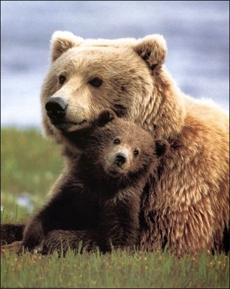

> ## 학습 목표 {.objectives}
>
> * 구글 클라우드 비젼 API 기능을 이해한다.
> * `RoogleVision` 팩키지로 구글 비젼 API를 사용한다.
> * 구글 비젼 API 이미지 검출 기능을 활용한다. 
>     * 이미지 로고, 표지, 얼굴, 텍스트 검출 및 감정 인식 등  

### 1. `RoogleVision` 설치 및 구글 비젼 API 연동

`RoogleVision`를 통해 이미지를 인식하는 방법은 다음과 같다.

1. `RoogleVision` 팩키지를 `install_github`을 통해 설치한다.
1. 구글 클라우드 플랫폼에 인증과정을 거친다.
    * `client.id`와 `client.secret` 정보는 `gcp_conf.R` 환경정보 파일에 저장되어 있다.
    * `googleAuthR`에서 인증할 대상을 설정: `https://www.googleapis.com/auth/cloud-platform`
1. `getGoogleVisionResponse` 함수로 구글 비젼 API 호출 서비스를 지정하고 실행한다.
    * `TYPE_UNSPECIFIED` : 특정한 기능 미지정
    * `FACE_DETECTION`: 얼굴 검출 및 감정 인식
    * `LANDMARK_DETECTION`: 주요지명 검출
    * `LOGO_DETECTION`: 로고 검출
    * `LABEL_DETECTION`: 표지 검출
    * `TEXT_DETECTION`: 자동 언어 탐지 및 텍스트 검출, OCR 실행
    * `SAFE_SEARCH_DETECTION`: 다양한 컴퓨터 비젼 모형 실행
    * `IMAGE_PROPERTIES`: 이미지를 지배하는 색상같은 이미지에 대한 특징정보

~~~ {.r}
##=========================================================================================
## 1. 환경설정
##=========================================================================================
# 팩키지 설치 
if("googleAuthR" %in% installed.packages() == FALSE) install.packages("googleAuthR")
library(googleAuthR)
library(devtools)
# install_github("flovv/RoogleVision")
library(RoogleVision)

# GA 계정 인증
setwd("~/Dropbox/01_data_science/03_kds/08-google-vision")

source("gcp_conf.R")

options("googleAuthR.client_id" = client.id)
options("googleAuthR.client_secret" = client.secret)

options("googleAuthR.scopes.selected" = 
          c("https://www.googleapis.com/auth/cloud-platform"))

googleAuthR::gar_auth()

##=========================================================================================
## 2. 구글 비젼 API 실행
##=========================================================================================

bear.res <- getGoogleVisionResponse("bear.jpg")
brand.res <- getGoogleVisionResponse(imagePath="brandlogos.png", feature="LOGO_DETECTION", numResults=5)
landmark.res <- getGoogleVisionResponse("https://media-cdn.tripadvisor.com/media/photo-s/02/6b/c2/19/filename-48842881-jpg.jpg", feature="LANDMARK_DETECTION")
label.res <- getGoogleVisionResponse("http://static.flickr.com/1129/1394639648_1e10df0ddd.jpg", feature="LABEL_DETECTION")
text.res <- getGoogleVisionResponse("http://www.justsomebroad.com/wp-content/uploads/2013/01/handwriting.jpg", feature="TEXT_DETECTION")
hantext.res <- getGoogleVisionResponse("http://static.campaign.naver.com/0/hangeul/2013/img/img_renew_docs/img_h_docs.png", feature="TEXT_DETECTION")
face.res <- getGoogleVisionResponse("http://www.news.ucsb.edu/sites/www.news.ucsb.edu/files/styles/article_horizontal/public/images/2014/angry%20face.jpg?itok=xdzforot", feature="FACE_DETECTION")
~~~

### 2. 구글 비젼 API 서비스

#### 2.1. 표지 검출(LABEL_DETECTION)

이미지에 어떤 물체가 있는지 인식하고 이를 표식으로 검출한다.

|    이미지    |   구글 비젼 API   |
|----------------------------------|----------------------------------|
|  | 기본설정 LABEL_DETECTION | 

~~~ {.output}
> bear.res
       mid  description     score
1 /m/01dxs   brown bear 0.9848321
2 /m/04rky       mammal 0.9646480
3  /m/0jbk       animal 0.9576262
4 /m/037_v grizzly bear 0.9441352
5 /m/01dws         bear 0.9440595
~~~

#### 2.2. 로고 검출(LOGO_DETECTION)

이미지에 어떤 로고가 있는지 인식하고 이를 검출한다.

|    이미지    |   구글 비젼 API   |
|----------------------------------|----------------------------------|
|  | LOGO_DETECTION | 

~~~ {.output}
> brand.res
        mid  description     score                               vertices
1  /m/0cnn5 The Guardian 0.4697565 213, 351, 351, 213, 412, 412, 443, 443
2 /m/016s7w  Sainsbury's 0.4589797     157, 327, 327, 157, 15, 15, 38, 38
3      <NA>        Heinz 0.4362870     710, 784, 784, 710, 16, 16, 42, 42
4      <NA>      Walmart 0.4303052 361, 458, 458, 361, 353, 353, 384, 384
5      <NA>      Colgate 0.4092249     470, 562, 562, 470, 13, 13, 43, 43
~~~

#### 2.3. 주요 지명 검출(LANDMARK_DETECTION)

이미지에 어떤 주요 지명이 있는지 인식하고 이를 검출한다.

|    이미지    |   구글 비젼 API   |
|----------------------------------|----------------------------------|
|  | LANDMARK_DETECTION | 

~~~ {.output}
> landmark.res
       mid         description     score                             vertices           locations
1 /m/0gtxh Notre Dame de Paris 0.9245162 117, 369, 369, 117, 40, 40, 285, 285 48.853096, 2.349113
2 /m/02j81               Paris 0.8143099 168, 354, 354, 168, 43, 43, 285, 285 48.858546, 2.322242
~~~

#### 2.4. 자동 텍스트 검출 (TEXT_DETECTION)

이미지에 어떤 텍스트가 있는지 인식하고 이를 검출한다. OCR로 알려진 기능으로 자동으로 언어를 인식해서 해당 언어 텍스트를 검출한다.

|    이미지    |   구글 비젼 API   |
|----------------------------------|----------------------------------|
|  | TEXT_DETECTION | 

~~~ {.output}
> text.res
... <중략>
description
1  hello\ndidn't find out until recently that there's\na National Handwriting Day, inadvertently\ncelebrated by writing a long letter to\none of my penpals. l fove waiting letters,\nit's very much a lost art form e to the\nease and speed of emails, texting, aod of\nphone. lt was pretty\ncourse, talking\non the difficult to find penpals, out now I have two!\nIf you're interested in arapholoay (the study\nof handwriting, feel free to let me know\nwhat mine says about myself You should\nwrite it out by hand fo me!\n
... <중략>
~~~

##### 한글 텍스트 검출

이미지에 한글 텍스트가 있는 경우, 이를 자동으로 인식해서 한글 텍스트를 검출한다.

|    이미지    |   구글 비젼 API   |
|----------------------------------|----------------------------------|
|  | TEXT_DETECTION | 

~~~ {.output}
> text.res
... <중략>
description
1  아름다운\n한글문서서식\n본 문서서식은 더 많은 사람들이 더 좋은 문서를 쓸 수 있도록 나눔글꼴에 최적화되어 만들어졌습니다\n문서를 정상적으로 보기 위해서는 나눔글꼴 설치가 필요합니다\n글꼴을 나눔글꼴에코로 변경 후 출력하면 잉크를 최대 35% 절약할 수 있습니다\n
... <중략>
~~~

#### 2.5. 얼굴 및 감정 검출 (FACE_DETECTION)

이미지에 사람 얼굴이 있는지 인식하고 이를 검출한다. 인식된 얼굴에 나타난 감정도 자동으로 제시한다.

`angerLikelihood` 에 `LIKELY`로 표현되고, 나머지 감정을 나타낸 결과는 `VERY_UNLIKELY`로 표현된다.

|    이미지    |   구글 비젼 API   |
|----------------------------------|----------------------------------|
|  | FACE_DETECTION | 

~~~ {.output}
> face.res
                              vertices                             vertices
1 206, 355, 355, 206, 40, 40, 215, 215 225, 338, 338, 225, 83, 83, 197, 197

1 LEFT_EYE, RIGHT_EYE, LEFT_OF_LEFT_EYEBROW, RIGHT_OF_LEFT_EYEBROW, LEFT_OF_RIGHT_EYEBROW, RIGHT_OF_RIGHT_EYEBROW, MIDPOINT_BETWEEN_EYES, NOSE_TIP, UPPER_LIP, LOWER_LIP, MOUTH_LEFT, MOUTH_RIGHT, MOUTH_CENTER, NOSE_BOTTOM_RIGHT, NOSE_BOTTOM_LEFT, NOSE_BOTTOM_CENTER, LEFT_EYE_TOP_BOUNDARY, LEFT_EYE_RIGHT_CORNER, LEFT_EYE_BOTTOM_BOUNDARY, LEFT_EYE_LEFT_CORNER, LEFT_EYE_PUPIL, RIGHT_EYE_TOP_BOUNDARY, RIGHT_EYE_RIGHT_CORNER, RIGHT_EYE_BOTTOM_BOUNDARY, RIGHT_EYE_LEFT_CORNER, RIGHT_EYE_PUPIL, LEFT_EYEBROW_UPPER_MIDPOINT, RIGHT_EYEBROW_UPPER_MIDPOINT, LEFT_EAR_TRAGION, RIGHT_EAR_TRAGION, FOREHEAD_GLABELLA, CHIN_GNATHION, CHIN_LEFT_GONION, CHIN_RIGHT_GONION, 256.02124, 301.26849, 239.97955, 267.60248, 289.44971, 317.72717, 278.61609, 281.78342, 282.71335, 284.36075, 266.80551, 300.41769, 283.6926, 295.42117, 269.89139, 282.7973, 256.62448, 265.28381, 256.52417, 247.3898, 256.24405, 301.70123, 311.69528, 302.78403, 292.99298, 302.46414, 253.63567, 302.53455, 229.93874, 332.32971, 278.49728, 286.16602, 237.50287, 329.98877, 122.56126, 118.55954, 113.87316, 111.97066, 109.7189, 107.13105, 120.21013, 146.85126, 162.42365, 176.71413, 170.79666, 168.17764, 168.77847, 149.16769, 150.12383, 154.06479, 120.05192, 123.12947, 125.30446, 123.64769, 123.13268, 116.12682, 118.32967, 121.49896, 120.61049, 119.13891, 107.2864, 103.01984, 145.68547, 136.74921, 110.20454, 197.74667, 174.67319, 166.65485, 0.00080117426, 0.0081655942, 4.1464648, -9.236371, -9.2514915, 4.4432216, -9.5594721, -21.873848, -10.671109, -6.8767939, 1.5200875, 1.4940871, -7.045455, -4.0386014, -4.3447552, -11.153033, -3.1817565, 0.21080714, -0.29128665, 4.269196, -1.1868118, -3.1571257, 4.3592844, -0.25511825, 0.19155107, -1.2076702, -6.0064616, -5.9625931, 56.624302, 56.624748, -11.001035, 0.29252371, 39.300781, 39.360943

  rollAngle   panAngle tiltAngle detectionConfidence landmarkingConfidence 
1 -4.987261 0.03869577 -2.105059            0.998906             0.7301045 

  joyLikelihood sorrowLikelihood angerLikelihood surpriseLikelihood
VERY_UNLIKELY    VERY_UNLIKELY          LIKELY      VERY_UNLIKELY
  underExposedLikelihood blurredLikelihood headwearLikelihood
1          VERY_UNLIKELY     VERY_UNLIKELY      VERY_UNLIKELY
~~~

