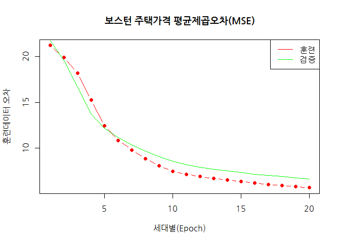

# xwMOOC 딥러닝

## 1. 보스턴 주택 가격 데이터

텐서플로우를 활용한 딥러닝기법을 주택가격과 같은 연속형변수를 예측하는데 사용하는 것도 가능하다.

보스턴 주택가격 데이터는 행이 506, 열이 14개로 구성된 데이터로 마지막 변수 주택가격(중위값)을 
13개 변수로 예측하는 문제로 많이 사용된다. [보스톤 주택 가격](http://ai-times.tistory.com/431) 블로그에
한국어로 변역된 설명 내용은 다음과 같다.

- CRIM: 자치시(town) 별 1인당 범죄율
- ZN: 25,000 평방피트를 초과하는 거주지역의 비율
- INDUS:비소매상업지역이 점유하고 있는 토지의 비율
- CHAS: 찰스강에 대한 더미변수(강의 경계에 위치한 경우는 1, 아니면 0)
- NOX: 10ppm 당 농축 일산화질소
- RM: 주택 1가구당 평균 방의 개수
- AGE: 1940년 이전에 건축된 소유주택의 비율
- DIS: 5개의 보스턴 직업센터까지의 접근성 지수
- RAD: 방사형 도로까지의 접근성 지수
- TAX: 10,000 달러 당 재산세율
- PTRATIO: 자치시(town)별 학생/교사 비율
- B: 1000(Bk-0.63)^2, 여기서 Bk는 자치시별 흑인의 비율을 말함.
- LSTAT: 모집단의 하위계층의 비율(%)
- MEDV: 본인 소유의 주택가격(중앙값) (단위: $1,000)

## 2. 딥러닝 모형으로 적합

### 2.1. 보스턴 주택가격 데이터 전처리

단순한 데이터를 딥러닝 모형으로 적합시킨 경우 부작용도 상당하다는 주장도 있다. 
따라서, 딥러닝 모형을 연속형변수에 적합시켜 모형을 생성하는 수준에서 사용법을 살펴보는 정도로 이해하면 될 듯 싶다.

`keras` 팩키지 내부에 보스톤 주택가격 데이터가 포함되어 있어, 
`dataset_boston_housing()` 명령어를 통해 데이터를 불러온다. 
전처리는 `scale` 함수로 정규화하고 나서, 4번째 변수는 범주형이라 가변수 처리한다.

~~~{.r}
# 0. 환경설정 ------------------------
#library(tidyverse)
#library(keras)

# 1. 데이터 가져오기 ------------------------
boston <- dataset_boston_housing()

# 2. 전처리 및 훈련/학습 데이터 분할 ----------------------------------
## 훈련데이터
train_x <- scale(boston$train$x, center = TRUE, scale = TRUE)
train_x[,4] <- boston$train$x[,4]
train_y <- boston$train$y

## 검증데이터
test_x <- scale(boston$test$x, center = TRUE, scale = TRUE)
test_x[,4] <- boston$test$x[,4]
test_y <- boston$test$y
~~~

### 2.2. 보스턴 주택가격 예측 모형

13개 입력변수를 받아 1개의 출력변수를 만들고, 중간에 계층을 하나 더 놓아 딥러닝이라고 하기에는 좀 그렇지만
신경망 아키텍쳐를 구축한다. 그리고 나서 손실함수는 "mse", 평균제곱오차로 지정하여 이폭 20회, 배치크기 10으로 설정하여
학습을 시킨다.

~~~{.r}
# 3. 딥러닝 모형 ----------------------------------
## 3.1. 모형 초기화
model <- keras_model_sequential()

## 3.2. 모형 아키텍쳐 구성
model %>% 
    layer_dense(units=36, kernel_initializer='normal', activation='relu', input_shape=c(13))  %>%
    layer_dense(units=6, kernel_initializer='normal', activation='relu')  %>%
    layer_dense(units=1, activation = "relu", kernel_initializer='normal') 

summary(model)
~~~

~~~{.output}
Model
___________________________________________________________________________
Layer (type)                     Output Shape                  Param #     
===========================================================================
dense_1 (Dense)                  (None, 36)                    504         
___________________________________________________________________________
dense_2 (Dense)                  (None, 6)                     222         
___________________________________________________________________________
dense_3 (Dense)                  (None, 1)                     7           
===========================================================================
Total params: 733
Trainable params: 733
Non-trainable params: 0
___________________________________________________________________________

 

~~~

~~~{.r}
model %>%
    compile(loss ="mse",
            optimizer = "adam")

## 3.3. 학습
history <- model %>% fit(train_x, train_y, epochs = 20, batch_size = 10,
                         callbacks = callback_tensorboard(log_dir = "logs/run_b"),
                         validation_split = 0.2) 
history$metrics
~~~

~~~{.output}
$val_loss
 [1] 472.01922 383.94909 276.99221 188.34494 148.03433 125.00140 107.16720
 [8]  93.12612  81.90249  72.96477  66.60478  62.52658  59.13130  56.43135
[15]  53.64271  50.60874  48.97117  47.37940  45.24506  43.75909

$loss
 [1] 449.92567 396.36524 331.66133 231.91577 153.86702 117.60213  95.89921
 [8]  78.13874  64.63229  55.53465  50.91266  47.29405  44.54993  42.09855
[15]  40.09888  38.12401  36.23847  34.75228  33.39728  31.99447

~~~

### 2.3. 보스턴 주택가격 예측 모형 평가

딥러닝으로 학습시킨 과정을 시각화 통해 평가한다. 그리고 나서 연속형 회귀모형의 예측성능지표인
제곱근평균제곱오차(RMSE)를 출력한다. Random Forest와 같은 모형과 비교하여 RMSE가 크게 차이 나지 않는 것이
시각적으로 확인된다.

~~~{.r}
## 5.4. 딥러닝 모형 평가
### 시각화
plot(x = 1:length(history$metrics$val_loss), y = sqrt(history$metrics$loss),
     pch=19, col='red',type='b',
     ylab="훈련데이터 오차", xlab="세대별(Epoch)", family="NanumGothic")
lines(sqrt(history$metrics$val_loss), col="green")
title("보스턴 주택가격 평균제곱오차(MSE)", family="NanumGothic")
legend("topright", c("훈련","검증"), col=c("red", "green"), lty=c(1,1))
~~~

~~~{.r}
# 검증데이터 평가점수
score <- model %>% 
    evaluate(test_x, test_y, batch_size=32)

cat("제곱근평균제곱오차(RMSE): ", sqrt(score[[1]]), "\n")
~~~

~~~{.output}
제곱근평균제곱오차(RMSE):  6.816028 

~~~

