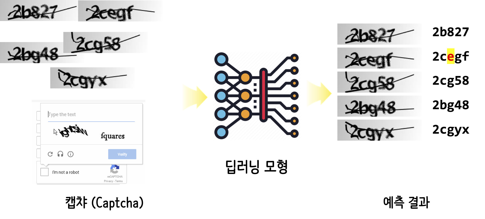

``` {r, include=FALSE}
knitr::opts_chunk$set(echo = TRUE, message=FALSE, warning=FALSE,
                      comment="", digits = 3, tidy = FALSE, prompt = FALSE, fig.align = 'center')
```

# 캡챠(Captcha) {#captcha}

Captcha를 사용해서 RPA 봇은 막을 수 있지만, 값싼 노동력을 이용하여 mechanical turk와 같은 서비스를 사용할 경우 우회도 가능하고 RPA 봇에 딥러닝 기법을 적용시켜 엔진을 장착시킬 경우 역시 무력화시킬 수 있다.



# 캡챠 데이터셋 [@captcha_dataset] {#captcha-dataset}

캡챠 원본 데이터는 [Wilhelmy, Rodrigo & Rosas, Horacio. (2013)](https://www.researchgate.net/publication/248380891_captcha_dataset)에서 다운로드 받을 수 있고, 캐글 [CAPTCHA Images Version 2 CAPTCHA Images](https://www.kaggle.com/fournierp/captcha-version-2-images/data) 데이터를 확인가능하다.
캡챠 원본 데이터를 가지고 작업을 진행한다. 다운로드 받아 압축을 풀어 제대로 가져왔는지 확인해 본다.

## 헬로 월드 {#captcha-dataset-helloworld}

먼저 제대로 압축을 풀고 데이터를 준비했는지 `magick` 팩키지 `image_read()` 함수로 불러 읽어온다.

```{r download-captcha-dataset}
library(tidyverse)
library(magick)

sample <- image_read("data/captcha_dataset/226md.png")

sample
```

## 라벨 데이터 {#captcha-dataset-label}

원본 이미지 데이터에서 라벨 데이터를 준비한다.

```{r download-captcha-dataset-label}
library(glue)

file_names <- list.files("data/captcha_dataset/")

captcha_labels <- str_extract(file_names, "[\\w\\d]+?(?=\\.)")

captcha_df <- tibble(label = captcha_labels, 
       captcha = glue("data/captcha_dataset/{file_names}"))

captcha_df
```

# 캡챠 딥러닝 {#captcha-deep-learning}

CNN 신경망 모형을 개발하여 챕챠 이미지를 제대로 학습했는지 훈련/시험 데이터를 통해 확인한다.

# 모형 성능평가 {#captcha-deep-learning-evaluation}

```{r captcha-evaluate}
randomized_character <- function(label_string) {
  string_characters <- str_split(label_string, "") %>% unlist
  random_character <- sample(string_characters, 1)
  character_pos <- which(string_characters == random_character)
  string_characters[character_pos] <- sample(LETTERS, 1)
  output_string <- str_flatten(string_characters)
  return(output_string)
}

# for(i in 1:10) {  randomized_character("ywn6f") }

captcha_trained <- captcha_df %>% 
  mutate(answer = rbinom(nrow(captcha_df), 1, prob=0.9))  %>% 
  mutate(predicted = ifelse(answer == 1, label, map_chr(label, randomized_character))) 

captcha_trained
```

# 캡챠 갤러리 {#captcha-dataset-gallery}

캡챠 데이터를 `trelliscopejs`를 사용해서 직관적으로 살펴볼 수 있도록 준비한다.

```{r captcha-gallary}
library(trelliscopejs)

captcha_trained <- captcha_trained %>%
  sample_n(100) %>% 
  mutate(captcha = as.character(captcha)) %>% 
  mutate(panel = img_panel_local(captcha))

trelliscope(captcha_trained, name = "captcha", 
            nrow = 3, ncol = 7,
            state = list(labels = c("label", "predicted")),
            path="captcha")
```


