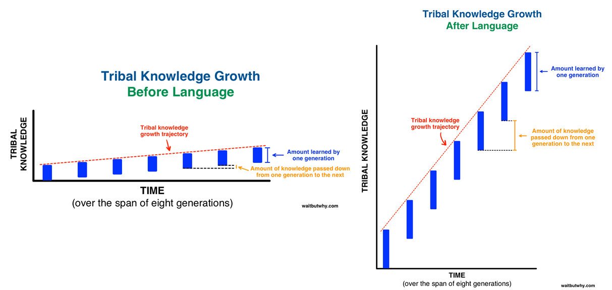

```{r, include=FALSE}
source("tools/chunk-options.R") 

knitr::opts_chunk$set(echo = TRUE, warning=FALSE, message=FALSE)

library(keras)
library(tidyverse)
library(ggplot2)
library(jpeg)

options(scipen = 999)
```

## 1. 전이 학습(transfer learning)과 학습된 모형(Pretrained Model) [^transfer-learning-pretrained] [^tim-urban-language]

[^transfer-learning-pretrained]: [Transfer learning & The art of using Pre-trained Models in Deep Learning](https://www.analyticsvidhya.com/blog/2017/06/transfer-learning-the-art-of-fine-tuning-a-pre-trained-model/)

[^tim-urban-language]: [Neuralink and the Brain’s Magical Future](https://waitbutwhy.com/2017/04/neuralink.html)

어떻게 학습(learning)을 전이(transfer)시킬 수 있을까? 오래전부터 인류가 고민해온 숙제다.
언어가 존재하지 않던 시절에는 지식의 축적이 매우 한정될 수 밖에 없었다. 하지만, 언어를 사용함에 따라
한 세대가 학습할 수 있는 지식의 양이 비약적으로 늘어나게 되었다.



컴퓨터의 발전과 함께 기존에 개발된 코드를 재사용할 수 있게 진화한 것도 유사한 맥락이다.
기존 서브루틴(subroutine)에서 객체(object), 컴포넌트(component), 플랫폼(platform)으로 진화하여 
훨씬 다양한 작업을 많이 수행할 수 있게 되었다.

이와 함께 딥러닝을 통해 학습시킨 모형은 GPU를 많이 사용했기 때문에 CPU 대비 상대적으로 소중한 자원인 
GPU를 활용하여 개발된 학습모형은 현재 어떻게 보면 소중한 자원이라고 할 수 있다.

## 2. 이미지넷(ImageNet) 딥러닝 모형 

### 2.1. 환경설정 및 데이터 가져오기

[`elephant.jpg` 이미지](https://cran.r-project.org/web/packages/kerasR/vignettes/introduction.html)를 가져온다. 
어떤 이미지인지 확인해보자. 그리고 데이터의 차원정보가 중요하니 `dim` 함수로 살펴본다.

``` {r imagenet-transfer-learning-setup}
# 0. 환경설치 -------------------------------------
# library(keras)
# library(tidyverse)
# library(ggplot2)
# library(jpeg)

# options(scipen = 999)

# 1. 데이터 불러오기 -------------------------------------
img <- readJPEG("data/elephant.jpg")
plot(0:1, 0:1, type="n", ann=FALSE, axes=FALSE)
rasterImage(img, 0,0,1,1)

dim(img)
```

### 2.2. 전이학습(transfer learning)

파이썬 Pillow 객체를 전이학습을 통한 딥러닝에 사용한다. 
`image_load` 함수가 그 역할을 수행하고 `imagenet_preprocess_input`에 넣기 전에 전처리 작업을 수한다.
그리고 나서 사전 학습된 딥러닝 모형 `application_vgg19` 모형에 넣어 `elephant.jpg` 파일에 담긴 
객체를 식별한다. `imagenet_decode_predictions` 함수를 실행시키면 
`elephant.jpg` 파일에 담긴 객체에 대한 라벨을 붙여 상위 10개를 반환한다.

``` {r imagenet-transfer-learning}
# 2. 사전 훈련된 신경망 모형 -------------------------------------
## 2.1. 이미지 데이터 준비 ---------------------------------------
img2keras <- image_load("data/elephant.jpg", target_size = c(224, 224))
img2array <- image_to_array(img2keras)

dim(img2array) <- c(1, dim(img2array))
img2array <- imagenet_preprocess_input(img2array)

## 2.2. 사전 훈련된 모형 적합 ------------------------------------
model_vgg19 <- application_vgg19(weights="imagenet")

pred_vg19 <- model_vgg19 %>% 
    predict(img2array)

## 2.3. 모형 평가 ------------------------------------------------
imagenet_decode_predictions(pred_vg19, top = 10)[[1]]
```
