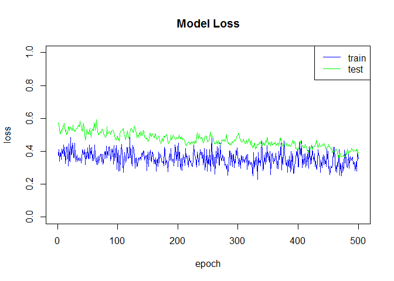
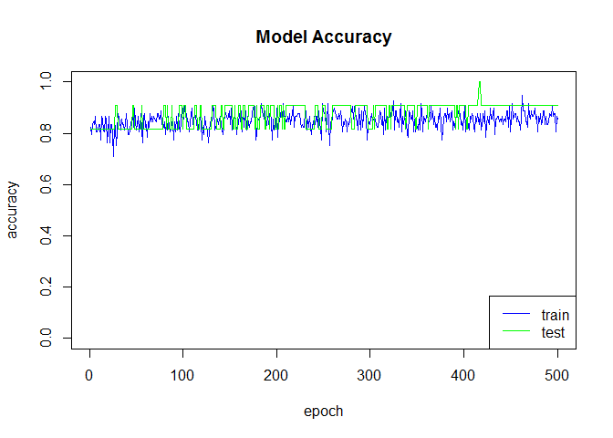

# xwMOOC 딥러닝

## 1. 신경망, 딥러닝 팩키지

R에서 신경망, 딥러닝을 돌릴 수 있는 팩키지가 다수 존재한다.
단순한 전방 전달 신경망부터 텐서플로우, MXNet을 활용할 수 있게 하는 팩키지까지 다양하다.

|R 팩키지   |      팩키지 설명                       |
|-----------|----------------------------------------|
|nnet	    | 전방 전달 신경망(feed-forward neural networks) + 다항 로그선형모형(multinomial log-linear models) |
|neuralnet	| 역전파 신경망                          |
|h2o	    | $H_2 O$ 지원                           |
|RSNNS	    | Stuttgart Neural Network Simulator (SNNS) 지원  |
|tensorflow | 구글 텐서플로우                        |
|deepnet	| 딥러닝 툴킷                            |
|darch	    | 볼츠만 기계(Deep Architectures and Restricted Boltzmann Machines)  |
|rnn	    | 순환신경망(Recurrent Neural Networks)  |
|FCNN4R	    | FCNN 라이브러리                        |
|rcppDL	    | 다양한 딥러닝 구현 라이브러리          |
|deepr	    | `darch`, `deepnet` 을 사용하기 쉽게 함 |
|MXNetR	    | `MXNet` 라이브러리                     |

딥러닝에 활용되는 방법론을 중심으로 살펴보면 다음과 같다. 다만 최신 텐서플로우는 포함되어 있지 않다. [^r-deep-learning-comparison]

[^r-deep-learning-comparison]: [Deep Learning in R](http://www.rblog.uni-freiburg.de/2017/02/07/deep-learning-in-r/)

| 팩키지   | 지원되는 신경망 아키텍쳐 |
|----------|---------------------------------------------|
| MXNetR   | Feed-forward neural network, convolutional neural network (CNN)  |
| darch    | Restricted Boltzmann machine, deep belief network                |
| deepnet  | Feed-forward neural network, restricted Boltzmann machine, deep belief network, stacked autoencoders |
| H2O      | Feed-forward neural network, deep autoencoders                   |
| deepr    | 케라스처럼 H2O, deepnet 팩키지를 쉽게 사용할 수 있게 지원        |

### 1.1. 케라스(Keras) [^keras-gura] [^deep-learning-in-r]

[^keras-gura]: [케라스 이야기](https://tykimos.github.io/Keras/2017/01/27/Keras_Talk/)

[^deep-learning-in-r]: [keras: Deep Learning in R](https://www.datacamp.com/community/tutorials/keras-r-deep-learning)

텐서플로우(tensorflow), 티아오(theano), 마이크로소프트 CNTK 등 딥러닝 라이브러리가 너무 많아 어떤 팩키지를 
골라야 하나 고민이 많다. R을 통해 모형을 개발하고 데이터를 분석하는 입장에서는 부족한 시간에 참 고민이 되는 지점이다.
케라스가 다음 4가지 품질속성을 중심으로 딥러닝 모형 개발에 출사표를 던졌다.

- 모듈화 (Modularity)
- 최소주의 (Minimalism)
- 쉬운 확장성
- 파이썬 기반

그런데, 케라스를 R에서 사용할 수 있도록 개발된 팩키지가 Taylor Arnold가 주축이 된 [kerasR](https://github.com/statsmaths/kerasR), 
RStudio에서 개발한 [keras](https://github.com/rstudio/keras) 두가지 버젼이 존재한다.
만약 RStudio 개발 생태계에 익숙하다면 `keras` 팩키지가 시작하기 딱 좋을 수 있다.

### 1.2. 케라스 설치

`kerasR` 보다 `keras` 설치가 단순하다. `devtools` 팩키지로 `install_github`을 통해 `keras`를 설치하고 나서,
`install_tensorflow()`를 실행하면 된다. 다만, 윈도우 사용자의 경우 [아나콘다](https://www.continuum.io/downloads)를 먼저 
설치하고 나서 `install_tensorflow()` 명령어 실행을 추천한다.

~~~{.r}
# 0. 환경설치 -------------------------------------
# devtools::install_github("rstudio/keras")
# library(keras)
# install_tensorflow()

# library(tidyverse)
~~~

## 2. 붓꽃 데이터 분류 

[iris 붓꽃 데이터](http://archive.ics.uci.edu/ml/machine-learning-databases/iris/iris.data)를 예제로 사용해서 시작해보자.
데이터프레임이 R에서 데이터를 분석하기 적합한 자료구조라면, 딥러닝을 시작하는 자료구조는 행렬이다.
따라서, 데이터를 `read_csv` 함수로 불러오면 자동으로 데이터프레임이 된다. 이를 행렬로 변환시킨다.
특히, `dimnames` 함수에 `NULL`값을 넣어 행렬 자료형으로 쉽게 변환하는 기법은 익혀두면 좋다.

~~~{.r}
# 1. 붓꽃 데이터 -------------------------------------
# 1.1. 붓꽃 데이터 가져오기 --------------------------
iris <- read_csv("http://archive.ics.uci.edu/ml/machine-learning-databases/iris/iris.data", col_names = FALSE) 

# 1.2. 데이터프레임을 행렬로 변환 -------------------
iris[,5] <- as.numeric(as.factor(unlist(iris[,5]))) -1
iris <- as.matrix(iris)
dimnames(iris) <- NULL
~~~

## 3. 붓꽃 데이터 딥러닝 시작하기 전 데이터 전처리 

데이터 전처리는 크게 관측점 데이터, 즉 행렬로 봤을 때 $\frac{2}{3}$ 행을 훈련데이터로 사용하고,
$\frac{1}{3}$ 데이터는 검증 데이터로 활용한다. 즉, 개발된 모형의 참성능은 검증데이터 $\frac{1}{3}$을 
활용하여 모형 성능을 검증한다.

피쳐는 정규화과정을 거쳐야 하는데 `keras` 내부에 `normalize()` 함수가 있어 쉽게 정규화할 수 있다.
또한, One-Hot 인코딩기법(통계에서는 가변수, dummy variable)을 통해 범주형 데이터를 0과 1만 갖는 
벡터로 변환한다.

~~~{.r}
# 2. 데이터 전처리 ----------------------------------
## 2.1. 데이터 정규화 -------------------------------
iris_x <- normalize(iris[,1:4])

iris_mat <- cbind(iris_x, iris[,5])
head(iris_mat)
~~~

~~~{.output}
          [,1]      [,2]      [,3]       [,4] [,5]
[1,] 0.8037728 0.5516088 0.2206435 0.03152050    0
[2,] 0.8281329 0.5070201 0.2366094 0.03380134    0
[3,] 0.8053331 0.5483119 0.2227517 0.03426949    0
[4,] 0.8000302 0.5391508 0.2608794 0.03478392    0
[5,] 0.7909650 0.5694948 0.2214702 0.03163860    0
[6,] 0.7841750 0.5663486 0.2468699 0.05808704    0

~~~

~~~{.r}
# 3. 딥러닝 모형 -----------------------------------
## 3.1. 훈련표본과 검증표본 ------------------------- 
ind <- sample(2, nrow(iris_mat), replace=TRUE, prob=c(0.67, 0.33))

### 모형 설계행렬
iris.training <- iris_mat[ind==1, 1:4]
iris.test <- iris_mat[ind==2, 1:4]

### 모형 예측변수
iris.trainingtarget <- iris_mat[ind==1, 5]
iris.testtarget <- iris_mat[ind==2, 5]

### One-Hot 인코딩: 훈련예측변수
iris.trainLabels <- to_categorical(iris.trainingtarget)

### One-Hot 인코딩: 검증예측변수
iris.testLabels <- to_categorical(iris.testtarget)
~~~

## 4. 딥러닝 모형 적합

딥러닝 모형을 개발하려면 데이터를 가져오고, 데이터를 전처리하고 나서, 데이터에 적합한 
딥러닝 모형을 적용해야 하는데 신경망 계층(layer)은 몇층으로 할지, 노드는 몇개로 할지,
활성화(activation) 함수는 무엇으로 할지, 하이퍼 모수 학습률(learning rate)은 어떻게 정할지,
다양한 조합이 모형의 성능에 영향을 미치게 된다. 그런 점에서 케라스는 모형자체에 
개발자가 집중할 수 있도록 함으로써 큰 도움을 주고 있다.

모형을 `keras_model_sequential()`로 초기화하고 나서,
"Sepal.Length", "Sepal.Width", "Petal.Length", "Petal.Width" 4개가 입력으로 들어가도록 설정한다.
`input_shape = c(4)`가 역할을 하고 계층은 입력계층 하나, 출력계층 하나 총 두개로 놓는데,
`layer_dense`를 통해 해결하고 `layer_dropout`을 사이에 넣어 신경망 모형을 단순화한다.
그리고 활성화함수는 `relu`, `softmax`를 지정한다.

모형을 적합시키기 전에 `compile` 단계를 지정하는데 신경망 아키텍처가 지정된 후에,
손실(loss), 최적화, 측도(metrics)를 지정한다.

그리고 나서 `fit` 단계에서 모형을 학습시킨다. `epoch`은 몇회를 할지 배치크기는 얼마로 할지,
검증(validation)은 어떻게 나눌지 등등을 지정하여 학습을 돌린다.

~~~{.r}
## 3.2. 모형 개발 ------------------------- 
set.seed(777)
### 3.2.1. 모형 초기화
model <- keras_model_sequential()

### 3.2.2. 모형에 계층 추가

# 4 inputs -> [8 hidden nodes] -> 3 outputs
model %>% 
    layer_dense(units = 8, activation = 'relu', input_shape = c(4)) %>% 
    layer_dropout(rate = 0.5) %>% 
    layer_dense(units = 3, activation = 'softmax')

### 3.2.3. 모형 살펴보기
summary(model)
~~~

~~~{.output}
Model
___________________________________________________________________________
Layer (type)                     Output Shape                  Param #     
===========================================================================
dense_1 (Dense)                  (None, 8)                     40          
___________________________________________________________________________
dropout_1 (Dropout)              (None, 8)                     0           
___________________________________________________________________________
dense_2 (Dense)                  (None, 3)                     27          
===========================================================================
Total params: 67
Trainable params: 67
Non-trainable params: 0
___________________________________________________________________________

 

~~~

~~~{.r}
# get_config(model)
# get_layer(model, index = 1)
# model$layers
# model$inputs
# model$outputs

### 3.2.4. 모형 컴파일
model %>% compile(
    loss = 'categorical_crossentropy',
    optimizer = 'adam',
    metrics = 'accuracy'
)

### 3.2.5. 모형 적합
model %>% fit(
    iris.training, 
    iris.trainLabels, 
    epochs = 500, 
    batch_size = 5,
    validation_split = 0.1
)
~~~

## 5. 딥러닝 모형 적합성 시각화

딥러닝 모형이 잘 학습되었는지, 즉 과대학습 혹은 과소학습이 되지 않았나 
훈련표본과 검증표본의 손실과 정확도 두가지 측면에서 시각적으로 확인한다.

~~~{.r}
### 3.2.6. 적합된 모형 시각화
history <- model %>% fit(
    iris.training, 
    iris.trainLabels, 
    epochs = 500,
    batch_size = 5,
    validation_split = 0.1
)

listviewer::jsonedit(history, model="view")
~~~

<!--html_preserve-->

<!--/html_preserve-->

~~~{.r}
### 모형 수렴
plot(history$metrics$loss, main="Model Loss", xlab = "epoch", ylab="loss", col="blue", type="l",
     ylim=c(0,1))
lines(history$metrics$val_loss, col="green")
legend("topright", c("train","test"), col=c("blue", "green"), lty=c(1,1))
~~~

~~~{.r}
### 모형 정확성
plot(history$metrics$acc, main="Model Accuracy", xlab = "epoch", ylab="accuracy", col="blue", type="l",
     ylim=c(0,1))
lines(history$metrics$val_acc, col="green")
legend("bottomright", c("train","test"), col=c("blue", "green"), lty=c(1,1))
~~~

## 6. 딥러닝 모형 적합성 시각화

붓꽃 분류기가 개발되었으니, 실제 성능이 얼마나 나오는지 앞서 검증표본으로 남겨 놓은 `iris.test` 데이터를 통해 
정확도를 추정한다.

~~~{.r}
### 3.2.7. 검증표본을 통한 평가
pred_mat <- model %>% predict(iris.test, batch_size = 5) %>% tbl_df()

pred_mat <- pred_mat %>% 
    mutate(max_prob = max.col(., ties.method = "last")-1)

### 오차 행렬(Confusion Matrix)
table(iris.testtarget, pred_mat$max_prob)
~~~

~~~{.output}
               
iris.testtarget  0  1  2
              0 11  0  0
              1  0 16  0
              2  0  1 14

~~~

~~~{.r}
### 모형 정확도 평가
score <- model %>% 
    evaluate(iris.test, iris.testLabels, batch_size = 128)

print(score)
~~~

~~~{.output}
[[1]]
[1] 0.1808525

[[2]]
[1] 0.9761904

~~~

