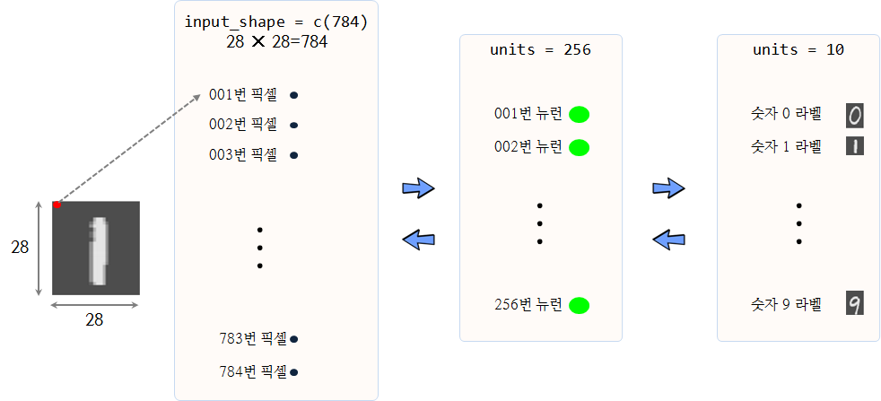

```{r setup, include=FALSE}
knitr::opts_chunk$set(echo = TRUE, message=FALSE, warning=FALSE,
                      comment="", digits = 3, tidy = FALSE, prompt = FALSE, fig.align = 'center')

```

# 숫자 필기(MNIST) 데이터 {#mnist-dataset}

필기숫자 인식 데이터는 [Yann LeCun](http://yann.lecun.com/exdb/mnist/) 웹사이트에서 다운로드 받을 수도 있고,
[캐글 숫자인식기(Digit Recognizer)](https://www.kaggle.com/c/digit-recognizer) 웹사이트에서도 다운로드 받을 수 있고,
`keras` 팩키지를 설치하면 팩키지 내부에 `dataset_mnist()` 함수를 통해 데이터를 불러올 수 있다.

# 숫자 필기 인식기 개발 [^mnist-keras-rstudio] {#mnist-recognizer}

[^mnist-keras-rstudio]: [Implementing Deep learning in R using Keras and Tensorflow packages for R and implementing a Multi layer perceptron Model on MNIST dataset and doing Digit Recognition](https://github.com/anishsingh20/Deep-Learning-in-R-using-Keras-and-Tensorflow-)

## 데이터 가져오기 {#mnist-ingest}

요즘들어 R 팩키지가 개발되면 유의미한 데이터를 포함시키는 경향이 있다. 
`keras` 팩키지에도 숫자 필기(MNIST) 데이터가 포함되어 있다. 
`? dataset_mnist()` 명령어를 실행하면 자세한 데이터에 대한 내용을 확인할 수 있다.

``` {r mnist-setup}
# 0. 환경설치 -------------------------------------
library(keras)
library(tidyverse)

# 1. 데이터 불러오기 -------------------------------------
mnist_lst <- dataset_mnist()

# str(mnist_lst)
```

`str(mnist_lst)` 명령어로 리스트 형태로 `train`, `test`로 구분되어 있음이 확인된다.

## 데이터 살펴보기 {#mnist-glimpse}

관심이 있는 것은 필기숫자 데이터를 맞추는 것이다. 따라서 훈련데이터에 필기숫자 데이터가 
0 -- 9 까지 몇개나 되는지 살펴보고, 표본으로 50개를 뽑아 그래프로 그려본다.
`display_digit` 함수는 사람이 이해하기 쉬운 형태 이미지로 시각화하기 위해 필요한 기능을 담고 있다.

``` {r mnist-eda}
# 2. 탐색적 데이터 분석 ----------------------------------
## 2.1. 사람손으로 쓴 손글씨 숫자 
mnist_lst$train$y %>% as_tibble() %>% 
  ggplot(aes(x=as.factor(value), fill=as.factor(value))) +
    geom_bar(stat="count") +
    scale_y_continuous(labels = scales::comma) +
    theme_bw(base_family = "AppleGothic") +
    labs(title="필기 숫자 훈련데이터 ", x="숫자", y="빈도수", fill="") +
    theme(legend.position = "right")

## 2.2. 사람손으로 쓴 손글씨 숫자 시각화
mnist_smpl <- mnist_lst$train$x %>% tbl_df() %>% 
    sample_n(50)

par(mfrow=c(5,10), mar=c(0.1,0.1,0.1,0.1))

display_digit <- function(input){
    m <- matrix(unlist(input), nrow = 28, byrow = FALSE)
    m <- t(apply(m, 2, rev))
    image(m, col=grey.colors(255), axes=FALSE)
}

for(i in 1:50) {
    display_digit(mnist_smpl[i,])
}
```

## 데이터 전처리 {#mnist-preprocessing}

딥러닝 모형학습 전에 데이터를 훈련데이터와 검증데이터로 구분한다.
`dataset_mnist()` 원본 데이터가 훈련과 검증 데이터로 구분이 되어 있어 이를 활용한다.
그리고, 기계학습을 위해 정규화 과정을 거친다. `dataset_mnist()` 데이터가 2D 이차원 배열이라,
이를 1차원 배열로 바꾸고 나서 255로 나눠 0 -- 1 사이 값으로 정규화시킨다.


훈련데이터로 60,000 개 데이터, 검증데이터로 10,000 개 데이터가 준비되었다.
`to_categorical()` 함수를 통해 종속변수를 One-Hot 인코딩 가변수 변환시킨다.

``` {r mnist-preprocessing}
# 3. 훈련/학습 데이터 분할 ----------------------------------

# 훈련데이터
train_x <- mnist_lst$train$x
train_y <- mnist_lst$train$y

# 검증데이터
test_x <- mnist_lst$test$x
test_y <- mnist_lst$test$y

# 4. 데이터 전처리 ----------------------------------
## 데이터 정규화(2D 배열 --> 1D 배열)
train_x <- array(as.numeric(train_x), dim = c(dim(train_x)[[1]], 784))
test_x <- array(as.numeric(test_x), dim = c(dim(test_x)[[1]], 784))

# RGB 값을 [0,1] 범위로 변환
train_x <- train_x / 255
test_x <- test_x / 255

cat(dim(train_x)[[1]], '개: 훈련표본\n') #60000 훈련표본
cat(dim(test_x)[[1]], '개: 검증표본\n') #10000 검증표본

## 종속변수 가변수 변환
train_y <- to_categorical(train_y, 10)
test_y  <- to_categorical(test_y, 10)
```

## 딥러닝 모형 적합/훈련 {#mnist-fit}

훈련데이터와 검증데이터가 모두 준비되었으니, 모형을 초기화하고, 
3층 구성을 갖는 신경망 모형을 준비한다. 더불어 손실함수와 측도도 함께 정의한후 
`fit` 함수를 통해 준비한 신경망을 학습시킨다.



중간 dropout 계층과 128개 뉴런을 갖는 계층을 제외하면 이미지($28\times 28 = 784$) 픽셀을 입력으로 받아 256 뉴런에 넣는 계층 하나와
출력으로 0--9까지 숫자 10개 라벨을 갖는 출력 계층으로 단순화할 수 있다.


``` {r mnist-keras-deep-learning}
# 5. 딥러닝 모형 ----------------------------------

## 5.1. 모형 초기화
model <- keras_model_sequential()

## 5.2. 모형 아키텍쳐 구성
model %>%
  layer_conv_2d(filters = 32, kernel_size = c(3,3), activation = 'relu',
                input_shape = input_shape) %>% 
  layer_conv_2d(filters = 64, kernel_size = c(3,3), activation = 'relu') %>% 
  layer_max_pooling_2d(pool_size = c(2, 2)) %>% 
  layer_dropout(rate = 0.25) %>% 
  layer_flatten() %>% 
  layer_dense(units = 128, activation = 'relu') %>% 
  layer_dropout(rate = 0.5) %>% 
  layer_dense(units = num_classes, activation = 'softmax')

    # layer_dense(units=256, activation="relu", input_shape=c(784))  %>%
    # layer_dropout(rate=0.4) %>%
    # layer_dense(units = 128, activation = "relu") %>%
    # layer_dropout(rate=0.4) %>%
    # layer_dense(units=10,activation="softmax") 

summary(model)

model %>%
    compile(loss ="categorical_crossentropy",
            optimizer = "adam",
            metrics= c("accuracy"))

## 5.3. 학습
history <- model %>% 
  fit(train_x, train_y, 
      epochs = 10, 
      batch_size = 128,
      callbacks = callback_tensorboard(log_dir = "logs/run_b"),
      validation_split = 0.2) 

history$metrics
```

## 모형평가 {#mnist-evaluation}

훈련데이터에 대한 딥러닝 학습을 수행한 결과를 시각적으로 평가한다.
딥러닝 모형이 과적합하지 않고 적절한 시점(이폭, Epochs)에서 정지한 것을 확인한 후,
검증데이터에 대해 손실오차와 정확도를 평가한다.

``` {r mnist-keras-deep-learning-evaluation}
## 5.4. 딥러닝 모형 평가
### 훈련데이터 모형 성능 시각화
eval_df <- tibble(train_acc = history$metrics$accuracy,
                  test_acc  = history$metrics$val_accuracy)

eval_df %>% 
  mutate(epoch = 1:10) %>% 
  pivot_longer(-epoch, names_to = "metric", values_to="accuracy") %>% 
  ggplot(aes(x=epoch, y = accuracy, color=metric)) +
    geom_line() +
    geom_point() +
    labs(x="한세대(이폭, Epochs)", y="정확도",
         title = "모형 정확도(Accuracy) 개선 추이") + 
    scale_y_continuous(labels = scales::percent) +
    theme_bw(base_family = "NanumGothic")

# plot(history, labels=TRUE)

# 검증데이터 평가점수
score <- model %>% 
    evaluate(test_x, test_y)

cat("손실오차(loss): ", scales::percent(score[[1]]), "\n")
cat("정확도(Accurracy: ", scales::percent(score[[2]]), "\n")
```
