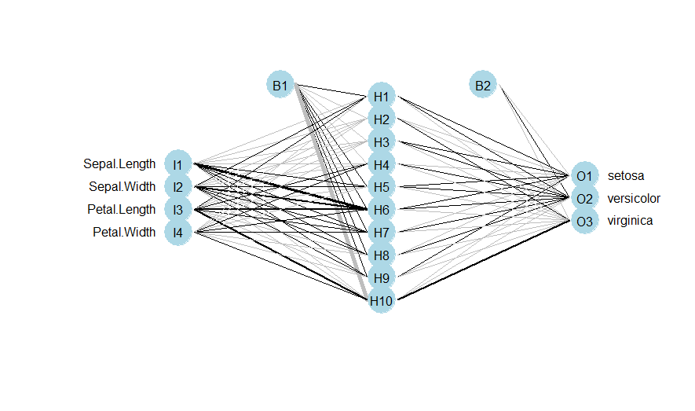
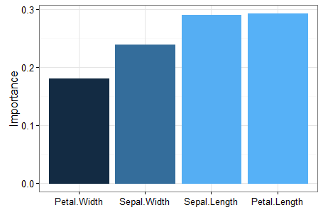
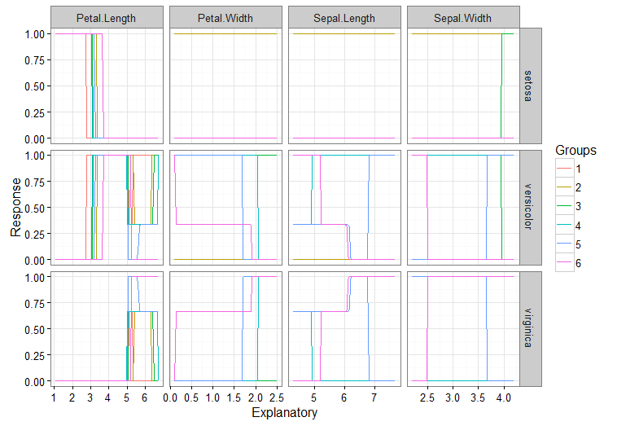

> ## 학습 목표 {.objectives}
>
> * 이미 전통이 된 신경망에 대해 이해한다.
> * `nnet` 팩키지를 사용하여 예측 모형을 구축한다.
> * 예측모형으로 개발하는 신경망을 시각화한다.
> * `garson`, `lekprofile` 함수를 사용하여 변수 중요도와 민감도를 추가 분석한다.

### 1. `nnet` 신경망 예측 모형 구축

1. `nnet` 신경망에 종속변수로 입력하기 위해서는 `class.ind` 함수로 가변수를 생성하는 과정이 특이하다.
1. `sample` 함수로 150개 붓꽃 데이터를 훈련 데이터 100개, 검증 데이터 50개로 분리한다.
1. `nnet` 함수에 훈련데이터를 `x`, `y`에 맞춰 집어 넣는다. 
    * `size` 는 노드를 10개 설정, `softmax`로 최종결과 예측
1. `table` 함수를 통해 검증데이터와 모형결과 정확도를 확인한다.
1. `plot.nnet` 함수를 통해 신경망 모형을 확인한다.

~~~ {.r}
##================================================================
## 01. 환경설정 및 데이터 불러오기
##================================================================
library(nnet)
data(iris)

# nnet 종속변수 입력을 위한 종속변수 변환
species.ind <- class.ind(iris$Species)
iris <- cbind(iris, species.ind)

##================================================================
## 02. 훈련 및 검증 데이터 분리
##================================================================
train.idx  <-  sample(1:150,100)

iris.train.df <- iris[train.idx, ]
iris.test.df <- iris[-train.idx, ]

##================================================================
## 03. 신경망 모형 적합
##================================================================

iris.nn  <-  nnet(x=iris.train.df[,c(1:4)], y=iris.train.df[,c(6:8)], size=10, softmax=TRUE)

##================================================================
## 04. 검증 데이터 예측 및 모형 평가
##================================================================
# 훈련데이터
iris.pred <- predict(iris.nn, iris.train.df[,c(1:4)], type="class")
table(iris.pred, iris.train.df$Species)
# 검증데이터
iris.pred <- predict(iris.nn, iris.test.df[,c(1:4)], type="class")
table(iris.pred, iris.test.df$Species)

##================================================================
## 05. 신경망 시각화
##================================================================
# 시각화 R 코드 함수 다운로드
library(devtools)
source_url('https://gist.githubusercontent.com/fawda123/7471137/raw/466c1474d0a505ff044412703516c34f1a4684a5/nnet_plot_update.r')

# 신경망 모형 시각화
library(reshape2)
plot.nnet(iris.nn)
~~~

신경망 모형을 이용한 예측모형 결과값이 훈련데이터를 사용한 
신경망 모형에서 오분류가 1건 발생했지만, 검증데이터에는 오분류 없이 예측했다.

~~~ {.output}
> table(iris.pred, iris.train.df$Species)
            
iris.pred    setosa versicolor virginica
  setosa         35          0         0
  versicolor      0         33         0
  virginica       0          1        31

> table(iris.pred, iris.test.df$Species)
            
iris.pred    setosa versicolor virginica
  setosa         15          0         0
  versicolor      0         16         0
  virginica       0          0        19  
~~~

~~~ {.r}
##================================================================
## 06. 신경망 이해
##================================================================
library(NeuralNetTools)
garson(iris.nn)
lekprofile(iris.nn)
~~~

Garson 알고리즘을 사용한 `garson` 함수로 변수 중요도를 시각화한다.

Lek 프로파일 방법을 사용하여 `lekprofile` 함수로 민감도 분석도 가능하다.

### 참고문헌

* [NeuralNetTools](https://cran.r-project.org/web/packages/NeuralNetTools/index.html): [NeuralNetTools 1.0.0 now on CRAN](http://www.r-bloggers.com/neuralnettools-1-0-0-now-on-cran/)
    * `garson` : Garson 알고리즘을 사용하여 변수 중요도를 시각화
    * `lekprofile` : Lek 프로파일 방법을 사용하여 민감도 분석
* [neuralnet](https://cran.r-project.org/web/packages/neuralnet/) : [Fitting a neural network in R; neuralnet package](http://www.r-bloggers.com/fitting-a-neural-network-in-r-neuralnet-package/)
    * `hidden` 인자로 다층으로 신경망을 구성할 수 있다.

