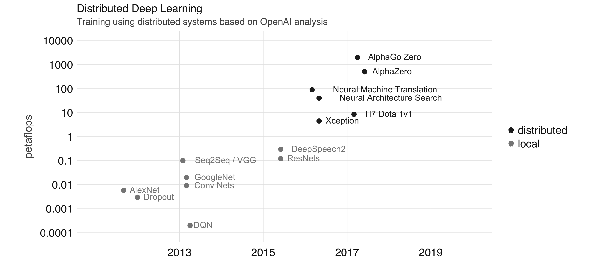

``` {r setup, include=FALSE}
knitr::opts_chunk$set(echo = TRUE, message=FALSE, warning=FALSE,
                      comment="", digits = 3, tidy = FALSE, prompt = FALSE, fig.align = 'center')

knitr::opts_knit$set(global.par = TRUE) 
```

# 이미지 분류 [^image-classification] {#object-classification}

[^image-classification]: [Arthur Ouaknine (Jan 16, 2018 ), "Review of Deep Learning Algorithms for Image Classification"](https://medium.com/zylapp/review-of-deep-learning-algorithms-for-image-classification-5fdbca4a05e2)

[ImageNet Classification](https://pjreddie.com/darknet/imagenet/) 분류기는 [Large Scale Visual Recognition Challenge 2015 (ILSVRC2015)](http://image-net.org/challenges/LSVRC/2015/index)에 등재된 1,000개 객체(Image Object)를 정확히 분류하는 것을 목표로 한다. 정확도를 높이고자 그동안 많은 노력이 경주되어 왔다. Yann Lecun의 LeNet-5 (1998)에 영감을 받아 SIFT 모형이 달성한 ImageNet 26.2%를 뛰어넘는 2013년 AlexNet을 시작으로 연도별로 매년 혁신적인 딥러닝 알고리즘이 발표되었다.

```{r distributed-deep-learning, eval = FALSE}
webshot::webshot(url = "https://therinspark.com/extensions.html", selector = '#deep-learning > div:nth-child(20) > img', "fig/distributed-deep-learning.png")
```



[ImageNet Classification](https://pjreddie.com/darknet/imagenet/) 웹사이트에서 이미지넷 다양한 알고리즘을 다운로드 받을 수 있다.

- AlexNet: <http://pjreddie.com/media/files/alexnet.weights>
- Darknet Reference Model: <http://pjreddie.com/media/files/darknet.weights>
- VGG-16: <http://pjreddie.com/media/files/vgg-16.weights>
- Googlenet/extraction: <http://pjreddie.com/media/files/extraction.weights>
- Darknet19: <http://pjreddie.com/media/files/extraction.weights>
- Darknet19 448x448: <http://pjreddie.com/media/files/darknet19_448.weights>


이미지 분류를 위한 아키텍처 다이어그램은 [NN SVG](http://alexlenail.me/NN-SVG/LeNet.html), [PlotNeuralNet](https://github.com/HarisIqbal88/PlotNeuralNet)을 통해서 딥러닝 신경망 모형 아키텍처를 시각화할 수 있다.

```{r slickR-deep-learning-algorithm, eval = FALSE}
library(slickR)

"fig/deep_learning/LeNet-5.png"
"fig/deep_learning/AlexNet.png"
"fig/deep_learning/Inception.png"
"fig/deep_learning/GoogLeNet.png"
```


AlexNet을 시작으로 증흥기를 이룬 딥러닝 신경망 모형 아키텍처의 성능은 다음과 같다.


```{r imagenet-performance}
library(rvest)
library(tidyverse)

darknet_url <- "https://pjreddie.com/darknet/imagenet/"

comparison_table <- darknet_url %>% 
  read_html() %>% 
  html_node(css = '#compare') %>% 
  html_table()

comparison_table %>% 
  tbl_df() %>% 
  set_names(c("Model", "Top-1", "Top-5", "Ops(Bn)", "GPU(ms)", "CPU(s)", "Cfg", "Weights(MB)")) %>% 
  janitor::clean_names() %>% 
  mutate_at(vars("ops_bn", "gpu_ms", "cpu_s", "weights_mb"), parse_number) %>% 
  DT::datatable()
```

# 객체 분류기: `AlexNet` {#object-classification-alexnet}

`AlexNet`[@krizhevsky2012imagenet]을 활용하여 이미지에 포함된 객체를 분류해보자.

먼저, 이미지에 포함된 객체를 식별하는데 사용될 사진들을 살펴보자.

```{r image-clasify}
library(tidyverse)
library(magick)
library(image.darknet)

trilobite <- image_read("fig/trilobite.jpg") %>% image_resize(100)
airplane <- image_read("fig/airplane.jpeg") %>% image_resize(100)
wagon <- image_read("fig/wagon.jpg")  %>% image_resize(100)
경복궁 <- image_read("fig/경복궁.jpg")  %>% image_resize(100)
설악산 <- image_read("fig/설악산.png") %>% image_resize(100)
bear <- image_read("fig/bear.jpg") %>% image_resize(100)
elephant <- image_read("fig/imagenet-transfer-learning-setup-1.png")  %>% image_resize(100)

image_append(c(trilobite, airplane, wagon, 경복궁, 설악산, bear, elephant), stack = FALSE)
```

AlexNet을 다운로드 받아 사전 훈련된 모형(Pre-Trained Model)을 사용해서 이미지를 분류해보자.

```{r image-darknet-alexnet, eval = TRUE}
library(image.darknet)

# download.file(url = "https://pjreddie.com/media/files/alexnet.weights", destfile = "DL_library/alexnet.weights")

## ImageNet 라벨
labels <- readLines(system.file(package="image.darknet", "include", "darknet", "data", "imagenet.shortnames.list"))

## AlexNet ....................................................................
### http://pjreddie.com/media/files/alexnet.weights

alexnet_weights <- "DL_library/alexnet.weights"

alexnet <- image_darknet_model(type = 'classify', 
                               model = "DL_library/alexnet.cfg", 
                               weights = alexnet_weights, 
                               labels = labels, 
                               resize = FALSE) # FALSE 값 설정 Alexnnet, VGG-16

image_darknet_classify(file = "fig/airplane.jpeg", object = alexnet)
```

# 객체 분류기: `Darknet 19` {#object-classification-resnet}

Darknet19를 사용해서 동일하게 분류해보자.

```{r resnet-classification}

darknet19_weights <- "DL_library/darknet19.weights"

darknet19 <- image_darknet_model(type = 'classify', 
                                 model = "DL_library/darknet19.cfg",
                                 weights = darknet19_weights, 
                                 labels = labels)

image_darknet_classify(file = "fig/airplane.jpeg", object = darknet19)

```

# 자동화 {#automate-classification}

[ImageNet Classification](https://pjreddie.com/darknet/imagenet/) 사전 학습 모형(pre-trained Model)을 다운로드 받아 이를 기반으로 분류작업을 수행한다. 먼저 Pre-trained Model을 다운로드 받는다.

- AlexNet: alexnet
- VGG-16: vgg-16
- Google Extraction: extraction
- Darknet19: darknet19
- Darknet19 448x448: darknet19_448
- Resnet 18: resnet18
- Resnet 34: resnet34
- Resnet 50: resnet50
- Resnet 101:resnet101
- Resnet 152:resnet152
- ResNeXt 50: resnext50
- ResNeXt 101 (32x4d): resnext101-32x4d
- ResNeXt 152 (32x4d): resnext152-32x4d
- Densenet 201: densenet201
- Darknet53: darknet53
- Darknet53 448x448: darknet53_448

상기 모델을 다운로드 받기 위해서 백그라운드(background) 작업을 위해 `Start Local Job` RStudio 기능을 활용한다. `download_transfer_learning_library.R` 파일에 다음 내용을 저장하고 실행시킨다. 

```{r download-script, eval = FALSE}
# AlexNet
download.file(url = "https://raw.githubusercontent.com/pjreddie/darknet/master/cfg/alexnet.cfg", destfile = "DL_library/alexnet.cfg")
download.file(url = "https://pjreddie.com/media/files/alexnet.weights", destfile = "DL_library/alexnet.weights")

# VGG-16
download.file(url = "https://raw.githubusercontent.com/pjreddie/darknet/master/cfg/vgg-16.cfg", destfile = "DL_library/vgg-16.cfg")
download.file(url = "https://pjreddie.com/media/files/vgg-16.weights", destfile = "DL_library/vgg-16.weights")

# Google Extraction
download.file(url = "https://raw.githubusercontent.com/pjreddie/darknet/master/cfg/extraction.cfg", destfile = "DL_library/extraction.cfg")
download.file(url = "https://pjreddie.com/media/files/extraction.weights", destfile = "DL_library/extraction.weights")

# Darknet19
download.file(url = "https://raw.githubusercontent.com/pjreddie/darknet/master/cfg/darknet19.cfg", destfile = "DL_library/darknet19.cfg")
download.file(url = "https://pjreddie.com/media/files/darknet19.weights", destfile = "DL_library/darknet19.weights")

# Darknet19 448x448
download.file(url = "https://raw.githubusercontent.com/pjreddie/darknet/master/cfg/darknet19_448.cfg", destfile = "DL_library/darknet19_448.cfg")
download.file(url = "https://pjreddie.com/media/files/darknet19_448.weights", destfile = "DL_library/darknet19_448.weights")

# Resnet 18
download.file(url = "https://raw.githubusercontent.com/pjreddie/darknet/master/cfg/resnet18.cfg", destfile = "DL_library/resnet18.cfg")
download.file(url = "https://pjreddie.com/media/files/resnet18.weights", destfile = "DL_library/resnet18.weights")

# Resnet 34
download.file(url = "https://raw.githubusercontent.com/pjreddie/darknet/master/cfg/resnet34.cfg", destfile = "DL_library/resnet34.cfg")
download.file(url = "https://pjreddie.com/media/files/resnet34.weights", destfile = "DL_library/resnet34.weights")

# Resnet 50
download.file(url = "https://raw.githubusercontent.com/pjreddie/darknet/master/cfg/resnet50.cfg", destfile = "DL_library/resnet50.cfg")
download.file(url = "https://pjreddie.com/media/files/resnet50.weights", destfile = "DL_library/resnet50.weights")

# Resnet 101
download.file(url = "https://raw.githubusercontent.com/pjreddie/darknet/master/cfg/resnet101.cfg", destfile = "DL_library/resnet101.cfg")
download.file(url = "https://pjreddie.com/media/files/resnet101.weights", destfile = "DL_library/resnet101.weights")

# Resnet 152
download.file(url = "https://raw.githubusercontent.com/pjreddie/darknet/master/cfg/resnet152.cfg", destfile = "DL_library/resnet152.cfg")
download.file(url = "https://pjreddie.com/media/files/resnet152.weights", destfile = "DL_library/resnet152.weights")

# ResNeXt 50
download.file(url = "https://raw.githubusercontent.com/pjreddie/darknet/master/cfg/resnext50.cfg", destfile = "DL_library/resnext50.cfg")
download.file(url = "https://pjreddie.com/media/files/resnext50.weights", destfile = "DL_library/resnext50.weights")

# ResNeXt 101 (32x4d)
download.file(url = "https://raw.githubusercontent.com/pjreddie/darknet/master/cfg/resnext101-32x4d.cfg", destfile = "DL_library/resnext101-32x4d.cfg")
download.file(url = "https://pjreddie.com/media/files/resnext101-32x4d.weights", destfile = "DL_library/resnext101-32x4d.weights")

# ResNeXt 152 (32x4d)
download.file(url = "https://raw.githubusercontent.com/pjreddie/darknet/master/cfg/resnext152-32x4d.cfg", destfile = "DL_library/resnext152-32x4d.cfg")
download.file(url = "https://pjreddie.com/media/files/resnext152-32x4d.weights", destfile = "DL_library/resnext152-32x4d.weights")

# Densenet 201
download.file(url = "https://raw.githubusercontent.com/pjreddie/darknet/master/cfg/densenet201.cfg", destfile = "DL_library/densenet201.cfg")
download.file(url = "https://pjreddie.com/media/files/densenet201.weights", destfile = "DL_library/densenet201.weights")

# Darknet53
download.file(url = "https://raw.githubusercontent.com/pjreddie/darknet/master/cfg/darknet53.cfg", destfile = "DL_library/darknet53.cfg")
download.file(url = "https://pjreddie.com/media/files/darknet53.weights", destfile = "DL_library/darknet53.weights")

# Darknet53 448x448
download.file(url = "https://raw.githubusercontent.com/pjreddie/darknet/master/cfg/darknet53_448.cfg", destfile = "DL_library/darknet53_448.cfg")
download.file(url = "https://pjreddie.com/media/files/darknet53_448.weights", destfile = "DL_library/darknet53_448.weights")
```

## 이미지 평가 {#pretrained-model}

앞서 각각 Pre-trained Model을 사용했다면 이번에는 설치한 모형에 이미지를 던저 이미지에 담긴 객체분류 작업을 수행한다.

```{r automate-classification-for-loop}

# Pretrained Model
# pretrained_models <- c("alexnet", "vgg-16", "extraction", "darknet19", "darknet19_448", 
#                        "resnet18","resnet34", "resnet50", "resnet101", "resnet152", 
#                        "resnext50", "resnext101-32x4d", "resnext152-32x4d", "densenet201", 
#                        "darknet53", "darknet53_448")

pretrained_models <- c("alexnet", "vgg16", "extraction", 
                       "darknet19", "densenet201", "darknet19_448")

## alexnet
alexnet_weights <- "DL_library/alexnet.weights"

alexnet <- image_darknet_model(type = 'classify', 
                                 model = "DL_library/alexnet.cfg",
                                 weights = alexnet_weights, 
                                 labels = labels,
                                 resize = FALSE)

## vgg-16
vgg_weights <- "DL_library/vgg-16.weights"

vgg16 <- image_darknet_model(type = 'classify', 
                                 model = "DL_library/vgg-16.cfg",
                                 weights = vgg_weights, 
                                 labels = labels,
                                 resize = FALSE)

## Google extraction
extraction_weights <- "DL_library/extraction.weights"

extraction <- image_darknet_model(type = 'classify', 
                                 model = "DL_library/extraction.cfg",
                                 weights = extraction_weights, 
                                 labels = labels)


## darknet19
darknet19_weights <- "DL_library/darknet19_448.weights"

darknet19 <- image_darknet_model(type = 'classify', 
                                 model = "DL_library/darknet19_448.cfg",
                                 weights = darknet19_weights, 
                                 labels = labels)

## resnet18
resnet18_weights <- "DL_library/resnet18.weights"

resnet18 <- image_darknet_model(type = 'classify', 
                                 model = "DL_library/resnet18.cfg",
                                 weights = resnet18_weights, 
                                 labels = labels)

## densenet201
densenet201_weights <- "DL_library/densenet201.weights"

densenet201 <- image_darknet_model(type = 'classify', 
                                 model = "DL_library/densenet201.cfg",
                                 weights = densenet201_weights, 
                                 labels = labels)

## darknet19_448
darknet19_448_weights <- "DL_library/darknet19_448.weights"

darknet19_448 <- image_darknet_model(type = 'classify', 
                                 model = "DL_library/darknet19_448.cfg",
                                 weights = darknet19_448_weights, 
                                 labels = labels)


models_summary <- tibble(model = pretrained_models,
                         probability = 0,
                         label = "x")

for(i in 1:length(pretrained_models)){
  x <- image_darknet_classify(file = "fig/trilobite.jpg",
                              object = get(pretrained_models[i]))
  models_summary$probability[i] <- x$type$probability[1]
  models_summary$label[i] <- x$type$label[1]
}

models_summary %>% 
  arrange(desc(probability))
```

## 다양한 이미지 {#make-function-pretrained-model}

`classify_image()` 사용자 정의 함수를 만들어서 이미지를 다양한 Pre-trained Image Classification 모형에 넣어 평가한다.

```{r image-classification-function}
classify_image <- function(image) {
    for(i in 1:length(pretrained_models)){
      x <- image_darknet_classify(file = image,
                                  object = get(pretrained_models[i]))
      models_summary$probability[i] <- x$type$probability[1]
      models_summary$label[i] <- x$type$label[1]
    }
  
    models_summary %>% 
      arrange(desc(probability))
}

classify_image("fig/trilobite.jpg")
```


