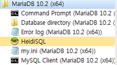
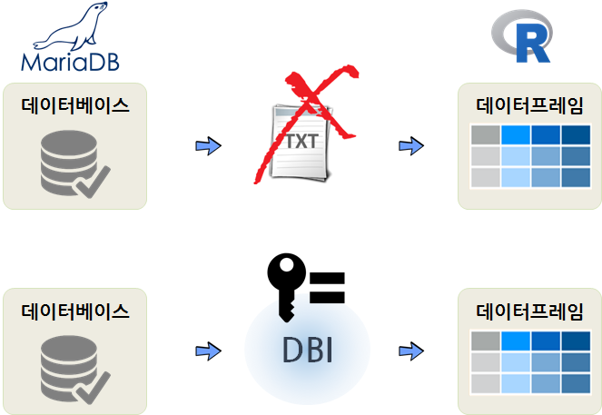
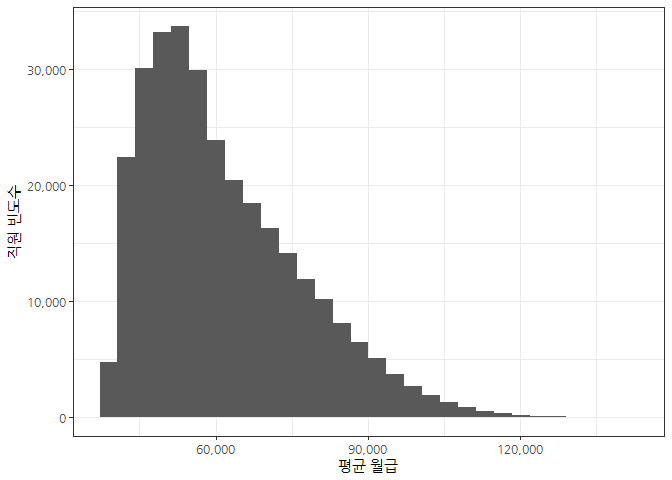
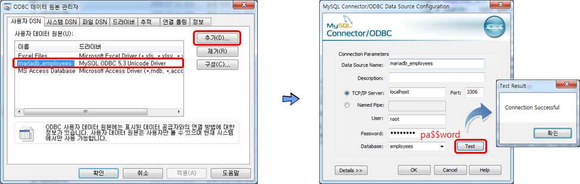

# xwMOOC 딥러닝

## 1. 데이터 분석가를 위한 보안 {#r-security}

데이터를 다루는 데이터 분석가는 사내외 내밀한 정보를 다루는 경우가 많다.
하지만, 데이터 분석가 본인 자신은 보안관리에 취약한 경우도 많다. 
R 개발자가 직면하는 보안관련된 현황과 함께 이를 체계적으로 회피하는 방법을 살펴보자.

### 1.1. R 개발자는 왜 보안을 이해해야 하는가? {#why-security}

데이터가 적을 때야 데이터가 귀하기 때문에 그 자체로 보안이 유지되었다.
반도체나 금보다도 비싼 것이 데이터이기 때문에 그런데 지금은 상황이 많이 다르다.
데이터는 데이터베이스에 저장된 경우가 있는데 데이터베이스는 한 사람만 사용하는 것이 아니라
여러 사람이 사용하기 때문에 **연결(connenction)**을 맺어 1:1 보다는 1:N 의 관계로 활용이 된다.

이런 경우 데이터베이스에 접근을 아무나 허가하면 되지 않기 때문에 허가 받은 특정인만 접근할 수 있도록 
권한을 부여하여 접근한다. 마찬가지로 빅데이터를 열어보고 분석을 수행하려면 
대규모 컴퓨터 자원에 대한 허가가 필요한데 이에 대해서도 보안 인증키가 필요하다.
아마존에 EC2 인스턴스로 분석 환경을 설정한 경우 이에 대한 인증접근을 IAM 서비스를 통하는 것도 이에 해당된다.
뿐만 아니라 다양한 API를 통해 데이터 및 서비스에 대한 인증을 지원한다. 
경우에 따라서는 API 사용량에 따라 과금을 하기도 한다. 
GitHub의 협업과 Travis 서비스를 통한 CI 를 떠올리기만 해도 얼마나 많은 데이터 과학과 직간접으로 연결되어 있는지 
쉽게 확인될 수 있다.

### 1.2. 보안 인증키 보관방식 {#r-secure-ways}

R을 데이터분석 기본 언어로 사용하는 데이터 과학자의 경우, 
일반 텍스트(Plain Text) 방식을 활용하여 인증키를 파일에 저장시켜 놓거나,
전자우편으로 통해 인증키 정보를 전달하거나, `.History`, `.Rdata`, `.Renviron` 등을 활용하여 저장하기도 한다.
차이점이 있다면 분석하는 데이터 프로젝트와 이를 통합시키거나, 분리시키거나 하는 차이가 있다.
경우에 따라서는 암호화(Encrypted)하기도 한다.

## 2. R 진영의 대응 [^secret-package] {#r-countermeasure}

[^secret-package]: [useR!2017: Can you keep a secret?](https://channel9.msdn.com/Events/useR-international-R-User-conferences/useR-International-R-User-2017-Conference/Can-you-keep-a-secret)

이러한 문제를 R 뿐만 아니라 다른 언어로 데이터 분석 및 모형 개발을 진행하는 
개발자 모두 공통으로 겪는 문제다. 이에 대한 대응으로 R에서 다양한 팩키지가 개발되었는데,
하나의 팩키지 혹은 팩키지 다수를 결합해서 사용하는 것이 일반적이다. 자세한 사항은 
RStudio [Securing Credentials](https://db.rstudio.com/managing-credentials/)를 참조한다.

- `keyring`
- `config`
- `.Renviron`
- `options()`
- `secret`

## 3. 데이터베이스 - 마리아 DB (MariaDB) {#maria-db}

MySQL이 오라클로 넘어가면서 `MariaDB`가 만들어졌다. 
[MariaDB](https://mariadb.org/) 웹사이트에서 무료로 마리아DB를 다운로드 받아 설치한다.
설치과정에 비밀번호를 꼭 등록한다.

### 3.1. 예제 데이터베이스 설치 {#install-mariadb-sample}

마이아 DB가 설치되면 데이터베이스는 하나도 없이 깡통 데이터베이스관리시스템이 설치된 것이다.
따라서, 예제 혹은 실제 작업할 데이터베이스를 하나 추가해본다.

`MariaDB 10.2 (x64)` > `Command Prompt (MariaDB 10.2 ...)` 을 클릭하게 되면 `mysql` 명령어를 통해 
마리아DB 실행이 가능하다.

GitHub에서 [A sample MySQL database](https://github.com/datacharmer/test_db)를 `git clone` 명령어를 통해 복제하여 가져온다. 

~~~{.r}
$ git clone https://github.com/datacharmer/test_db.git
Cloning into 'test_db'...
remote: Counting objects: 94, done.
remote: Total 94 (delta 0), reused 0 (delta 0), pack-reused 94
Unpacking objects: 100% (94/94), done.
Checking connectivity... done.
Checking out files: 100% (24/24), done.

$ cd test_db/
$ ls
.git/                          load_salaries1.dump
Changelog                      load_salaries2.dump
README.md                      load_salaries3.dump
employees.sql                  load_titles.dump
employees_partitioned.sql      objects.sql
employees_partitioned_5.1.sql  sakila/
images/                        show_elapsed.sql
load_departments.dump          sql_test.sh
load_dept_emp.dump             test_employees_md5.sql
load_dept_manager.dump         test_employees_sha.sql
load_employees.dump
~~~

데이터가 정상적으로 확인되었다면 다음 단계로 데이터베이스를 생성하여 본다.
`mysql -uroot -p` 명령어를 입력하게 되면 비밀번호를 넣게 되고 이미 준비된 `employees.sql` 파일을 통해 
`employees` 데이터베이스를 생성시킬 수 있다.

~~~{.r}
C:\test_db>mysql -uroot -p < employees.sql
Enter password: ****
INFO
CREATING DATABASE STRUCTURE
INFO
storage engine: InnoDB
INFO
LOADING departments
INFO
LOADING employees
INFO
LOADING dept_emp
INFO
LOADING dept_manager
INFO
LOADING titles
INFO
LOADING salaries
data_load_time_diff
00:01:06
~~~

### 3.2. `employees` 데이터베이스 {#employees-database}

`employees` 데이터베이스가 정상적으로 생성되었는지는 `MariaDB 10.2 (x64)` > `MySQL Client (MariaDB 10.2 (x64))` 을 클릭하게 되면 
바로 마리아DB CLI로 떨어진다.

~~~{.r}
Enter password: ****
Welcome to the MariaDB monitor.  Commands end with ; or \g.
Your MariaDB connection id is 14
Server version: 10.2.8-MariaDB mariadb.org binary distribution

Copyright (c) 2000, 2017, Oracle, MariaDB Corporation Ab and others.

Type 'help;' or '\h' for help. Type '\c' to clear the current input statement.

MariaDB [(none)]>
MariaDB [(none)]>
MariaDB [(none)]>
MariaDB [(none)]> SHOW databases;
+--------------------+
| Database           |
+--------------------+
| employees          |
| information_schema |
| mysql              |
| performance_schema |
| test               |
+--------------------+
5 rows in set (0.00 sec)

MariaDB [(none)]>
~~~

### 3.3. 마리아DB에 R을 붙여본다. {#r-mariadb-connection}

마리아DB에서 데이터를 추출하여 R에서 작업하려면 텍스트 데이터로 마리아DB에서 뽑아내고 이를 다시 
R에서 불러 읽어오는 과정을 거쳐야 한다. 하지만 R 에서 `DBI` 팩키지를 사용할 경우 불필요하게 
중간에 TEXT 데이터를 만들 필요없이 R에서 직접 데이터프레임 변환이 가능하다. 

중간에 TEXT 데이터를 불필요하게 만드는 과정 대신에 `인증키(Credentials)`이 꼭 필요하다.

~~~{.r}
# 0. 환경설정 ------------
# library(DBI)
# library(tidyverse)
# library(ggthemes)
# library(extrafont)
# loadfonts()

# 1. 데이터베이스 연결 ------------
conn <- dbConnect(RMySQL::MySQL(), 
                    user = "root",
                    password = "pa$$word",
                    host = "localhost",
                    dbname = "employees")

dbListTables(conn)
~~~

~~~{.output}
[1] "current_dept_emp"     "departments"          "dept_emp"            
[4] "dept_emp_latest_date" "dept_manager"         "employees"           
[7] "salaries"             "titles"              

~~~

~~~{.r}
# 2. 데이터프레임 변환 ------------

salary_df <- tbl(conn, "salaries")
head(salary_df)
~~~

~~~{.output}
# Source:   lazy query [?? x 4]
# Database: mysql 10.2.8-MariaDB [root@localhost:/employees]
  emp_no salary  from_date    to_date
   <int>  <int>      <chr>      <chr>
1  10001  60117 1986-06-26 1987-06-26
2  10001  62102 1987-06-26 1988-06-25
3  10001  66074 1988-06-25 1989-06-25
4  10001  66596 1989-06-25 1990-06-25
5  10001  66961 1990-06-25 1991-06-25
6  10001  71046 1991-06-25 1992-06-24

~~~

~~~{.r}
salary_df %>% group_by(emp_no) %>% 
    summarise(mean_sal= mean(salary)) %>% 
    collect() %>% 
    ggplot(aes(x= mean_sal)) +
    geom_histogram() +
    theme_bw(base_family = "NanumGothic") +
    labs(x="평균 월급", y="직원 빈도수") +
    scale_x_continuous(labels = scales::comma) +
    scale_y_continuous(labels = scales::comma)
~~~

~~~{.r}
# 3. 데이터베이스 연결해제 ------------
dbDisconnect(conn)
~~~

~~~{.output}
[1] TRUE

~~~

`user = "root"`, `password = "pa$$word"` 가 R 개발 코드에 그대로 노출되는 위험은 있지만,
순쉽게 데이터베이스에 붙어 분석이 가능한 장점이 있다. 
하지만, 이와 같이 코드를 작성하게 되면 비밀번호가 그대로 노출되어 누출될 경우 데이터베이스 전체가 위험에 빠질 수가 있다.
R 개발자 관점에서도 정신건강에 무척이나 해롭다.

## 4. DSN(Data Source Name)을 통한 보안 {#r-mariadb-dsn}

ODBC 연결이 누군가에 의해 먼저 설정된 경우 R 개발자 입장에서는 편리하다. 즉, `mariadb_employees` 같은 별명만 알고 있다면 
이를 바탕으로 데이터베이스에 접속해서 데이터를 뽑아내서 분석하는 것이 가능하기 때문이다.

데이터베이스에 접근권한이 있는 분이 윈도우7 데스크톱 혹은 서버를 예를 들면, `C:\Windows\System32\odbcad32.exe` 프로그램을 
실행하여 **DSN(Data Source Name)**을 설정하고 내부적으로 필요한 접속서버, 사용자명, 비밀번호, 데이터베이스를 사전 설정시켜 놓는다.

R 개발자는 `Data Source Name`만 알면 되기 때문에 이 경우 `mariadb_employees` 사용자명과 비밀번호를 남기지 않게 된다.
따라서, R 스크립트에 보안관련 이슈를 데이터분석과 격리시킬 수 있다.

~~~{.r}
# 0. 환경설정 ------------
# library(odbc)
# library(tidyverse)
# library(ggthemes)
# library(extrafont)
# loadfonts()

# 1. 데이터베이스 연결 ------------
con <- dbConnect(odbc::odbc(), "mariadb_employees")

dbListTables(con)
~~~

~~~{.output}
[1] "current_dept_emp"     "departments"          "dept_emp"            
[4] "dept_emp_latest_date" "dept_manager"         "employees"           
[7] "salaries"             "titles"              

~~~

~~~{.r}
# 2. 데이터프레임 변환 ------------

emp_df <- tbl(con, "employees")
head(emp_df)
~~~

~~~{.output}
# Source:   lazy query [?? x 6]
# Database: MySQL 5.5.5-10.2.8-MariaDB[root@localhost via
#   TCP/IP/employees]
  emp_no birth_date first_name last_name gender  hire_date
   <int>     <date>      <chr>     <chr>  <chr>     <date>
1  10001 1953-09-02     Georgi   Facello      M 1986-06-26
2  10002 1964-06-02    Bezalel    Simmel      F 1985-11-21
3  10003 1959-12-03      Parto   Bamford      M 1986-08-28
4  10004 1954-05-01  Chirstian   Koblick      M 1986-12-01
5  10005 1955-01-21    Kyoichi  Maliniak      M 1989-09-12
6  10006 1953-04-20     Anneke   Preusig      F 1989-06-02

~~~

~~~{.r}
emp_df %>% collect() %>% 
    count(gender) %>% 
    mutate(gender_pcnt = scales::percent(n/sum(n)))
~~~

~~~{.output}
# A tibble: 2 x 3
  gender      n gender_pcnt
   <chr>  <int>       <chr>
1      F 120051         40%
2      M 179973         60%

~~~

~~~{.r}
# 3. 데이터베이스 연결해제 ------------
dbDisconnect(con)
~~~

## 5. `config.yml` 파일을 활용한 방법 {#r-config-yaml}

`install.packages("config")` 명령어로 `config` 팩키지를 설치하게 되면 
`config.yml` 파일 내부에 환경설정에 필요한 정보를 담을 수가 있다.

> #### `config.yml` 파일 
> 
> 
> ~~~{.r}
> >
> default:
>  employees:
>    driver: 'MySQL' 
>    server: 'localhost'
>    uid: 'root'
>    pwd: 'pa$$word'  
>    port: 3306
>    database: 'employees'
> ~~~

config::get() 명령어를 통해 설정된 내용을 받아와서 이를 활용해서 데이터베이스에 접속하여 
데이터를 가져온다.

~~~{.r}
# 0. 환경설정 ------------
# library(DBI)
# library(tidyverse)
# library(config)

# 1. 데이터베이스 연결 ------------

(dw <- config::get("employees"))
~~~

~~~{.output}
$driver
[1] "MySQL"

$server
[1] "localhost"

$uid
[1] "root"

$pwd
[1] "pa$$word"

$port
[1] 3306

$database
[1] "employees"

~~~

~~~{.r}
con <- DBI::dbConnect(RMySQL::MySQL(), 
                      user = dw$uid,
                      password = dw$pwd,
                      host = dw$server,
                      port = dw$port,
                      dbname = dw$database)

dbListTables(con)
~~~

~~~{.output}
[1] "current_dept_emp"     "departments"          "dept_emp"            
[4] "dept_emp_latest_date" "dept_manager"         "employees"           
[7] "salaries"             "titles"              

~~~

~~~{.r}
# 2. 데이터베이스 연결해제 ------------
dbDisconnect(con)
~~~

~~~{.output}
[1] TRUE

~~~

    
