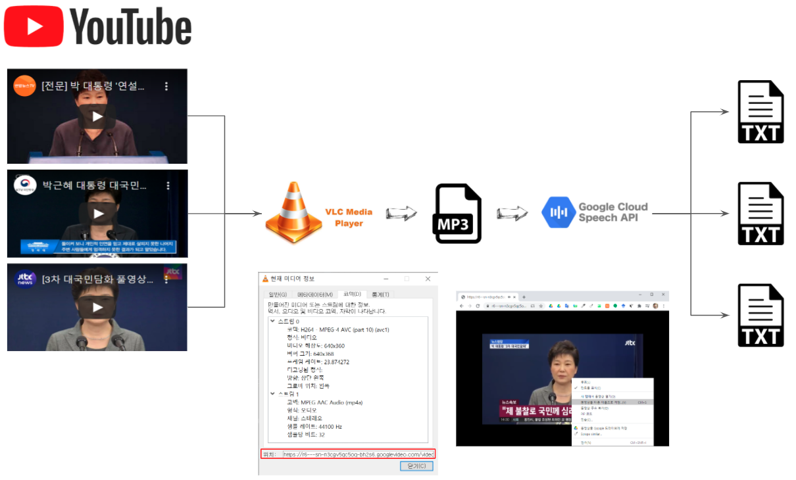
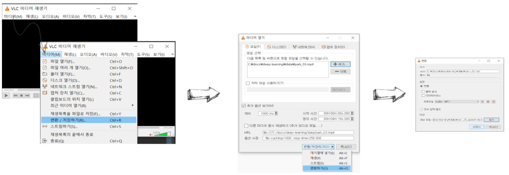
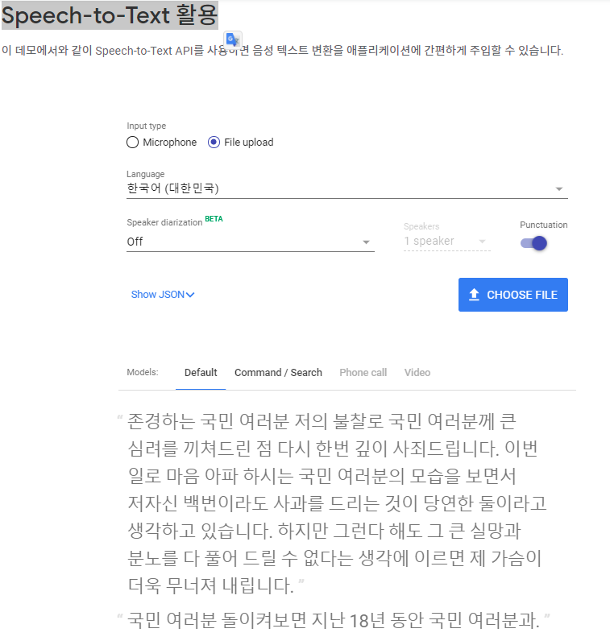

```{r setup, include=FALSE}
knitr::opts_chunk$set(echo = TRUE, message=FALSE, warning=FALSE,
                      comment="", digits = 3, tidy = FALSE, prompt = FALSE, fig.align = 'center')

knitr::opts_knit$set(global.par = TRUE) 
```

<center>



</center>

# 유튜브 → MP4 {#youtube-to-mp4}

[VideoLAN](https://www.videolan.org/vlc/index.ko.html)을 다운로드 받아 사용한다. VLC는 DVD, 오디오 CD, VCD 와 다양한 스트리밍 프로토콜뿐 아니라 대부분의 멀티미디어 파일을 재생할 수 있는 무료 오픈 소스 크로스 플랫폼 멀티미디어 재생기이자 프레임워크다.

실시간 유튜브 동영상을 MP4 형태로 변환시킬 경우 다음 단계를 거쳐 `youtube.luac` 파일을 처음 업데이트시켜야 한다. 자세한 사항은 [Download/Convert YouTube Videos to Mp4 using VLC Media Player [Error Solved 2020]](https://www.youtube.com/watch?v=z3ROdb8NatE)을 참조하여 유튜브 실시간 동영상을 MP4로 저장한다.

1.  `C:\Program Files (x86)\VideoLAN\VLC\lua\playlist` 디렉토리 `youtube.luac` 파일을 삭제하고 [`youtube.lua`](https://raw.githubusercontent.com/videolan/vlc/master/share/lua/playlist/youtube.lua) 파일을 `youtube.luac` 파일로 대체시킨다.
2.  VLC → 도구 → 코덱 → 코덱 탭에서 "위치"를 복사한다.
3.  구글 크롬 웹브라우저 주소창에 입력하여 동영상을 재생시킨다.
4.  재생되는 동영상에 마우스 우클릭으로 "동영상을 다른 이름으로 저장" 해서 MP4 파일로 로컬 컴퓨터로 저장시킨다.

# MP4 → 오디오 파일 변환 {#mp4-to-audio}

유튜브 주소를 가지고 `.mp4` 동영상을 로컬 파일로 갖게 되면 다음 단계로 오디오만 추출하여 `.mp3`로 저장시킨다.

-   VLC → 변환 /저장하기 → 하단, 변환하기 → 시작



상기 전체 과정이 마무리되면 결과물은 다음과 같다.

<table class='table'>
<tr> <th>유튜브 동영상</th> <th>MP4 동영상</th> <th>MP3 오디오</th> <tr>
<tr>
<td>
<iframe width="200" height="150" src="https://www.youtube.com/embed/y8RapzS-JxI" frameborder="0" allow="accelerometer; autoplay; clipboard-write; encrypted-media; gyroscope; picture-in-picture" allowfullscreen></iframe>
</td>
<td>
<video width="200" height="160" controls> <source src="data/park_03.mp4" type="video/mp4"> </video>
</td>
<td>
```{r park-speech-03, echo = FALSE}
html_tag_audio <- function(file, type = c("wav")) {
  type <- match.arg(type)
  htmltools::tags$audio(
    controls = NA,
    htmltools::tags$source(
      src = file,
      type = glue::glue("audio/{type}", type = type)
    )
  )
}

html_tag_audio("data/park_03_speech.mp3", type = "wav")
```
</td>
</table>


# 정답: 대국민 담화문 전문 {#script-park}

한겨레 신문사 "박근혜 대통령 3차 대국민담화 전문"을 
[담화문 전문](http://www.hani.co.kr/arti/politics/bluehouse/772447.html) 웹스크랩핑하여 텍스트 데이터로 준비한다.

```{r park-third-script}
library(tidyverse)
library(rvest)

hani_script_url  <- "http://www.hani.co.kr/arti/politics/bluehouse/772447.html"

hani_script <- hani_script_url %>% 
  read_html(encoding = "utf-8") %>% 
  html_node(xpath = '//*[@id="a-left-scroll-in"]/div[2]/div/div[2]') %>% 
  html_text() 

hani_script <- hani_script %>% 
  str_remove_all(pattern = "\\n") %>% 
  str_trim()

hani_script
```

# 오디오 &rarr; 텍스트 {#audio-to-text}

Google Cloud [Speech-to-Text 활용](https://cloud.google.com/speech-to-text)을 사용하면 1분 이하 (59초까지) 무료로 MP3 파일을 올려 텍스트를 추출할 수 있다.



본격적으로 [`googleLanguageR`](https://cran.r-project.org/web/packages/googleLanguageR/index.html) 팩키지를 사용해서 음성이 담긴 MP3 파일에서 텍스트를 추출해보자.
구글 클라우드 콘솔로 이동해서 다운로드 받은 인증 json 파일을 `GL_AUTH` 환경변수명을 `.Renviron` 파일에 등록시킨다.

- `$private_key` 가 포함된 `Credential`은 "Service Accounts" 에서 `.json` 파일을 다운로드받아 환경설정한다.
    - `error was: $private_key not found in JSON`
- `googleAuthR::gar_auth_service()`을 통해 한번 더 인증과정을 거친다.
    - ` No .httr-oauth  file exists in current working directory. `
    
1분 이하만 구글 Speech to Text 를 받기 때문에 1분간격으로 파일을 쪼개 각각을 TTS 한다.    
MP3 파일을 받지 않기 때문에 `FLAC` 파일 형태로 취하고 `FLAC` 파일에서 지정된 `audio_channel_count` 갯수를 맞춰준다.

```{r google-speech-to-text, eval = FALSE}
library(googleLanguageR)

# 환경설정
readRenviron("~/.Renviron")

# No .httr-oauth  file exists in current working directory. 문제 해결
# googleAuthR::gar_auth_service("~/youtube-xxxxx-xxxxxx200426574.json")

kt_config <- list(encoding = "FLAC",
                  audioChannelCount = 2,
                  diarizationConfig = list(
                    enableSpeakerDiarization = TRUE
                  ))

script_01_obj <- gl_speech("data/park_03_flac (mp3cut.net) (1).flac", languageCode = "ko-KR", customConfig = kt_config)
script_02_obj <- gl_speech("data/park_03_flac (mp3cut.net) (2).flac", languageCode = "ko-KR", customConfig = kt_config)
script_03_obj <- gl_speech("data/park_03_flac (mp3cut.net) (3).flac", languageCode = "ko-KR", customConfig = kt_config)
script_04_obj <- gl_speech("data/park_03_flac (mp3cut.net) (4).flac", languageCode = "ko-KR", customConfig = kt_config)
script_05_obj <- gl_speech("data/park_03_flac (mp3cut.net) (5).flac", languageCode = "ko-KR", customConfig = kt_config)


whole_script <- glue::glue("{script_01_obj$transcript$transcript}",
                           "{script_02_obj$transcript$transcript}",
                           "{script_03_obj$transcript$transcript}",
                           "{script_04_obj$transcript$transcript %>% na.omit()}",
                           "{script_05_obj$transcript$transcript  %>% na.omit()}")

stt_script <- whole_script %>% 
  str_remove_all(pattern = "[a-zA-Z]") %>% 
  str_c(collapse = " ")

stt_script %>% 
  write_lines("data/stt_script.txt")
```


```{r stt-print}
stt_script <- read_lines("data/stt_script.txt")
stt_script
```


# 담화문과 STT 비교 {#stt-comparison}

마지막으로 대국민 담화문 원문과 구글 STT 결과 작업결과를 비교해보자.

```{r compare-stt-with-original}
library(diffr)

original_script <- tempfile()
writeLines(hani_script, con = original_script)
google_stt_script <- tempfile()
writeLines(stt_script, con = google_stt_script)


diffr(original_script, google_stt_script, before = glue::glue("대국민 담화문 원문"), after = glue::glue("구글 STT 작업결과"))
```


