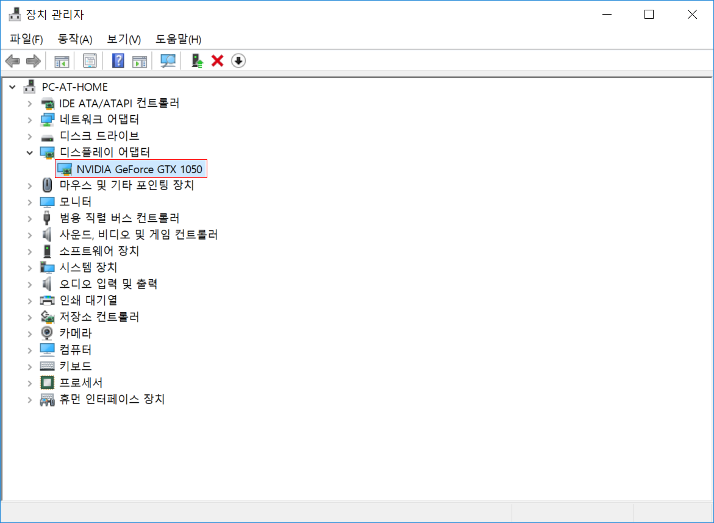

```{r, include=FALSE}
knitr::opts_chunk$set(echo = TRUE, message=FALSE, warning=FALSE,
                      comment="", digits = 3, tidy = FALSE, prompt = FALSE, fig.align = 'center')

library(reticulate)
use_condaenv("anaconda3")
# reticulate::repl_python()

```

# 텐서플로우 사전준비 [^tensorflow-install-windows] {#tensorflow-setup}

[^tensorflow-install-windows]: [teavanist (2019-02-5), "Install Tensorflow-GPU on Windows 10", Medium](https://medium.com/@teavanist/install-tensorflow-gpu-on-windows-10-5a23c46bdbc7)

텐서플로우를 R에서 사용하고자 할 경우, 파이썬 설치만으로 문제가 해결되지 않는 경우가 있다.
만약 CPU 버젼만 사용한다면 그다지 문제가 될 것은 없다. 하지만,
하드웨어로 GPU를 사용하고자 할 경우 NVidia 그래픽카드를 사용할 수 있도록 툴체인을 사전에 설치해야된다.

- CUDA® Toolkit 8.0: 자세한 내용 [CUDA Installation Guide for Microsoft Windows](http://docs.nvidia.com/cuda/cuda-installation-guide-microsoft-windows/) 참조
- CUDA® Toolkit 8.0과 연관된 NVIDIA 드라이버: CUDA® Toolkit 8.0을 설치하면 자동으로 맞춰준다.
- cuDNN v6 or v6.1: [NVIDIA cuDNN - GPU Accelerated Deep Learning](https://developer.nvidia.com/cudnn) 참조
- CUDA와 GPU 그래픽카드 호환성 검사: [CUDA GPUs](https://developer.nvidia.com/cuda-gpus) 참조.

`CUDA® Toolkit 8.0`을 설치하면 시스템 경로에 자동으로 추가된다. 만약 환경변수 시스템 경로에 추가되지 않았다면 수작업으로 넣어둔다.
`cuDNN v6 or v6.1`은 zip 파일로 담겨졌기 때문에 압축을 풀고 나서 환경변수 시스템 경로에 추가한다.

윈도우에서 GPU 그래픽카드 하드웨어를 딥러닝 텐서플로우를 활용하고자 할 경우 환경설정을 맞추기가 쉽지 않다. 많은 사람들이 어려움을 겪고 있어 이를 파이썬 스크립트로 정리한 것이 있어 다음 스크립트를 활용하여 빠른 시간내에 설정을 해본다. `tensorflow_self_check.py` 파이썬 스크립트를 다운로드 받아 파이썬에서 돌려보면 텐서플로우 설정에서 부족한 부분을 검사하여 준다. 

- [TensorFlow on Windows self-check](https://gist.github.com/mrry/ee5dbcfdd045fa48a27d56664411d41c)

## 윈도우 10 [^windows-prerequisite-cuda] {#widnows-prerequisite}

[^windows-prerequisite-cuda]: [Dr. Joanne Kitson (2019-04-03), "Installing Tensorflow with CUDA, cuDNN and GPU support on Windows 10 - Pimp Up your PC for Deep Learning-Part 2", Towards Data Science](https://towardsdatascience.com/installing-tensorflow-with-cuda-cudnn-and-gpu-support-on-windows-10-60693e46e781)

윈도우10에 텐서플로우를 설치할 경우 다음 도구가 필요하다. [^tensorflow-software-requirement]

[^tensorflow-software-requirement]: [TensorFlow Install, GPU support](https://www.tensorflow.org/install/gpu)

### GPU 하드웨어  {#widnows-prerequisite-hardware}

그전에 하드웨어가 엔비디아 GPU 그래픽카드가 장착되어 있는지 확인한다.
이를 위해서 [CUDA GPUs](https://developer.nvidia.com/cuda-gpus) 웹사이트를 참조하여 설치된 그래픽 카드와 CUDA 지원여부를 확인한다.



### 소프트웨어  {#widnows-prerequisite-software}

이제 텐서플로우가 CUDA 10.0 버젼을 지원하니 현재 시점 기준(2019-07-06)으로 CUDA 10.0버젼을 다운로드 받아 설치한다. cuDNN SDK는 CUDA 10.0버전에 대응되는 "cuDNN v7.6.1" 버젼을 다운로드 받아 설치한다.

- [마이크로소프트 비주얼 스튜디오 2015](https://visualstudio.microsoft.com/ko/vs/older-downloads/) 혹은 [Visual Studio Dev Essentials](https://visualstudio.microsoft.com/ko/dev-essentials/)
    - 윈도우에서 텐서플로우를 설치하게 되면 C/C++ 지원이 필요한데 이에 필요한 도구가 2015년 비주얼 스튜디오다.
- Python - 3.6.6 
- [NVIDIA® GPU drivers](https://www.nvidia.com/Download/index.aspx) - CUDA 10.0 requires 410.x or higher.
- [CUDA® Toolkit](https://developer.nvidia.com/cuda-toolkit-archive) —TensorFlow supports CUDA 10.0 (TensorFlow >= 1.13.0)
    - CUDA Toolkit 10.0 Archive에서 CUDA 10.0을 다운로드 받는다.
- [CUPTI](https://docs.nvidia.com/cuda/cupti/) ships with the CUDA Toolkit.
    - CUDA Profiling Tools Interface로 CUDA 성능도구 인터페이스로 CUDA를 설치하면 딸려온다.
- [cuDNN SDK](https://developer.nvidia.com/cudnn) (>= 7.4.1)
    - Download cuDNN v7.6.1 (June 24, 2019), for CUDA 10.0
- Tensorflow GPU - 1.5.0 

"Control Panel &rarr; System and Security &rarr; System &rarr;  Advanced System settings"를 통해 **환경변수**를 설정한다. CUDA 경로를 지정해 준다.

- `C:\Program Files\NVIDIA GPU Computing Toolkit\CUDA\v10.0\bin`
- `C:\Program Files\NVIDIA GPU Computing Toolkit\CUDA\v10.0\libnvvp`


# 텐서플로우 설치 [^tensorflow-rstudio] {#install-tensorflow}

[^tensorflow-rstudio]: [TensorFlow for R from RStudio - Installing TensorFlow](https://tensorflow.rstudio.com/tensorflow/articles/installation.html)

## 파이썬 설치 {#install-python}

텐서플로우는 최신 3.7버젼 대신에 3.6버전에서 버그 없이 잘 돌아간다. 따라서 가장 최신 파이썬 3.7.x 대신에 3.6.x 버전을 설치한다.

```{python check-version}
import platform
print(platform.python_version())
```

## 텐서플로우(Tensorflow GPU) 설치 {#install-tensorflow-finally}

`cmd` 즉, 'Command Prompt'를 관리자권한으로 실행하는 것이 중요하다. 천신만고끝에 여기까지 왔다면 이제 `tensorflow-gpu` 버젼을 설치한다. 아래와 같은 오류가 있다면 답이 없다. `--ignore-installed`을 추가하면 `tensorflow-gpu`를 설치해준다. 

> `ERROR: Cannot uninstall 'wrapt'. It is a distutils installed project and thus we cannot .accurately determine which files belong to it which would lead to only a partial uninstall.`

```{r install-tensorflow-pip, eval=FALSE}
pip3 install --upgrade --ignore-installed tensorflow-gpu
```

# 텐서플로우 헬로월드 {#install-tensorflow-hello-world}

파이썬 `tensorflow-gpu`가 설치되었기 때문에 이제는 맘편하게 헬로월드를 던져보자.

```{python tensorflow-helloworld}
import tensorflow as tf 

## 텐서플로우 버젼
print (tf.__version__)

## cuda 지원
print(tf.test.is_built_with_cuda())

## GPU를 텐서플로우에서 사용할 수 있는지 확인
print(tf.test.is_gpu_available(cuda_only=False, min_cuda_compute_capability=None))
```


# R {#install-tensorflow-r}

CPU 버젼 텐서플로우 설치는 `tensorflow` 팩키지를 설치하고 나서, `install_tensorflow()` 명령어로 설치하면 된다. 파이썬 언어에 기초하여 개발되었기 때문에 다수 파이썬 설치방법을 지원하고 있다.
하지만, 기본적으로 R은 텐서플로우를 불러다 쓰는 입장이라. 앞서 Visual Studio, CUDA 등을 제대로 설치하면 R에서 윈도우 환경에 별도 설치를 하지 않더라도 앞서 파이썬에서 제대로 설치되었기 때문에 이를 그대로 받아서 활용할 수 있다.

|  설치방법  |                        설명                                 |
|:----------:|:------------------------------------------------------------|
| auto       | 현재 운영체제 기본설정에 맞춰 자동 설치                     |
| virtualenv | `~/.virtualenvs/r-tensorflow` 위치한 파이썬 가상환경에 설치 |
| conda      | `r-tensorflow` 명칭으로 명명된 아나콘다 파이썬 환경에 설치  |
| system     | 시스템 파이썬 환경에 설치                                   |

단, “virtualenv”, “conda” 는 리눅스와 맥OSX를 지원하고, “conda”, “system”은 윈도우에 적용된다.
예를 들어, `install_tensorflow(method = "conda")` 방식으로 설치할 수 있다.

``` {r install-tensorflow, eval=TRUE}
library(tensorflow)
```

R에서 텐서플로우를 사용할 준비가 되었다면 `Hello, TensorFlow!`를 실행하여 정상적으로 동작하는지 확인해본다.

``` {r hello-tensorflow, eval=TRUE}
sess = tf$Session()
hello <- tf$constant('Hello, TensorFlow!')
sess$run(hello)
```

