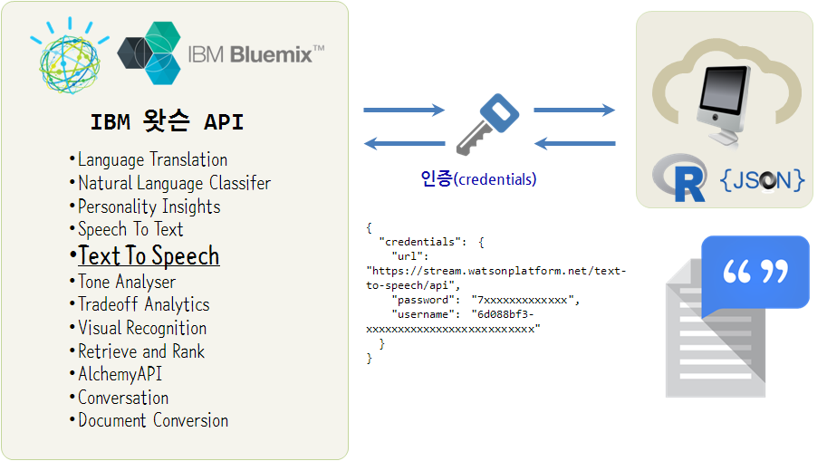

> ## 학습 목표 {.objectives}
>
> * 인공지능이 바꿔 놓을 세상에 대해 살펴본다.
> * IBM 왓슨 API를 활용하여 간단한 응용프로그램을 생성한다.

### 1. IBM 왓슨 서비스

IBM 왓슨은 너무나도 유명한 인공지능의 대명사다. 특히 제퍼디 쇼에 나와서 퀴즈게임에서 승리하여 사람들에게 강한 인상을 남겼다. 그 왓슨이 더 진화된 인공지능을 탑재하고 돌아왔고, 그 당시 퀴즈쇼에 참가했던 켄 제닝스는 미국의 제퍼디 퀴즈쇼에서 최장 기간 우승을 거두었던 잡학의 천재다. 하지만 2011년 왓슨과의 대결에서 패배하면서 느낀 소회를 2013년 [켄 제닝스(Ken Jennings): 왓슨, 제퍼디와 나 - 쓸모없어져 버린 똑똑이](https://www.ted.com/talks/ken_jennings_watson_jeopardy_and_me_the_obsolete_know_it_all?language=ko)

> ### IBM 왓슨 동영상  {.prereq}
> | 퀴즈쇼에 나온 IBM 왓슨 | 퀴즈 참가자(Ken Jennings) |
> |:------------------------------------------------------------------:|:------------------------------------------------------------------:|
> | <iframe width="350" height="260" src="https://www.youtube.com/embed/P18EdAKuC1U" frameborder="0" allowfullscreen></iframe> | <iframe width="350" height="260" src="https://www.youtube.com/embed/b2M-SeKey4o" frameborder="0" allowfullscreen></iframe> |

### 2. IBM 왓슨 API 활용 TTS 서비스 개발

미국 대부분의 회사에서 제공하는 API와 마찬가지로 IBM 왓슨 API를 사용할 때 RESTful API로 자격증명을 하기 때문에 JSON 파일 형식으로 떨어지는 
`credentials` 사용자 계정과 비밀번호를 소중히 관리한다.

먼저 텍스트를 음성으로 들려주는 응용프로그램을 개발할 것이기에 먼저 작업결과에 대한 사전체험을 할 수 있는 
[IBM 왓슨 텍스트를 음성전환 데모](https://text-to-speech-demo.mybluemix.net/) 웹사이트를 방문하여 개발되면 어떤 느낌일지 사전 체험한다.

텍스트를 음성으로 들려주는 기능외에도 다양한 API를 제공하고 있다. 이를 타사 API와 조합하여 다양하고 강력한 기능을 갖는 서비스 개발이 가능하다.

* Language Translation
* Natural Language Classifer
* Personality Insights
* Speech To Text
* **Text To Speech**
* Tone Analyser
* Tradeoff Analytics
* Visual Recognition
* Retrieve and Rank
* AlchemyAPI
* Conversation
* Document Conversion

#### 2.1. IBM 왓슨 서버 설정

가장 먼저 IBM 왓슨 서버쪽 설정을 해주어야 된다. IBM 왓슨 API를 사용하려면 
먼저 IBM에서 제공하는 클라우드 PaaS 서비스인 IBM 블루믹스 서비스에 가입해야 한다.
그리고 나서, IBM에서 제공하는 다양한 클라우드 서비스가 모두 망라된 상단 카탈로그(Catalog)를 클릭하여, 서비스(Watson)을 선택한다.

1. [IBM Bluemix Console](https://console.ng.bluemix.net/)에 접속하여 가입정보를 입력하고 회원가입한다.
1. 카탈로그 &rarr; 서비스(Watson) &rarr; Text-To-Speech 선택하여 관련 정보를 채워넣는다.
    * 영역 
    * 앱
    * 서비스 이름
    * 신임 정보 이름

신임정보에 다음과 같은 `credentials` 가 생성되는데 이 정보를 활용하여 R 에서 TTS기능을 활용하게 된다.

~~~ {.json}
{
  "credentials": {
    "url": "https://stream.watsonplatform.net/text-to-speech/api",
    "password": "7xxxxxxxxxxxxx",
    "username": "6z077bf3-xxxxxxxxxxxxxxxxxxxxxxxxxx"
  }
}
~~~

#### 2.2. R 클라이언트 설정 [^ryan-tts]

[^ryan-tts]: [Watson-TEXT-TO-SPEECH-Code-Snippet.R](https://dreamtolearn.com/ryan/r_journey_to_watson/13)

[IBM Watson - Starter Kits](https://dreamtolearn.com/ryan/r_journey_to_watson/13)에는 R과 IBM 왓슨을 연결하여 체험할 수 있는 유용한 정보가 다수 정리되어 있다. 
본 서비스도 [Ryan](https://github.com/rustyoldrake/R_Scripts_for_Watson/blob/master/Watson-TEXT-TO-SPEECH-Expressive.R) 이 작성한 R 코드를 기반으로 일부 수정을 한 것이다.

역사에 길이 남을 명언이 개그 콘서트에서 방영이 되어 있고, 이에 영감을 받아 통계학과 관련된 명언 2개를 음성으로 들어본다.

> **Donald Rumsfeld**     
> 
> "Reports that say that something hasn't happened are always interesting to me, because as we know, there are known knowns; there are things we know we know. We also know there are known unknowns; that is to say we know there are some things we do not know. But there are also unknown unknowns- the ones we don't know we don't know."

> **George Box**    
>
> "Since all models are wrong the scientist cannot obtain a correct one by excessive elaboration. On the contrary following William of Occam he should seek an economical description of natural phenomena. Just as the ability to devise simple but evocative models is the signature of the great scientist so overelaboration and overparameterization is often the mark of mediocrity."

`watson.TTS.execute` 함수를 만들어 IBM 왓슨 TTS 서비스를 호출하고 그 결과를 `donald-rumsfeld.wav`, `george_box.wav` 파일로 저장하여 음성으로 듣는 응용프로그램이다.

불행히도 아직 IBM 왓슨이 한국어를 아직 학습중이라... 기다려 보자!!!

~~~ {.r}
library(RCurl) 
library(httr)
library(audio)
library(seewave)
library(Rtts)
library(splitstackshape)

source("02.code/IBM_WATSON.R")
# username_TTS <-"..."
# password_TTS <- "..."
url <- "https://stream.watsonplatform.net/text-to-speech/api"
username_password_TTS = paste(username_TTS,":",password_TTS,sep="")

########  FUNCTION --- TEXT TO SPEECH
watson.TTS.execute <- function(url1,text1,voice1,filename1)
{
  the_audio = CFILE(filename1, mode="wb") 
  curlPerform(url = paste(url1,"?text=",text1,"&voice=",voice1,sep=""),
              userpwd = username_password_TTS,
              httpheader=c(accept="audio/wav"),
              writedata = the_audio@ref)
  close(the_audio)
  # system(paste("open",filename1,"-a vlc"))
}

###########

# Donald Rumsfeld
url <- "https://stream.watsonplatform.net/text-to-speech/api/v1/synthesize"
text <- URLencode("Reports that say that something hasn't happened are always interesting to me, because as we know, there are known knowns; there are things we know we know. We also know there are known unknowns; that is to say we know there are some things we do not know. But there are also unknown unknowns- the ones we don't know we don't know.")
voice <- voices[10,] # us lisa
filename <- "04.output/donald-rumsfeld.wav"
watson.TTS.execute(url,text,voice,filename)

# George Box
url <- "https://stream.watsonplatform.net/text-to-speech/api/v1/synthesize"
text <- URLencode("Since all models are wrong the scientist cannot obtain a correct one by excessive elaboration. On the contrary following William of Occam he should seek an economical description of natural phenomena. Just as the ability to devise simple but evocative models is the signature of the great scientist so overelaboration and overparameterization is often the mark of mediocrity.")
voice <- voices[11,] # us michael
filename <- "04.output/george_box.wav"
watson.TTS.execute(url,text,voice,filename)
~~~

> ### IBM 왓슨 TTS API 실행 결과  {.prereq}
> | Donald Rumsfeld | George Box |
> |:------------------------------------------------------------------:|:------------------------------------------------------------------:|
> |<iframe width="100%" height="100" scrolling="no" frameborder="no" src="https://w.soundcloud.com/player/?url=https%3A//api.soundcloud.com/tracks/283441956&amp;auto_play=false&amp;hide_related=false&amp;show_comments=true&amp;show_user=true&amp;show_reposts=false&amp;visual=true"></iframe>| <iframe width="100%" height="100" scrolling="no" frameborder="no" src="https://w.soundcloud.com/player/?url=https%3A//api.soundcloud.com/tracks/283441955&amp;auto_play=false&amp;hide_related=false&amp;show_comments=true&amp;show_user=true&amp;show_reposts=false&amp;visual=true"></iframe>|

