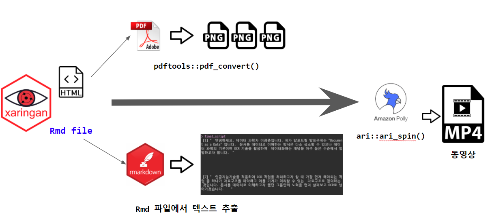

``` {r setup, include=FALSE}
knitr::opts_chunk$set(echo = TRUE, message=FALSE, warning=FALSE,
                      comment="", digits = 3, tidy = FALSE, prompt = FALSE, fig.align = 'center')

knitr::opts_knit$set(global.par = TRUE) 
```




`xaringan` 파일을 HTML 파일로 변환시킨 후에 PDF 파일로 변환시킨다. 그리고 나서 `pdftools`를 활용하여 이미지를 추출한다.
동시에 `xaringan` `.Rmd` 파일에서 `???` 다음에 위치한 발표자 노트 텍스트를 출력하여 텍스트로 저장시킨다.
이를 `ari` 팩키지 `ari_spin()` 함수를 사용해서 `.mp4` 동영상을 제작하고 이를 유튜브에 배포시킨다.


# 파워포인트 원본파일 {#original-pptx}

파워포인트 동영상 제작에 사용된 원본 파일은 [다운로드](data/Xaringan_OCR.pptx) 받아 직접 실습에 사용할 수 있다.
[`pptx` &rarr; `png`](https://statkclee.github.io/deep-learning/r-ari.html#3_PPT_%E2%86%92_%EB%B0%9C%ED%91%9C%EB%8F%99%EC%98%81%EC%83%811) 변환결과를 웹사이트에서 확인할 수 있다.
이제 PPT 파일을 `xaringan` 파일로 변환해보자.

# `xaringan` 발표자료 [^how-to-presentor-notes] [^RaukR-xaringan-demo] {#xaringan-slideshow}

[^how-to-presentor-notes]: [Claus Thorn Ekstrøm (September 26th, 2019), "Xaringan shenanigans", Copenhagen R users](https://www.biostatistics.dk/talks/CopenhagenRuseRs-2019/index.html)

[^RaukR-xaringan-demo]: [Roy Francis, "RaukR presentation demo", RaukR 2019 • Advanced R for Bioinformatics](https://github.com/NBISweden/raukrtemplate)


`???` 뒤에 작성되는 발표자 노트는 `P` 키를 눌렀을 때 나타나게 된다. 이제 PPT 슬라이드를 `xaringan`에 맞춰 하나하나 차근히 변환시켜보자.

```{r embed-xaringan-ocr}
knitr::include_url('xaringan-OCR.html')
```


## 발표자 노트 추출 {#extract-all-notes}

`xaringan`은 발표자 노트가 `???` 으로 시작되고 새로운 슬라이드는 `---`으로 시작되는 특성을 이용하여 슬라이드에 붙어 있는 모든 발표자 노트를 텍스트로 추출한다.

```{r extract-presenter-notes}
library(tidyverse)

slides_text <- read_lines("xaringan-OCR.Rmd") 

ocr_scripts <- paste0(slides_text, collapse = " ") %>% 
  str_extract_all(., pattern = "(?<=\\?\\?\\?)(.*?)(?=---)")

last_script <- paste0(slides_text, collapse = " ") %>% 
  str_extract_all(., pattern = "[^\\?\\?\\?]+$") %>% 
  .[[1]]

# ocr_scripts[length(ocr_scripts)+1] <- last_script
final_script <- c(ocr_scripts, last_script) %>% 
  unlist
```

## 슬라이드 이미지 변환 {#extract-all-slides}

`pdftools`를 사용해서 PNG 파일로 뽑아내보자

```{r xaringan-to-png, eval = TRUE}
library(tidyverse)
library(pdftools)
library(slickR)

# remotes::install_github('rstudio/pagedown')
# pagedown::chrome_print("xaringan-OCR.html",output="xaringan-OCR.pdf")
# Windows Error
# Error in force(expr) : 
#   Failed to generate output. Reason: Failed to open https://fonts.googleapis.com/css?family=Nanum+Gothic:300,300i&display=swap (HTTP status code: 400)
# xaringan::decktape("xaringan-OCR.html", output="xaringan-OCR.pdf", 
#                    docker = TRUE)
# Error in xaringan::decktape("xaringan-OCR.html", output = "xaringan-OCR.pdf",  : 
#   Failed to convert xaringan-OCR.html to PDF

xaringan_ocr_pdf <- pdf_convert("data/xaringan-OCR.pdf",format = 'png',verbose = FALSE)

xaringan_pdf_df <- tibble(page = glue::glue("data/{xaringan_ocr_pdf[c(1,3:11)]}") )

xaringan_pdf_df %>% 
  write_rds("data/xaringan_pdf_df.rds")
```

`pdf_convert()` 함수를 사용해서 PNG 파일로 저장시킨다.

```{r xaringan-slide-png}
xaringan_pdf_df <-  
  read_rds("data/xaringan_pdf_df.rds")  
slickR(xaringan_pdf_df$page, height = 600)
```


# 동영상 제작 {#extract-all-slides-youtube}

동영상 제작은 여러 방식 중 슬라이드를 변환시킨 각 "PNG 이미지"를 스크립트와 매칭하는 방식으로 `ari_spin()` 함수를 사용하여 조합한다.

```{r xaringan-youtube-making, eval = FALSE}
library(ari)

ari_spin(
  xaringan_pdf_df$page,
  final_script,
  output = "data/xaringan_OCR.mp4", 
  voice = "Seoyeon",
  divisible_height = TRUE, subtitles = TRUE)
```

작업결과 .mp4와 .srt 파일이 동시에 생성되는데 이를 유튜브에 올려 자막도 함께 재활용시키도록 등록한다. 
변환작업 결과는 [xaringan 으로 제작된 슬라이드 발표자료를 AWS POLLY 를 이용하여 MP4 동영상을 제작합니다.](https://www.youtube.com/watch?v=TjYnx2jALmY)에서 확인이 가능하다.

# 유튜브 배포 {#extract-all-slides-youtube-deploy}

유튜브에 MP4를 업로드하고 관련 메타데이터를 저장시키고 `.srt` 자막파일도 함께 등록시킨다.

<iframe width="560" height="315" src="https://www.youtube.com/embed/TjYnx2jALmY" frameborder="0" allow="accelerometer; autoplay; clipboard-write; encrypted-media; gyroscope; picture-in-picture" allowfullscreen></iframe>
