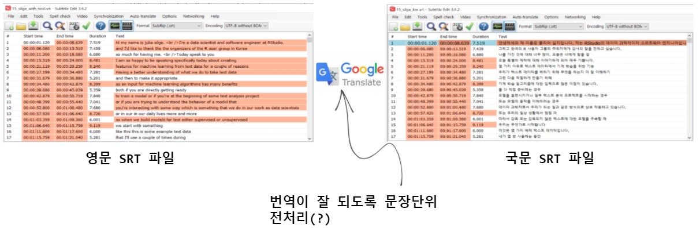
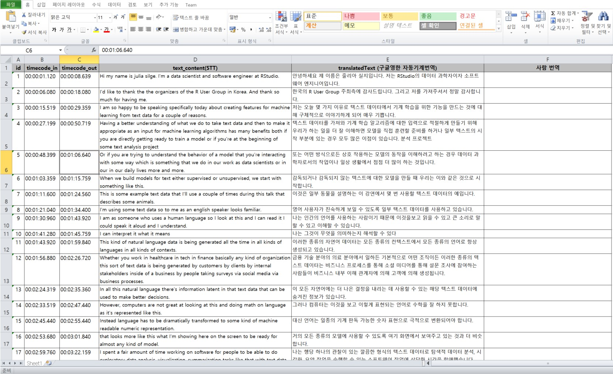
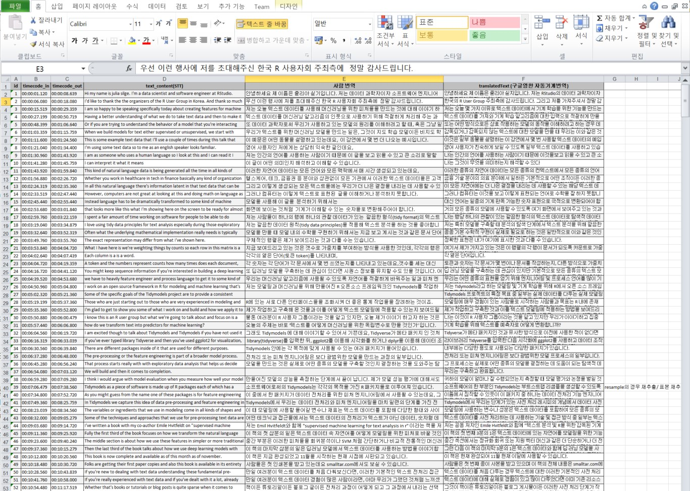

```{r setup, include=FALSE}
knitr::opts_chunk$set(echo = TRUE, message=FALSE, warning=FALSE,
                      comment="", digits = 3, tidy = FALSE, prompt = FALSE, fig.align = 'center')

knitr::opts_knit$set(global.par = TRUE) 
```


# 동영상 → 오디오 추출 {#audio-extraction}

동영상에서 오디오를 추출해서 Speech to Text (STT)가 가능한 `.flac` 형태로 저장한다. 유튜브 동영상에서 오디오를 추출하는 사례를 [speech-to-text - 음성을 텍스트로 변환](https://statkclee.github.io/deep-learning/r-stt.html)에서 자세한 사항 참조한다.

```{r julia-silge}
library(embedr)
library(tidyverse)

embed_audio("data/julia_silge/15_silge.mp3")

```

# 오디오 → 텍스트 (STT) {#audio-extraction-stt}

[Cloud Speech-to-Text API](https://cloud.google.com/speech-to-text/)를 사용해서 오디오에서 텍스트를 추출한다. 하지만 1분이 넘어가는 경우 제약이 있기 때문에 Google Cloud Storage에 앞서 추출한 `.flac` 파일을 GCS 버킷에 넣어 사용해야만 한다. 추출한 오디오 `.flac` 파일을 GCS 버킷에 담는 자세한 과정은 [Google Cloud Storage - googleCloudStorageR](https://statkclee.github.io/deep-learning/r-google-storage.html)을 참조한다.

구글 STT API를 활용하게 되면 오디오 파일을 입력으로 받아 추출한 텍스트와 시점정보를 함께 반환한다. `객체명$transcript`에 오디오에서 추출된 텍스트, `객체명$timings`에 추출된 텍스트 시점정보가 함께 저장되어 있다.

약 45분 오디오를 구글 STT에서 처리하는데 2,820 초가 소요되었다.

```{r tts-hello, error=TRUE, eval = FALSE}
library(googleLanguageR)

kt_config <- list(encoding = "FLAC",
                  audioChannelCount = 2,
                  diarizationConfig = list(
                    enableSpeakerDiarization = TRUE
                  ))

julia_gcs <- "gs://julia_silge/15_silge.flac"

julia_tts <-  gl_speech(julia_gcs, languageCode = "en-US", sampleRateHertz = 44100L, asynch = TRUE, 
                        customConfig = kt_config)

julia_tts_res <- gl_speech_op(julia_tts)
# 2021-11-05 15:49:59 -- Asynchronous transcription finished.
# 2021-11-05 15:49:59 -- Speech transcription finished. Total billed time: 2820s

julia_stt_tbl <- julia_tts_res$transcript %>% 
  as_tibble()

julia_stt_tbl %>% 
  write_rds("data/julia_silge/julia_stt_tbl.rds")

julia_stt_timing_list <- julia_tts_res$timings 

julia_stt_timing_list %>% 
  write_rds("data/julia_silge/julia_stt_timing_list.rds")
```

## STT 기계추출 → 텍스트 {#stt-raw-text}

추출한 텍스트와 전문은 다음과 같다. [다운로드: STT 원본 TEXT](data/julia_silge/julia_stt_raw_text.txt)

```{r julia-silge-translation, eval = TRUE}
library(reactable)

julia_stt_tbl <-  
  read_rds("data/julia_silge/julia_stt_tbl.rds") 

julia_stt_raw_text <- julia_stt_tbl %>% 
  summarise(stt_raw_text = paste(transcript, collapse = "\n"))

# julia_stt_raw_text %>% 
#   write_lines("data/julia_silge/julia_stt_raw_text.txt")

str_sub(julia_stt_raw_text, 1, 1000) %>% 
  as_tibble() %>% 
    reactable::reactable(
    defaultColDef = colDef(
      header = function(value) gsub(".", " ", value, fixed = TRUE),
      cell = function(value) format(value, nsmall = 1),
      align = "center",
      minWidth = 70,
      headerStyle = list(background = "#f7f7f8")
  ),
  bordered = TRUE,
  highlight = TRUE)
```

## STT 기계추출 → 시간 {#stt-raw-text-timing}

다음으로 중요한 것은 시점정보다. 이를 위해서 총 45분 강연이라 5분 단위로 짤라 9개로 쪼개 추후 자연어 처리가 가능하도록 조치한다.

```{r julia-silge-translation-time, eval = TRUE}

julia_stt_timing_list <- 
  read_rds("data/julia_silge/julia_stt_timing_list.rds")

julia_stt_timing_tbl <- map_df(julia_stt_timing_list, rbind) %>% 
  as_tibble() %>% 
  select(-speakerTag)


julia_stt_timing_five_tbl <- julia_stt_timing_tbl %>% 
  mutate(startTime = parse_number(startTime),
         endTime   = parse_number(endTime)) %>% 
  # 45 분 / 9 구간 = 5 분/구간
  mutate(nine_interval = cut( startTime, 
                              breaks = unique(quantile(startTime, probs = seq.int(0, 1, by = 1 / 9))), 
                                              include.lowest=TRUE)) %>% 
  group_by(nine_interval) %>% 
  summarise(five_min_text = paste(word, collapse = " "))

julia_stt_timing_five_tbl %>% 
  slice(1) %>% 
  reactable::reactable(
    defaultColDef = colDef(
      header = function(value) gsub(".", " ", value, fixed = TRUE),
      cell = function(value) format(value, nsmall = 1),
      align = "center",
      minWidth = 70,
      headerStyle = list(background = "#f7f7f8")
  ),
  columns = list(
    nine_interval = colDef(minWidth = 20),
    five_min_text = colDef(minWidth = 140)
  ),
  bordered = TRUE,
  highlight = TRUE)
```

# `.srt` 파일 {#srt-file}

구글 STT의 경우 상세한 시점정보가 제공되나 단어 STT 시간과 거의 1분 단위로 기계적으로 쪼개진 정보만 제공되고 있다. [데이터 가져오기 - 유튜브, 영화자막](https://statkclee.github.io/ingest-data/ingest-srt.html)을 참고하여 자막정보를 만들어보자.

자막 `.srt` 파일을 제작하는 다른 방식은 유튜브 자막 자동생성 기능을 활용하는 것이다. 일단 동영상을 업로드하고 공개로 설정을 해주면 기계가 자동으로 STT 를 수행하여 자막을 추출할 수 있게 도움을 준다.

{width="394"}

# `.srt` 파일 교정 {#srt-file-proof-reading}

[Subtitle Edit](https://github.com/SubtitleEdit/subtitleedit/releases) 최신 버전을 설치하여 구글 STT 기능으로 추출된 텍스트를 교정한다. 구글 STT는 아무래도 R 데이터 과학 전문용어에는 한계가 있기 때문에 `RStudio`, `dplyr`와 같은 용어오 `stopwords`, `n-gram`와 같은 NLP 전문용어 그리고 `um` 의성어 등도 있는 그대로 텍스트로 떨구기 때문에 이런 용어를 교정할 필요가 있다. [교정한 영문 SRT 파일](data/julia_silge/15_silge_english.srt)


```{r ingest-srt-file}
library(srt)

srt_eng_raw <- read_lines("data/julia_silge/15_silge_english.srt")

srt_eng_text <- srt_eng_raw[srt_eng_raw != ""]

srt_eng_text[1:10]
```

`read_srt()` 함수를 사용하여 전체 내용을 살펴보면 다음과 같다.

```{r second-srt-feature}
(keynote <- read_srt(path = "data/julia_silge/15_silge_english.srt", collapse = " "))
```

# 영문 `.srt` 파일 번역 {#srt-file-translation}

## 전체 통번역 {#full-text-translation}

먼저 텍스트를 하나로 묶어 이를 전체 문자 벡터로 만든 후에 이를 구글 번역기에 넣어 한글로 번역한다.

```{r srt-file-translation-full, eval = FALSE}
library(googleLanguageR)

eng_plain_text <- keynote %>% 
  summarise(eng_text = paste(subtitle, collapse = " ")) %>% 
  pull()

kor_translated_text <- googleLanguageR::gl_translate(eng_plain_text, target = "ko", source = "en", model = "nmt")
# 2021-11-07 10:53:00 -- Translating text: 33505 characters - 

kor_translated_text %>% 
  write_rds("data/julia_silge/full_ko_translation.rds")
```

영어 원문과 구글 번역기를 돌려 나온 결과물을 나란히 놓고 비교해보자.

```{r show-full-translation-side}
kor_translated_text <- 
  read_rds("data/julia_silge/full_ko_translation.rds")

kor_translated_text %>% 
  select(text, translatedText) %>% 
  reactable::reactable(
    defaultColDef = colDef(
      header = function(value) gsub(".", " ", value, fixed = TRUE),
      cell = function(value) format(value, nsmall = 1),
      align = "center",
      minWidth = 70,
      headerStyle = list(background = "#f7f7f8")
  ),
  # columns = list(
  #   translatedText = colDef(minWidth = 100),
  #   text = colDef(minWidth = 100)
  # ),
  bordered = TRUE,
  highlight = TRUE)
```

## `.srt` 자막 번역 {#srt-translation}

통번역이 아니라 `.srt` 파일에 나온 자막 시작시간과 종료시간을 고려하여 번역작업을 수행해보자.

```{r srt-file-translation, eval = FALSE}
keynote_gl_tbl <- keynote %>% 
  mutate(translation = googleLanguageR::gl_translate(subtitle, target = "ko", source = "en", model = "nmt"))

keynote_gl_tbl %>% 
  write_rds("data/julia_silge/keynote_gl_tbl.rds")
```

`.srt` 파일로 번역한 것을 영어 원문과 비교해 보면 다음과 같다.

```{r srt-file-translation-review}
keynote_gl_tbl <-  
  read_rds("data/julia_silge/keynote_gl_tbl.rds")

translation_obj <- keynote_gl_tbl %>% 
  pull(translation)

translation_obj %>% 
  select(translatedText) %>% 
  bind_cols(keynote_gl_tbl %>% select(-translation)) %>% 
  select(n, start, end, subtitle, translatedText) %>% 
  mutate(start = scales::comma(start),
         end = scales::comma(end)) %>% 
  reactable::reactable(
    defaultColDef = colDef(
      header = function(value) gsub(".", " ", value, fixed = TRUE),
      cell = function(value) format(value, nsmall = 1),
      align = "center",
      minWidth = 70,
      headerStyle = list(background = "#f7f7f8")
  ),
  columns = list(
    n = colDef(minWidth = 10),
    start = colDef(minWidth = 25),
    end = colDef(minWidth = 25),
    subtitle = colDef(minWidth = 100),
    translatedText = colDef(minWidth = 100)
  ),
  bordered = TRUE,
  highlight = TRUE)
```

## `.srt` 번역자막 내보내기 {#translation-export}

마지막으로 이렇게 기계 번역을 완료한 `.srt` 파일을 내보내서 기계번역을 입혀보도록 하자.

```{r srt-export}
keynote_kor_srt <- translation_obj %>% 
  select(translatedText) %>% 
  bind_cols(keynote_gl_tbl %>% select(-translation)) %>% 
  select(n, start, end, subtitle = translatedText)

# 기대했던 결과가 아님!!! (버그가 있음)
# keynote_kor_srt %>% 
#   srt::write_srt("data/julia_silge/15_silge_kor_google.srt", wrap = TRUE, width = 50)

```

`srt::write_srt()` 함수에 버그가 있어 [`subtools`](https://github.com/fkeck/subtools)

```{r srt-export-with-subtools, eval = FALSE}
# devtools::install_github("fkeck/subtools")
library(subtools)

eng_subtools <- subtools::read_subtitles("data/julia_silge/15_silge_english.srt")

kor_subtools <- eng_subtools %>% 
  bind_cols(translation_obj %>% select(translatedText)) %>% 
  select(ID, Timecode_in, Timecode_out, Text_content = translatedText)

# class(eng_subtools)
# class(kor_subtools)

kor_subtools %>% 
  subtools::write_subtitles(file = "data/julia_silge/15_silge_kor.srt", 
                            format = "srt", encoding = "UTF-8")
```

앞서 작업한 구글 영한 기계 번역 결과가 제대로 되었는지 다음을 통해 확인할 수 있다.

```{r korean-srt-output-overview}
kor_subtools <- 
  subtools::read_subtitles(file = "data/julia_silge/15_silge_kor.srt", 
                            format = "srt", encoding = "UTF-8")

kor_subtools %>% 
  janitor::clean_names() %>% 
  reactable::reactable(
    defaultColDef = colDef(
      header = function(value) gsub(".", " ", value, fixed = TRUE),
      cell = function(value) format(value, nsmall = 1),
      align = "center",
      minWidth = 70,
      headerStyle = list(background = "#f7f7f8")
  ),
  columns = list(
    id = colDef(minWidth = 10),
    timecode_in = colDef(minWidth = 25),
    timecode_out = colDef(minWidth = 25),
    text_content = colDef(minWidth = 100)
  ),
  bordered = TRUE,
  highlight = TRUE)
```



# 깔끔한 작업흐름 {#google-translation}

구글 실시간 번역 결과를 의미있는 형태로 바꾸기 위해서는 이를 문장단위로 나눠져야 구글 번역기의 성능이 향상되어 나름 적은 노력으로 `.srt` 한글 번역 자막을 만들어 바로 활용할 수 있다.

```{r read-sentence-level-translation}
julia_sentence_srt <- 
  subtools::read_subtitles(file = "data/julia_silge/15_silge_eng_for_translation.srt", 
                            format = "srt", encoding = "UTF-8") %>% 
    janitor::clean_names()

julia_sentence_srt %>% 
  reactable::reactable(
    defaultColDef = colDef(
      header = function(value) gsub(".", " ", value, fixed = TRUE),
      cell = function(value) format(value, nsmall = 1),
      align = "center",
      minWidth = 70,
      headerStyle = list(background = "#f7f7f8")
  ),
  columns = list(
    id = colDef(minWidth = 10),
    timecode_in = colDef(minWidth = 25),
    timecode_out = colDef(minWidth = 25),
    text_content = colDef(minWidth = 100)
  ),
  bordered = TRUE,
  highlight = TRUE)

```

구글 번역기에 문장단위로 쪼개 전송하여 영문을 한국어로 번역한다.

```{r translate-again-google, eval = FALSE}
julia_sentence_gl_translation_srt <- julia_sentence_srt %>% 
  mutate(translation = googleLanguageR::gl_translate(text_content, target = "ko", source = "en", model = "nmt"))

# i 2021-11-08 01:21:45 > Request Status Code:  400
# 2021-11-08 01:21:45 -- API returned: Too many text segments
# 2021-11-08 01:21:45 -- Attempting to split into several API calls
# 2021-11-08 01:21:45 -- Translating text: 81 characters - 
# 2021-11-08 01:21:45 -- Translating text: 99 characters - 
# 2021-11-08 01:21:45 -- Translating text: 132 characters - 
# 2021-11-08 01:21:46 -- Translating text: 271 characters - 
# 2021-11-08 01:21:46 -- Translating text: 201 characters - 
# 2021-11-08 01:21:46 -- Translating text: 99 characters - 
# 2021-11-08 01:21:46 -- Translating text: 108 characters - 
# 2021-11-08 01:21:46 -- Translating text: 71 characters - 
# 2021-11-08 01:21:47 -- Translating text: 118 characters - 
# 2021-11-08 01:21:47 -- Translating text: 32 characters - 
# 2021-11-08 01:21:47 -- Translating text: 118 characters - 
# 2021-11-08 01:21:47 -- Translating text: 262 characters - 
# 2021-11-08 01:21:47 -- Translating text: 116 characters - 
# 2021-11-08 01:21:48 -- Translating text: 109 characters - 
# 2021-11-08 01:21:48 -- Translating text: 108 characters - 
# 2021-11-08 01:21:48 -- Translating text: 103 characters - 
# 2021-11-08 01:21:48 -- Translating text: 220 characters - 
# 2021-11-08 01:21:48 -- Translating text: 146 characters - 
# 2021-11-08 01:21:49 -- Translating text: 184 characters - 
# 2021-11-08 01:21:49 -- Translating text: 62 characters - 
# 2021-11-08 01:21:49 -- Translating text: 94 characters - 
# 2021-11-08 01:21:49 -- Translating text: 27 characters - 
# 2021-11-08 01:21:50 -- Translating text: 162 characters - 
# 2021-11-08 01:21:50 -- Translating text: 328 characters - 
# 2021-11-08 01:21:50 -- Translating text: 147 characters - 
# 2021-11-08 01:21:50 -- Translating text: 163 characters - 
# 2021-11-08 01:21:50 -- Translating text: 206 characters - 
# 2021-11-08 01:21:51 -- Translating text: 199 characters - 
# 2021-11-08 01:21:51 -- Translating text: 187 characters - 
# 2021-11-08 01:21:51 -- Translating text: 123 characters - 
# 2021-11-08 01:21:51 -- Translating text: 62 characters - 
# 2021-11-08 01:21:51 -- Translating text: 163 characters - 
# 2021-11-08 01:21:52 -- Translating text: 150 characters - 
# 2021-11-08 01:21:52 -- Translating text: 79 characters - 
# 2021-11-08 01:21:52 -- Translating text: 81 characters - 
# 2021-11-08 01:21:52 -- Translating text: 103 characters - 
# 2021-11-08 01:21:52 -- Translating text: 46 characters - 
# 2021-11-08 01:21:52 -- Translating text: 91 characters - 
# 2021-11-08 01:21:53 -- Translating text: 335 characters - 
# 2021-11-08 01:21:53 -- Translating text: 168 characters - 
# 2021-11-08 01:21:53 -- Translating text: 392 characters - 
# 2021-11-08 01:21:53 -- Translating text: 111 characters - 
# 2021-11-08 01:21:53 -- Translating text: 377 characters - 
# 2021-11-08 01:21:54 -- Translating text: 111 characters - 
# 2021-11-08 01:21:54 -- Translating text: 136 characters - 
# 2021-11-08 01:21:54 -- Translating text: 164 characters - 
# 2021-11-08 01:21:54 -- Translating text: 402 characters - 
# 2021-11-08 01:21:54 -- Translating text: 72 characters - 
# 2021-11-08 01:21:55 -- Translating text: 107 characters - 
# 2021-11-08 01:21:55 -- Translating text: 164 characters - 
# 2021-11-08 01:21:55 -- Translating text: 148 characters - 
# 2021-11-08 01:21:55 -- Translating text: 233 characters - 
# 2021-11-08 01:21:55 -- Translating text: 121 characters - 
# 2021-11-08 01:21:56 -- Translating text: 34 characters - 
# 2021-11-08 01:21:56 -- Translating text: 200 characters - 
# 2021-11-08 01:21:56 -- Translating text: 25 characters - 
# 2021-11-08 01:21:56 -- Translating text: 125 characters - 
# 2021-11-08 01:21:56 -- Translating text: 117 characters - 
# 2021-11-08 01:21:56 -- Translating text: 102 characters - 
# 2021-11-08 01:21:57 -- Translating text: 140 characters - 
# 2021-11-08 01:21:57 -- Translating text: 103 characters - 
# 2021-11-08 01:21:57 -- Translating text: 219 characters - 
# 2021-11-08 01:21:57 -- Translating text: 171 characters - 
# 2021-11-08 01:21:57 -- Translating text: 284 characters - 
# 2021-11-08 01:21:58 -- Translating text: 154 characters - 
# 2021-11-08 01:21:58 -- Translating text: 205 characters - 
# 2021-11-08 01:21:58 -- Translating text: 325 characters - 
# 2021-11-08 01:21:58 -- Translating text: 67 characters - 
# 2021-11-08 01:21:58 -- Translating text: 569 characters - 
# 2021-11-08 01:21:59 -- Translating text: 170 characters - 
# 2021-11-08 01:21:59 -- Translating text: 77 characters - 
# 2021-11-08 01:21:59 -- Translating text: 174 characters - 
# 2021-11-08 01:21:59 -- Translating text: 190 characters - 
# 2021-11-08 01:22:00 -- Translating text: 40 characters - 
# 2021-11-08 01:22:00 -- Translating text: 104 characters - 
# 2021-11-08 01:22:00 -- Translating text: 153 characters - 
# 2021-11-08 01:22:00 -- Translating text: 201 characters - 
# 2021-11-08 01:22:00 -- Translating text: 42 characters - 
# 2021-11-08 01:22:00 -- Translating text: 180 characters - 
# 2021-11-08 01:22:01 -- Translating text: 122 characters - 
# 2021-11-08 01:22:01 -- Translating text: 193 characters - 
# 2021-11-08 01:22:01 -- Translating text: 159 characters - 
# 2021-11-08 01:22:01 -- Translating text: 72 characters - 
# 2021-11-08 01:22:01 -- Translating text: 153 characters - 
# 2021-11-08 01:22:02 -- Translating text: 181 characters - 
# 2021-11-08 01:22:02 -- Translating text: 208 characters - 
# 2021-11-08 01:22:02 -- Translating text: 103 characters - 
# 2021-11-08 01:22:02 -- Translating text: 113 characters - 
# 2021-11-08 01:22:02 -- Translating text: 185 characters - 
# 2021-11-08 01:22:03 -- Translating text: 160 characters - 
# 2021-11-08 01:22:03 -- Translating text: 220 characters - 
# 2021-11-08 01:22:03 -- Translating text: 77 characters - 
# 2021-11-08 01:22:03 -- Translating text: 99 characters - 
# 2021-11-08 01:22:03 -- Translating text: 122 characters - 
# 2021-11-08 01:22:04 -- Translating text: 106 characters - 
# 2021-11-08 01:22:04 -- Translating text: 127 characters - 
# 2021-11-08 01:22:04 -- Translating text: 117 characters - 
# 2021-11-08 01:22:04 -- Translating text: 90 characters - 
# 2021-11-08 01:22:04 -- Translating text: 124 characters - 
# 2021-11-08 01:22:05 -- Translating text: 192 characters - 
# 2021-11-08 01:22:05 -- Translating text: 81 characters - 
# 2021-11-08 01:22:05 -- Translating text: 76 characters - 
# 2021-11-08 01:22:05 -- Translating text: 153 characters - 
# 2021-11-08 01:22:05 -- Translating text: 78 characters - 
# 2021-11-08 01:22:06 -- Translating text: 119 characters - 
# 2021-11-08 01:22:06 -- Translating text: 112 characters - 
# 2021-11-08 01:22:06 -- Translating text: 130 characters - 
# 2021-11-08 01:22:06 -- Translating text: 103 characters - 
# 2021-11-08 01:22:06 -- Translating text: 129 characters - 
# 2021-11-08 01:22:07 -- Translating text: 120 characters - 
# 2021-11-08 01:22:07 -- Translating text: 68 characters - 
# 2021-11-08 01:22:07 -- Translating text: 135 characters - 
# 2021-11-08 01:22:07 -- Translating text: 91 characters - 
# 2021-11-08 01:22:07 -- Translating text: 62 characters - 
# 2021-11-08 01:22:08 -- Translating text: 118 characters - 
# 2021-11-08 01:22:08 -- Translating text: 110 characters - 
# 2021-11-08 01:22:08 -- Translating text: 148 characters - 
# 2021-11-08 01:22:08 -- Translating text: 166 characters - 
# 2021-11-08 01:22:08 -- Translating text: 77 characters - 
# 2021-11-08 01:22:09 -- Translating text: 116 characters - 
# 2021-11-08 01:22:09 -- Translating text: 67 characters - 
# 2021-11-08 01:22:09 -- Translating text: 179 characters - 
# 2021-11-08 01:22:09 -- Translating text: 107 characters - 
# 2021-11-08 01:22:09 -- Translating text: 164 characters - 
# 2021-11-08 01:22:10 -- Translating text: 114 characters - 
# 2021-11-08 01:22:10 -- Translating text: 68 characters - 
# 2021-11-08 01:22:10 -- Translating text: 109 characters - 
# 2021-11-08 01:22:10 -- Translating text: 111 characters - 
# 2021-11-08 01:22:10 -- Translating text: 157 characters - 
# 2021-11-08 01:22:11 -- Translating text: 27 characters - 
# 2021-11-08 01:22:11 -- Translating text: 102 characters - 
# 2021-11-08 01:22:11 -- Translating text: 72 characters - 
# 2021-11-08 01:22:11 -- Translating text: 130 characters - 
# 2021-11-08 01:22:11 -- Translating text: 174 characters - 
# 2021-11-08 01:22:12 -- Translating text: 149 characters - 
# 2021-11-08 01:22:12 -- Translating text: 72 characters - 
# 2021-11-08 01:22:12 -- Translating text: 120 characters - 
# 2021-11-08 01:22:12 -- Translating text: 191 characters - 
# 2021-11-08 01:22:12 -- Translating text: 104 characters - 
# 2021-11-08 01:22:13 -- Translating text: 173 characters - 
# 2021-11-08 01:22:13 -- Translating text: 59 characters - 
# 2021-11-08 01:22:13 -- Translating text: 48 characters - 
# 2021-11-08 01:22:13 -- Translating text: 62 characters - 
# 2021-11-08 01:22:13 -- Translating text: 207 characters - 
# 2021-11-08 01:22:13 -- Translating text: 115 characters - 
# 2021-11-08 01:22:14 -- Translating text: 125 characters - 
# 2021-11-08 01:22:14 -- Translating text: 89 characters - 
# 2021-11-08 01:22:14 -- Translating text: 79 characters - 
# 2021-11-08 01:22:14 -- Translating text: 106 characters - 
# 2021-11-08 01:22:14 -- Translating text: 125 characters - 
# 2021-11-08 01:22:15 -- Translating text: 38 characters - 
# 2021-11-08 01:22:15 -- Translating text: 53 characters - 
# 2021-11-08 01:22:15 -- Translating text: 57 characters - 
# 2021-11-08 01:22:15 -- Translating text: 154 characters - 
# 2021-11-08 01:22:15 -- Translating text: 46 characters - 
# 2021-11-08 01:22:15 -- Translating text: 115 characters - 
# 2021-11-08 01:22:16 -- Translating text: 166 characters - 
# 2021-11-08 01:22:16 -- Translating text: 52 characters - 
# 2021-11-08 01:22:16 -- Translating text: 176 characters - 
# 2021-11-08 01:22:16 -- Translating text: 130 characters - 
# 2021-11-08 01:22:16 -- Translating text: 114 characters - 
# 2021-11-08 01:22:17 -- Translating text: 82 characters - 
# 2021-11-08 01:22:17 -- Translating text: 165 characters - 
# 2021-11-08 01:22:17 -- Translating text: 171 characters - 
# 2021-11-08 01:22:17 -- Translating text: 218 characters - 
# 2021-11-08 01:22:17 -- Translating text: 66 characters - 
# 2021-11-08 01:22:18 -- Translating text: 84 characters - 
# 2021-11-08 01:22:18 -- Translating text: 138 characters - 
# 2021-11-08 01:22:18 -- Translating text: 65 characters - 
# 2021-11-08 01:22:18 -- Translating text: 201 characters - 
# 2021-11-08 01:22:18 -- Translating text: 118 characters - 
# 2021-11-08 01:22:19 -- Translating text: 176 characters - 
# 2021-11-08 01:22:19 -- Translating text: 130 characters - 
# 2021-11-08 01:22:19 -- Translating text: 241 characters - 
# 2021-11-08 01:22:19 -- Translating text: 78 characters - 
# 2021-11-08 01:22:19 -- Translating text: 85 characters - 
# 2021-11-08 01:22:20 -- Translating text: 214 characters - 
# 2021-11-08 01:22:20 -- Translating text: 204 characters - 
# 2021-11-08 01:22:20 -- Translating text: 183 characters - 
# 2021-11-08 01:22:20 -- Translating text: 188 characters - 
# 2021-11-08 01:22:20 -- Translating text: 140 characters - 
# 2021-11-08 01:22:21 -- Translating text: 270 characters - 
# 2021-11-08 01:22:21 -- Translating text: 239 characters - 
# 2021-11-08 01:22:21 -- Translating text: 142 characters - 
# 2021-11-08 01:22:21 -- Translating text: 146 characters - 
# 2021-11-08 01:22:21 -- Translating text: 87 characters - 
# 2021-11-08 01:22:22 -- Translating text: 124 characters - 
# 2021-11-08 01:22:22 -- Translating text: 139 characters - 
# 2021-11-08 01:22:22 -- Translating text: 218 characters - 
# 2021-11-08 01:22:22 -- Translating text: 122 characters - 
# 2021-11-08 01:22:22 -- Translating text: 94 characters - 
# 2021-11-08 01:22:23 -- Translating text: 80 characters - 
# 2021-11-08 01:22:23 -- Translating text: 166 characters - 
# 2021-11-08 01:22:23 -- Translating text: 46 characters - 
# 2021-11-08 01:22:23 -- Translating text: 91 characters - 
# 2021-11-08 01:22:23 -- Translating text: 21 characters - 
# 2021-11-08 01:22:23 -- Translating text: 132 characters - 
# 2021-11-08 01:22:24 -- Translating text: 137 characters - 
# 2021-11-08 01:22:24 -- Translating text: 120 characters - 
# 2021-11-08 01:22:24 -- Translating text: 183 characters - 
# 2021-11-08 01:22:24 -- Translating text: 189 characters - 
# 2021-11-08 01:22:24 -- Translating text: 46 characters - 
# 2021-11-08 01:22:24 -- Translating text: 98 characters - 
# 2021-11-08 01:22:25 -- Translating text: 185 characters - 
# 2021-11-08 01:22:25 -- Translating text: 233 characters - 
# 2021-11-08 01:22:25 -- Translating text: 159 characters - 
# 2021-11-08 01:22:25 -- Translating text: 46 characters - 
# 2021-11-08 01:22:25 -- Translating text: 66 characters - 
# 2021-11-08 01:22:26 -- Translating text: 92 characters - 
# 2021-11-08 01:22:26 -- Translating text: 291 characters - 
# 2021-11-08 01:22:26 -- Translating text: 149 characters - 
# 2021-11-08 01:22:26 -- Translating text: 59 characters - 
# 2021-11-08 01:22:26 -- Translating text: 38 characters - 
# 2021-11-08 01:22:27 -- Translating text: 98 characters - 
# 2021-11-08 01:22:27 -- Translating text: 160 characters - 
# 2021-11-08 01:22:27 -- Translating text: 37 characters - 
# 2021-11-08 01:22:27 -- Translating text: 82 characters - 
# 2021-11-08 01:22:27 -- Translating text: 250 characters - 
# 2021-11-08 01:22:27 -- Translating text: 152 characters - 
# 2021-11-08 01:22:28 -- Translating text: 167 characters - 
# 2021-11-08 01:22:28 -- Translating text: 147 characters - 
# 2021-11-08 01:22:28 -- Translating text: 70 characters - 
# 2021-11-08 01:22:28 -- Translating text: 136 characters - 
# 2021-11-08 01:22:28 -- Translating text: 100 characters - 
# 2021-11-08 01:22:29 -- Translating text: 60 characters - 
# 2021-11-08 01:22:29 -- Translating text: 206 characters - 
# 2021-11-08 01:22:29 -- Translating text: 101 characters - 
# 2021-11-08 01:22:29 -- Translating text: 105 characters - 
# 2021-11-08 01:22:29 -- Translating text: 110 characters - 
# 2021-11-08 01:22:30 -- Translating text: 106 characters - 
# 2021-11-08 01:22:30 -- Translating text: 125 characters - 
# 2021-11-08 01:22:30 -- Translating text: 159 characters - 
# 2021-11-08 01:22:30 -- Translating text: 60 characters - 
# 2021-11-08 01:22:30 -- Translating text: 252 characters - 
# 2021-11-08 01:22:30 -- Translating text: 161 characters - 
# 2021-11-08 01:22:31 -- Translating text: 163 characters - 
# 2021-11-08 01:22:31 -- Translating text: 89 characters - 
# 2021-11-08 01:22:31 -- Translating text: 117 characters - 
# 2021-11-08 01:22:31 -- Translating text: 153 characters - 
# 2021-11-08 01:22:31 -- Translating text: 75 characters - 
# 2021-11-08 01:22:32 -- Translating text: 50 characters - 
# 2021-11-08 01:22:32 -- Translating text: 102 characters - 

julia_sentence_gl_translation_srt %>% 
  write_rds("data/julia_silge/julia_sentence_gl_translation_srt.rds")

```

```{r read-julia-transtion}
julia_sentence_gl_translation_srt  <-  
  read_rds("data/julia_silge/julia_sentence_gl_translation_srt.rds")

julia_translation_listcolumn <- julia_sentence_gl_translation_srt %>% 
  pull(translation)

julia_sentence_srt %>% 
  bind_cols(julia_translation_listcolumn) %>% 
  select(-text) %>% 
  janitor::clean_names() %>% 
  reactable::reactable(
    defaultColDef = colDef(
      header = function(value) gsub(".", " ", value, fixed = TRUE),
      cell = function(value) format(value, nsmall = 1),
      align = "center",
      minWidth = 70,
      headerStyle = list(background = "#f7f7f8")
  ),
  columns = list(
    id = colDef(minWidth = 10),
    timecode_in = colDef(minWidth = 25),
    timecode_out = colDef(minWidth = 25),
    text_content = colDef(minWidth = 100),
    translated_text = colDef(minWidth = 100)
  ),
  bordered = TRUE,
  highlight = TRUE)  

```

구글 유튜브에서 활용이 가능하도록 `.srt` 파일로 영한 구글 기계번역을 문장단위로 수행하여 번역이 자연스럽도록 수행한 뒤에 내보내기 작업을 수행하여 저장한다.

```{r make-export-for-youtube-srt, eval = FALSE}
julia_sentence_srt %>% 
  bind_cols(julia_translation_listcolumn) %>% 
  select(-text) %>% 
  janitor::clean_names() %>% 
  select(id, timecode_in, timecode_out, text_content = translated_text) %>% 
  set_names("ID", "Timecode_in", "Timecode_out", "Text_content") %>% 
  subtools::write_subtitles(file = "data/julia_silge/15_silge_kor_sentence.srt", 
                            format = "srt", encoding = "UTF-8")
  
```

## 엑셀파일 내보내기 {#export-srt-excel}

R 써포터즈가 작업하기 편하도록 엑셀파일로 변환시킨다.

```{r export-excel-srt, eval = FALSE}
julia_sentence_srt %>% 
  bind_cols(julia_translation_listcolumn) %>% 
  select(-text) %>% 
  writexl::write_xlsx(path = "data/julia_silge/keynote_translation.xlsx")
```



# 전문가 번역 반영 최종 `.srt` {#google-translation-final}

구글 번역기는 특히, 전문 용어 (자연어처리, 기계학습, 데이터과학, R/Tidyverse) 처리가 미진하고 경우에 따라서는 오역이 상당수 존재하여 이를 전문가가 직접 보정할 필요가 있다. 전문가 번역에는 한국 R 사용자회 이광춘, 이영록, 이승현 님이 참여해주셨습니다. 



번역이 완료되었기 때문에 최종 한글 번역 완료 자막을 넣어 확정하자.

```{r julia-sliege-completed}
library(tidyverse)
library(srt)
library(subtools)
library(readxl)

julia_sentence_gl_translation_srt  <-  
  read_rds("data/julia_silge/julia_sentence_gl_translation_srt.rds")

julia_translated  <-  
  read_excel("data/julia_silge/keynote_translation_human.xlsx") %>% 
  janitor::clean_names(ascii = FALSE) %>% 
  select(id, `사람_번역`)

julia_base_srt <- julia_sentence_gl_translation_srt %>% select(id, timecode_in, timecode_out)

julia_ko_srt <- julia_base_srt %>% 
   inner_join(julia_translated, by = "id")

julia_ko_srt %>% 
  select(ID = id, Timecode_in = timecode_in, Timecode_out = timecode_out, Text_content = `사람_번역`) %>% 
  subtools::write_subtitles(file = "data/julia_silge/15_silge_kor_human.srt", 
                            format = "srt", encoding = "UTF-8")
```

마지막 번역 결과를 살펴보자.

```{r final-review}
library(reactable)

julia_tbl <- julia_sentence_gl_translation_srt %>% 
  inner_join(julia_translated, by = "id")

google_translation_tbl <- julia_tbl %>% 
  pull(translation)

julia_tbl %>% 
  select(id, timecode_in, timecode_out, text_content, 사람_번역) %>% 
  bind_cols(google_translation_tbl %>% select(translatedText)) %>% 
  rename(구글_기계번역 = translatedText) %>% 
  reactable::reactable(
    defaultColDef = colDef(
      header = function(value) gsub(".", " ", value, fixed = TRUE),
      cell = function(value) format(value, nsmall = 1),
      align = "center",
      minWidth = 70,
      headerStyle = list(background = "#f7f7f8")
  ),
  columns = list(
    id = colDef(minWidth = 10),
    timecode_in = colDef(minWidth = 25),
    timecode_out = colDef(minWidth = 25),
    text_content = colDef(minWidth = 100),
    사람_번역 = colDef(minWidth = 100),
    구글_기계번역 = colDef(minWidth = 100)
  ),
  bordered = TRUE,
  highlight = TRUE)  

```

