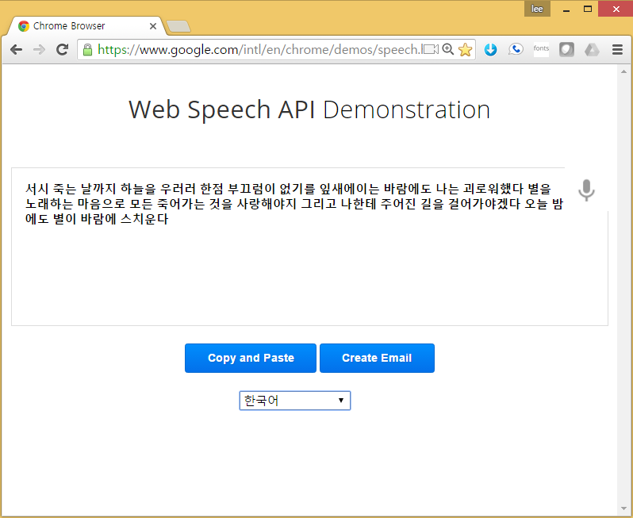
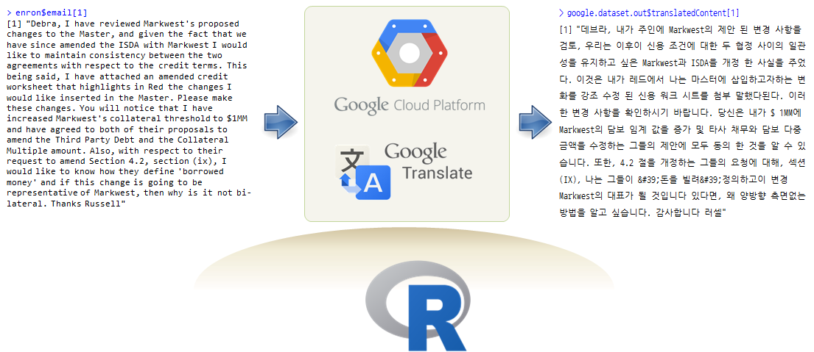

> ## 학습 목표 {.objectives}
>
> * 자동번역 API를 살펴본다.
> * 미국 구글과 러시아 얀덱스 번역 API로 엔론 전자우편을 자동번역한다.

### 1. 웹 인터페이스를 갖는 음성 API 서비스

[구글 말하기 API](https://cloud.google.com/speech/), [마이크로소프트 말하기 API](https://www.microsoft.com/cognitive-services/en-us/speech-api) 모두 거의 음성을 인식해서 정확하게 텍스트로 변환을 한다. 아직 구글 말하기 API는 알파버젼이고, 마이크로소프트 말하기 API는 한국어를 지원하고 있지는 않는다.

* [마이크로소프트 인지 서비스 빙 말하기 API](https://www.microsoft.com/cognitive-services/en-us/speech-api)
* [구글 Web Speech API Demonstration](https://www.google.com/intl/en/chrome/demos/speech.html)

    - [마이크로소프트 API](https://www.microsoft.com/cognitive-services/en-us/speech-api)
    - [구글 말하기 API](https://cloud.google.com/speech/)

### 2. 음성을 텍스트로 자동변환

### 3. 자동번역

`RYandexTranslate`, `translateR` 등 다양한 자동변역 팩키지가 존재한다.

기본적으로 R 팩키지를 설치하고 나서, API키를 받아 번역서비스 사이트에 던지게 되면 구글이나 얀덱스, 마이크로소프트에서 이를 인증하고 번역결과를 던져주는 방식이다.

#### 3.1. 구글 Translate API 

[GOOGLE TRANSLATE API](https://cloud.google.com/translate/)를 활용하여 영문에서 국문으로 번역을 R 환경에서 실행한다. 

1. `Google Cloud Platform`에서 `Translation API`를 활성화시킨다.
2. 구글 API 인증키를 잘 준비한다.
3. `translateR` 팩키지를 설치한다.
4. 번역할 영문 데이터를 데이터프레임 혹은 벡터로 준비하고 `translate` 함수에 넘겨 번역결과를 받는다.

~~~ {.r}
##======================================================================
## 01. 환경설정
##======================================================================

library(translateR)
TRANSLATION_KEY="구글에서 받은 API 인증키"

##======================================================================
## 02. 번역데이터 준비
##======================================================================

data(enron)
head(enron)

##======================================================================
## 03. 구글 번역 API 활용 영문을 국문으로 번역
##======================================================================

google.dataset.out <- translate(dataset = enron,
                                content.field = 'email',
                                google.api.key = TRANSLATION_KEY,
                                source.lang = 'en',
                                target.lang = 'ko')

##======================================================================
## 04. 번역결과 검토
##======================================================================

google.dataset.out$translatedContent[1]
~~~

`enron` 데이터프레임 `email` 필드전체(10개 행)를 구글 Translate API에 영문(`en`)에서 한글(`ko`)로 넘겨 번역을 실행하고 결과를 출력한다.

~~~ {.output}
> enron$email[1]
[1] "Debra,  I have reviewed Markwest's proposed changes to the Master, and given  the fact that we have since amended the ISDA with Markwest I would like to  maintain consistency between the two agreements with respect to the credit  terms.  This being said, I have attached an amended credit worksheet that  highlights in Red the changes I would like inserted in the Master.  Please  make these changes.  You will notice that I have increased Markwest's  collateral threshold to $1MM and have agreed to both of their proposals to  amend the Third Party Debt and the Collateral Multiple amount.  Also, with  respect to their request to amend Section 4.2, section (ix), I would like to  know how they define 'borrowed money' and if this change is going to be  representative of Markwest, then why is it not bi-lateral.  Thanks Russell"

> google.dataset.out$translatedContent[1]
[1] "데브라, 내가 주인에 Markwest의 제안 된 변경 사항을 검토, 우리는 이후이 신용 조건에 대한 두 협정 사이의 일관성을 유지하고 싶은 Markwest과 ISDA을 개정 한 사실을 주었다. 이것은 내가 레드에서 나는 마스터에 삽입하고자하는 변화를 강조 수정 된 신용 워크 시트를 첨부 말했다된다. 이러한 변경 사항을 확인하시기 바랍니다. 당신은 내가 $ 1MM에 Markwest의 담보 임계 값을 증가 및 타사 채무와 담보 다중 금액을 수정하는 그들의 제안에 모두 동의 한 것을 알 수 있습니다. 또한, 4.2 절을 개정하는 그들의 요청에 대해, 섹션 (IX), 나는 그들이 &#39;돈을 빌려&#39;정의하고이 변경 Markwest의 대표가 될 것입니다 있다면, 왜 양방향 측면없는 방법을 알고 싶습니다. 감사합니다 러셀"
~~~

#### 3.2. 얀덱스 번역 API

[RYandexTranslate](https://github.com/mukul13/RYandexTranslate) 팩키지를 사용해서도 다양한 언어로 번역을 할 수 있다.

1. [Yandex Translate API](https://tech.yandex.com/translate/doc/dg/concepts/api-overview-docpage/)에 대한 API키를 발급받는다.
1. [RYandexTranslate](https://cran.r-project.org/web/packages/RYandexTranslate/index.html) 팩키지를 설치한다.
1. `get_translation_direction` 방향을 확인하고 번역을 수행한다.
1. `translate` 함수에 `lang="en-de"` 인자를 넣어 번역 방향을 잘 설정한다.

~~~ {.r}
##======================================================================
## 01. 환경설정
##======================================================================
library(RYandexTranslate)
YANDEX_KEY ="XXXXXXXXXXXXXXXXXXXXXXXXXXXXXXXXXXXXXXXXXXXX"

##======================================================================
## 02. 번역데이터 준비
##======================================================================
data(enron)
head(enron)

##======================================================================
## 03. 얀덱스 번역 API 활용 영문을 독일어로 번역
##======================================================================
directions <- get_translation_direction(YANDEX_KEY)
directions
~~~ 

~~~ {.output}
$dirs
  [1] "az-ru" "be-bg" "be-cs" "be-de" "be-en" "be-es" "be-fr" "be-it" "be-pl" "be-ro" "be-ru"
 [12] "be-sr" "be-tr" "bg-be" "bg-ru" "bg-uk" "ca-en" "ca-ru" "cs-be" "cs-en" "cs-ru" "cs-uk"
 [23] "da-en" "da-ru" "de-be" "de-en" "de-es" "de-fr" "de-it" "de-ru" "de-tr" "de-uk" "el-en"
 [34] "el-ru" "en-be" "en-ca" "en-cs" "en-da" "en-de" "en-el" "en-es" "en-et" "en-fi" "en-fr"
 [45] "en-hu" "en-it" "en-lt" "en-lv" "en-mk" "en-nl" "en-no" "en-pt" "en-ru" "en-sk" "en-sl"
 [56] "en-sq" "en-sv" "en-tr" "en-uk" "es-be" "es-de" "es-en" "es-ru" "es-uk" "et-en" "et-ru"
 [67] "fi-en" "fi-ru" "fr-be" "fr-de" "fr-en" "fr-ru" "fr-uk" "hr-ru" "hu-en" "hu-ru" "hy-ru"
 [78] "it-be" "it-de" "it-en" "it-ru" "it-uk" "lt-en" "lt-ru" "lv-en" "lv-ru" "mk-en" "mk-ru"
 [89] "nl-en" "nl-ru" "no-en" "no-ru" "pl-be" "pl-ru" "pl-uk" "pt-en" "pt-ru" "ro-be" "ro-ru"
[100] "ro-uk" "ru-az" "ru-be" "ru-bg" "ru-ca" "ru-cs" "ru-da" "ru-de" "ru-el" "ru-en" "ru-es"
[111] "ru-et" "ru-fi" "ru-fr" "ru-hr" "ru-hu" "ru-hy" "ru-it" "ru-lt" "ru-lv" "ru-mk" "ru-nl"
[122] "ru-no" "ru-pl" "ru-pt" "ru-ro" "ru-sk" "ru-sl" "ru-sq" "ru-sr" "ru-sv" "ru-tr" "ru-uk"
[133] "sk-en" "sk-ru" "sl-en" "sl-ru" "sq-en" "sq-ru" "sr-be" "sr-ru" "sr-uk" "sv-en" "sv-ru"
[144] "tr-be" "tr-de" "tr-en" "tr-ru" "tr-uk" "uk-bg" "uk-cs" "uk-de" "uk-en" "uk-es" "uk-fr"
[155] "uk-it" "uk-pl" "uk-ro" "uk-ru" "uk-sr" "uk-tr"
~~~

~~~ {.r}
detect_language(YANDEX_KEY, text=enron$email[1])
~~~

~~~ {.output}
[1] "en"
~~~

~~~ {.r}
##======================================================================
## 04. 번역결과 검토
##======================================================================

enron$translated <- ""

for(i in 1:length(enron$email)) {
  if(i==4){
    next # 4번째 전자우편 특수문자 때문에 건너뜀
  }else{
    enron$translated[i] <- translate(YANDEX_KEY, enron$email[i], lang="en-de")$text
  }
}
enron$email[5]
enron$translated[5]
~~~

~~~ {.output}
> enron$email[5]
[1] "Sevil and others,  I have attached a detailed map of the ERCOT system, 69, 138 and 345 KV line  and buses (*.pwd).   The map is based on the 2001 Summer peak load flow case.  (Enron paid about $12,000 for this map so we do not need to disclose it to  outside personnel.)  I also have a detailed map of the eastern interconnect, I believe it is down  to the 138 KV level.  I have also attached a 2001 contingency file (*.ctg) for ease of importing a  standard list of line contingencies that I obtained from the ISO.  I have also attached an ERCOT injection group (*.aux) , which is valuable for  the years after 2001 because of one constrol group.      "

> enron$translated[5]
[1] "Sevil und andere habe ich in der Anlage eine detaillierte Karte der ERCOT system, 69, 138 und 345-KV-Leitung und Busse (*.pwd). Die Karte basiert auf der 2001 Summer peak-load-flow Fall. (Enron bezahlt ungefähr $12,000 für diese Karte, so dass wir nicht brauchen, um es zu veröffentlichen, um außerhalb Personal.) Ich habe auch eine detaillierte Karte der Ost-interconnect, ich glaube es liegt an den 138-KV-Ebene. Ich habe auch schonmal ein 2001 Kontingenz-Datei (*.ctg) für einfachen Import eine Liste der standard-Linie Risiken, die ich erhielt von der ISO. Ich habe auch mit einem ERCOT Injektion group (*.aux) , die wertvoll für die Jahre ab 2001 aufgrund einer constrol Gruppe. "
~~~