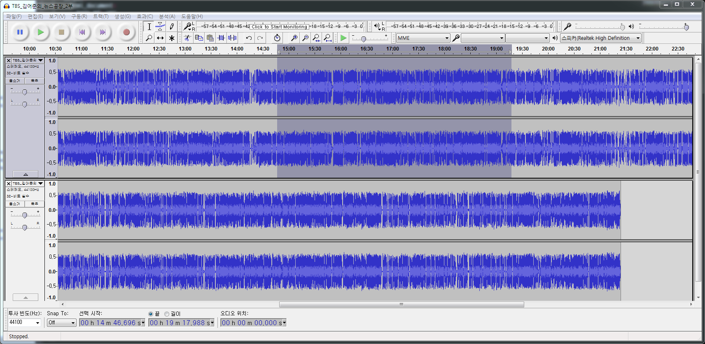
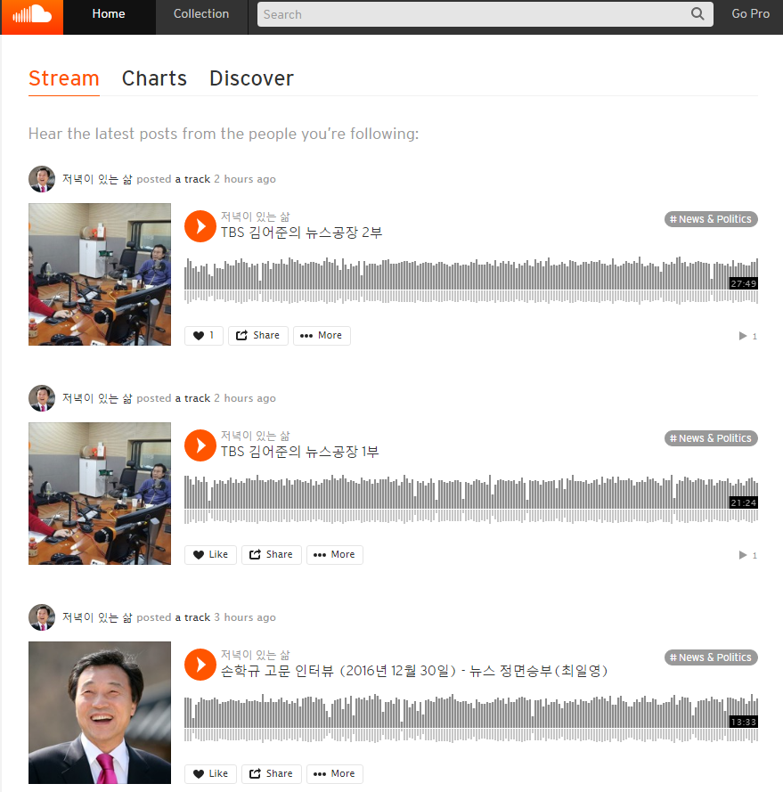

```{r, include=FALSE}
source("tools/chunk-options.R") 
```

> ## 학습 목표 {.objectives}
>
> * 오디오 데이터를 툴을 활용하여 편집한다.
> * 오디오 데이터를 클라우드 서비스에 저장하고 SNS를 통해 공유한다.

## 1. 오디오 데이터 활용 [^how-to-audacity]

GPL 라이선스(?)를 갖는 [오데서티(Audacity)](http://www.audacityteam.org/)를 활용하면
자유로이 음악 및 음성 등 다양한 오디오 소리를 편집하여 재가공해서 활용가능하다. 
소리 관련하여 가장 많이 활용하는 기능은 다음과 같다.

- 녹음, 이중녹음
- 소리 편집: 자르기 붙이기
- 잡음제거
- 음성변조

자세한 내용은 다음 웹사이트를 확인한다.

- [Audacity 사용법 첫번째 포스팅](http://sint.tistory.com/202)
- [Audacity 사용법 두번째 포스팅](http://sint.tistory.com/542)



## 2. 오디오 저장소 [사운드클라우드](https://soundcloud.com/) 

사운드클라우드(SoundCloud)는 독일 베를린에 본사를 둔 글로벌 온라인 음악 유통 플랫폼으로 다양한 디지털 정보 유통의 한축을 담당했다. 

- 사진: [플리커(flickr)](https://www.flickr.com/)
- 동영상: [유튜브(YouTube)](https://www.youtube.com/), [비메오(Vimeo)](https://vimeo.com/)
- 음악: [사운드클라우드(SoundCloud)](https://soundcloud.com/)




