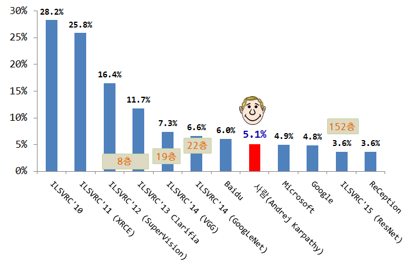
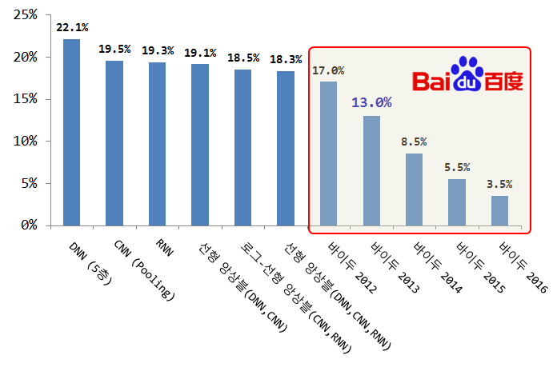

> ## 학습 목표 {.objectives}
>
> * 딥러닝이 주목받는 이유를 이해한다.

### 딥러닝이 주목받는 이유 [^imageNet-perf] [^andrew-ng-spark-2016] [^ms-speech]

[^imageNet-perf]: [ImageNet Large Scale Visual Recognition Challenge](http://arxiv.org/abs/1409.0575)
[^andrew-ng-spark-2016]: [AI-The New Electricity](https://www.youtube.com/watch?v=4eJhcxfYR4I)

[^ms-speech]: [Li Deng and John C. Platt (2014), Ensemble Deep Learning for Speech Recognition, Microsoft Research](http://research.microsoft.com/pubs/219987/EnsembleDL_submitted.pdf)

딥러닝이 주목받는 이유는 **성능** 이 잘 나오기 때문이다. 엄청난 자원(데이터와 컴퓨팅 연산)을 투입하여 음성인식과 이미지 인식에 있어 괄목할만한 성과를 창출하고 하고 있다. 특히 95%의 정확도와 99%의 정확도는 단순한 4%의 차이가 아니라 실험실에서 나와 실제 사람들이 사용할 정도를 의미하는 의미심장한 차이를 갖는다. 

이미지의 경우 사람(Andrej Karpathy)이 약 5.1% 오분류율을 보이는 반면 딥신경망은 층수를 쌓아나가며 3%대를 지나 조만간 1%대로 진입할 것으로 예상된다.

음성인식의 경우도 HMM 이후 딥신경망을 적용하여 20%대를 돌파하고, Ng 박사가 스파크 컨퍼런스에서 발표한 자료에 의하면 바이두가 2012년 17%로 내려온 이후 2016년 3.5%대로 오분류율을 뚝 떨어뜨렸다.

NVidia CEO 젠센의 2016 CES 발표회에서 [이미지넷](http://image-net.org/challenges/LSVRC/2015/) 정확도가 2012년부터 2015년까지 80%대에서 90%대로 획기적으로 향상된 것이 확인된다. 전통적인 컴퓨터 비젼으로 정확도를 80%대로 끌어올렸고, 디러닝으로 90%대로 끌어올려 상업화에 한걸음 다가섰다.

